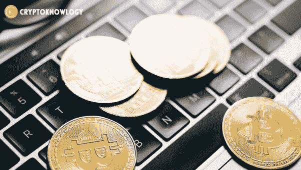

# 什么是 CBDC，它是如何工作的？

> 原文：<https://medium.com/coinmonks/what-is-cbdc-and-how-does-it-work-1b9368a7babe?source=collection_archive---------33----------------------->

随着对当前金融体系的信任度持续下降，世界各国政府都在争先恐后地推出他们的央行数字货币，即 CBDC 货币，以免他们的实物法定货币崩溃。

为什么央行想要推出他们的数字货币？

第一个原因是所有央行都喜欢说的，那就是央行的钱是最安全的货币形式。

作者随后声称，随着现金使用的减少，按面值兑换的承诺变得越来越没有意义。

中央银行想要 CBDC 的第二个原因是货币主权。

CBDC 将使政府有可能防止外币与本国货币竞争。如果你想知道为什么政府和

央行不喜欢这种货币竞争，因为这将从根本上迫使他们在支出和印刷方面更加负责任，而大多数政府和央行都不想这么做，因为这对他们和他们的朋友有利。

因此，几乎每个国家都将很快看到本国货币被某种外币取代，可能是美元，以稳定的硬币形式出现，如 USDT 和 USDC，因为这种情况正在缓慢但肯定地开始在经历最严重通胀的国家发生。

欲知详情，请访问**。**

> **交易新手？试试[密码交易机器人](/coinmonks/crypto-trading-bot-c2ffce8acb2a)或[复制交易](/coinmonks/top-10-crypto-copy-trading-platforms-for-beginners-d0c37c7d698c)**