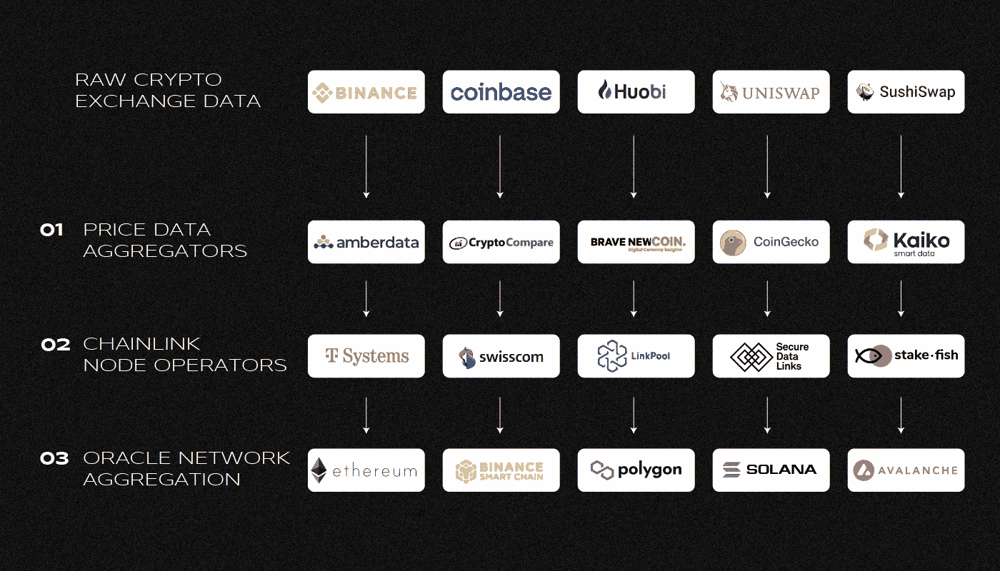
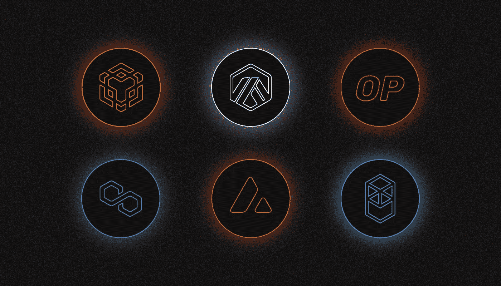
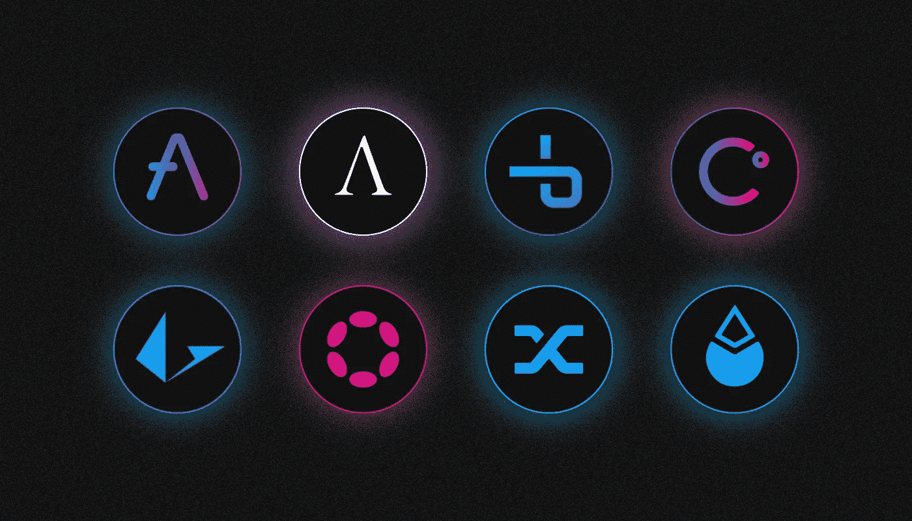
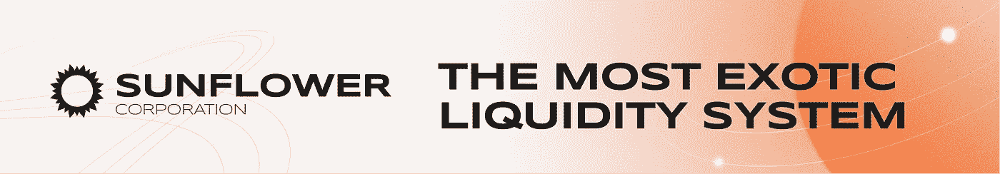

# 什么是 Chainlink(链接)？

> 原文：<https://medium.com/coinmonks/what-is-chainlink-link-ee39213c46b1?source=collection_archive---------27----------------------->

***Chainlink 是一个分散的 oracles 网络，它为区块链的智能合同验证和提供来自外部来源的数据。它解决了哪个问题？它的目的是什么？让我们一起来看看吧！***

Chainlink 是加密货币行业最大的去中心化神谕提供商。这项技术在分散式金融领域特别受欢迎。与区块链无关的大公司也使用神谕。

LINK 是本地链接令牌。它主要用于补偿 Oracles 所依赖的节点操作员的工作。

# 谁在何时创造了 Chainlink？

Chainlink 是由**谢尔盖·纳扎罗夫**和**史蒂夫·埃利斯**创造的。

该项目于 2017 年首次公开，当时纳扎罗夫和埃利斯发表了[白皮书](https://research.chain.link/whitepaper-v1.pdf?_ga=2.35618726.661663838.1654506535-1365712531.1654506535)。Chainlink 于 2019 年正式上线。该项目建立在基于 notes 的分布式 oracles 技术之上。

它是与康奈尔大学教授阿里·朱尔斯合作开发的。他现在在 Chainlink 实验室工作，与创始人和其他团队成员一起研究项目的协议和架构。

谷歌前高管埃里克·施密特(Eric Schmidt)于 2021 年底加入 Chainlink Labs 担任顾问。

# 神谕解决哪个问题？

分散式应用程序需要智能合约才能运行，但一些业务模型需要区块链之外的数据。其中一个主要问题是交付和验证智能合同执行的链外数据。

最初，神谕负责这一点，但它们是不可靠的和集中的:它们的工作经常被创造者控制，这样的神谕只被一个信息来源使用。所有这些导致了一个“故障点”,将智能合约用户置于危险之中。

一个例子是使用即时贷款的业务。数据的集中化——在本例中是加密资产的价格——创造了智能合同利用的可能性。结果在 **2020** 年，一名黑客从 bZx 协议中窃取了近 100 万美元的加密货币，该协议仅使用了一个甲骨文赛博网络。

Chainlink 的创造者通过引入去中心化的神谕改进了这项技术。它们的主要特点是缺乏单一的数据源和对操作的抵抗力。

连接到 Chainlink 网络的智能契约同时从多个 oracles 请求信息，以便获得最可靠的数据。因此，分散链式连接神谕也被称为一致神谕。

# 链环神谕是如何工作的？

Chainlink 是连接许多节点的 oracle 网络。单个节点的操作员可以部署多个 oracles。反过来，每个 oracle 可以有多个数据源。

Oracles 在工作中使用价格数据馈送(链接价格馈送)。它们使分散应用程序中的智能合约能够从集中交易平台接收加密货币报价。例如，当通过分散交换将一个加密资产交换为另一个加密资产时，这是必需的。

The scheme of the Chainlink oracles. Source: Chainlink Labs

上述用于通过 oracles 提供加密资产价格数据的系统分为三个级别:

1.众所周知的聚合器——coin gecko、CoinMarketCap、Cryptocompare 等——直接从交易所和其他交易平台接收交易和价格数据。

2.这些值被发送到链接节点。它们不创建块，而是处理请求和管理 oracles 的工作。当一个请求被接收时，它由一组随机选择的合适的神谕来回答。它们从相关外部来源获取所需数据，并将其传输至 Chainlink。

Chainlink 节点分为两种类型:核心节点(接受用户请求)和适配器节点(充当节点和外部数据源之间的“桥梁”)。

3.一个特殊的链接聚合契约比较和比较由 oracles 获得的数据。当节点就响应达成一致时，会向收件人发送一个值，这是发送原始请求的分布式应用程序的智能契约。

# Chainlink oracles 可以传递哪些数据？

分散式甲骨文技术不仅适用于加密货币和金融。例如，Chainlink 在 2021 年夏天宣布与流行的天气预报服务 AccuWeather 合作。作为合作的一部分，该平台通过 Google Cloud 向分散的 oracles 发送数据。

由于这种合作，Chainlink 能够吸引另一个客户。在 2022 年的春天，美国柠檬水保险平台与几个区块链项目合作，将为农民推出一项新的气候风险保险服务。与传统保单不同，保险购买者是与 Oracle Chainlink 关联的智能合约的参与者。

【2022 年 4 月，DeFi 公司 Truflation 使用 Chainlink oracles 创建了自己的美国消费者价格指数(CPI)。与政府计算的官方指数不同，Translation 使用一种替代计算方法，Chainlink 负责信息的来源和可靠性。

# Chainlink 还有哪些服务？

Chainlink oracles 能够执行具有广泛应用的各种功能:

*   一个可验证的随机函数(VRF)。链式 VRF 为每个请求生成一个或多个随机数和密码确认。VRF 用于需要基于特定公式的随机结果的应用合同中，例如区块链游戏和 NFT。PoolTogether 是第一个 VRF 游戏。
*   与 API 的集成 Chainlink 系统为智能合同提供了连接外部数据源(包括 API)的能力。
*   智能合同功能的自动化及其在“保管员”(链式保管员)帮助下的定期维护。

# Chainlink 使用哪个区块链？

Chainlink 没有自己的网络。项目节点运行在区块链上，作为它们支持的应用程序的基础。Chainlink 最初是在以太坊平台推出的。Oracles 目前正在研究索拉纳区块链和与以太坊虚拟机兼容的网络，如 BNB 链、Arbitrum、乐观、多边形、雪崩和 Fantom。

# 哪些公司和项目使用 Chainlink？

**截至 2022 年 6 月**，项目生态圈拥有超过 [1300 个项目](https://www.chainlinkecosystem.com/ecosystem)。

Chainlink oracles 使用领先的 DeFi 协议:Aave、Ampleforth、bZx、Celsius Network、Loopring、Polkadot、Synthetix、Lido 等。

【2022 年 2 月，美国银行将 Chainlink 项目列为 DeFi 增长的主要原因之一。当时，该项目的先知参与了 DeFi 应用，其在整个 DeFi 领域的总 TVL 指标中的份额超过了 59% *。*

在管理 oracles 的 Chainlink 节点运营商中有许多大型企业:瑞士电信运营商 Swisscom、德国公司 Deutsche Telekom 以及美联社(AP)通讯社。

# 什么是 Chainlink 2.0？

**2021**年初，开发者发布了一份名为 [Chainlink 2.0](https://chain.link/whitepaper/) 的白皮书。

该文件的作者专注于所谓的混合智能合同的开发，以及使用 Chainlink oracles 在网络上获得额外机会的新方法。

Chainlink 联合创始人 Sergey Nazarov 表示，混合智能合约的主要特点是将区块链上运行的代码与数据和计算相结合。

Chainlink 还打算推出 [CCIP](https://blog.chain.link/introducing-the-cross-chain-interoperability-protocol-ccip/) (跨链互操作性协议)，这是一个跨链兼容协议，将作为区块链之间消息传递和通信的全球标准。CCIP 的目标是通过创建一个单一的“区块链互联网”来完成 TCP/IP 协议为互联网所做的事情。

# 为什么我们需要链接？

LINK 是 Chainlink 项目的一个标志，在区块链以太坊发行。

它是市值排名前 50 的加密货币之一。链路令牌供应被限制为 10 亿个令牌。

加密资产需要支付先知的工作，并作为对节点运营商的经济激励。LINK 还用于提高数据处理精度和网络契约稳定性。

Chainlink 推出后迅速走红，代币价格上涨。只是在 **2020 年**链路成本一下子涨了几倍。Chainlink 还有一个活跃的“LINK Marines”(链接海军陆战队)社区，他们在社交媒体上积极推广该项目。

与此同时，观察人士注意到了 LINK 的高度集中:2021 年春初，总发行额的 81%集中在 1%的持有者手中。

【2021 年 5 月，链接价格在白皮书 2.0 发布后见顶，但随后开始下降。截至 2022 年 6 月**日**初，该资产价值约为 8 美元。

# 这个项目遇到什么麻烦了吗？

在 **2020** 年，发生了对项目的信息攻击。身份不明的个人代表英国宙斯资本银行在一个虚假网站上发布了一份捏造的报告。匿名作者在他们的工作中声称，开发者正在出售大量的链接，并预测令牌的价格会下降。然而，这些指控没有得到证实，加密资产的价值增加了。

同年 9 月在几个 Chainlink 节点上实施了垃圾邮件攻击，攻击者发送大量的价格数据请求。据 Chainlink 的代表称，这次攻击是轻微的，对网络或 oracles 没有影响。另一方面，节点运营商已经花钱支付以太坊佣金。

> 你有什么想法？如果你对 Chainlink 主题有任何补充，请在下面留下你的评论！
> 
> 在[媒体](/@SunflowerCorpAdmin)或[推特](https://mobile.twitter.com/sunflower_corp)上关注[向日葵公司](https://sunflowercorp.com/)定期更新关于趋势加密新闻。

[*向日葵公司*](https://sunflowercorp.com/)*——专注于最佳交易体验和卓越技术的新型加密货币衍生交易所。*

*我们提供杠杆高达 x100 的 BTC/USDT 永久期货，以及最具趋势性的工具。当您与我们交易时，您将获得一个可定制的交易终端、各种图表、技术分析工具、多种订单类型以及“止损”和“止盈”订单选项。*

> 交易新手？尝试[加密交易机器人](/coinmonks/crypto-trading-bot-c2ffce8acb2a)或[复制交易](/coinmonks/top-10-crypto-copy-trading-platforms-for-beginners-d0c37c7d698c)
> 
> 加入 Coinmonks [电报频道](https://t.me/coincodecap)和 [Youtube 频道](https://www.youtube.com/c/coinmonks/videos)获取每日[加密新闻](http://coincodecap.com/)

## 另外，阅读

*   [复制交易](/coinmonks/top-10-crypto-copy-trading-platforms-for-beginners-d0c37c7d698c) | [加密税务软件](/coinmonks/crypto-tax-software-ed4b4810e338)
*   [网格交易](https://coincodecap.com/grid-trading) | [加密硬件钱包](/coinmonks/the-best-cryptocurrency-hardware-wallets-of-2020-e28b1c124069)
*   [密码电报信号](/coinmonks/top-3-telegram-channels-for-crypto-traders-in-2021-8385f4411ff4) | [密码交易机器人](/coinmonks/crypto-trading-bot-c2ffce8acb2a)
*   [最佳加密交易所](/coinmonks/crypto-exchange-dd2f9d6f3769) | [印度最佳加密交易所](/coinmonks/bitcoin-exchange-in-india-7f1fe79715c9)
*   [面向开发人员的最佳加密 API](/coinmonks/best-crypto-apis-for-developers-5efe3a597a9f)
*   最佳[密码借贷平台](/coinmonks/top-5-crypto-lending-platforms-in-2020-that-you-need-to-know-a1b675cec3fa)
*   [免费加密信号](/coinmonks/free-crypto-signals-48b25e61a8da) | [加密交易机器人](/coinmonks/crypto-trading-bot-c2ffce8acb2a)
*   [杠杆代币终极指南](/coinmonks/leveraged-token-3f5257808b22)