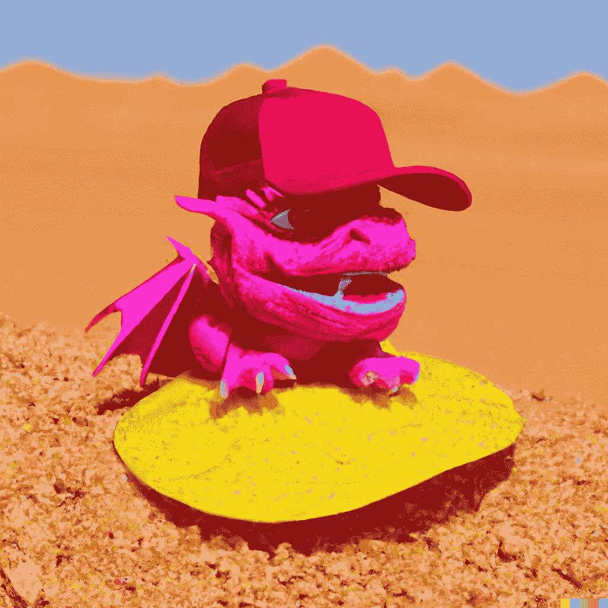

# 什么是 ChatGPT，它如何改变世界？

> 原文：<https://medium.com/coinmonks/what-is-chatgpt-and-how-can-it-change-the-world-2bf39eea90c8?source=collection_archive---------16----------------------->

## 利用人工智能成为超人

See the rest of the article to understand what this dragon is doing here.

ChatGPT 又名 OpenAI，是 OpenAI LP 创造的一个全新的革命性 AI。

> “OpenAI 由 OpenAI 非营利组织的董事会管理，由 OpenAI LP 员工 Greg Brockman(董事长兼总裁)、Ilya Sutskever(首席科学家)和 Sam Altman(首席执行官)以及非员工 Adam D'Angelo、雷德·霍夫曼、Will Hurd、塔莎·麦考利、海伦·托纳和 Shivon Zilis 组成。
> 
> 我们的投资者包括微软、雷德·霍夫曼慈善基金会和科斯拉风险投资公司。"来源: [Openai](https://openai.com/about/) 。com/about/
> 
> “以对话方式互动的 ChatGPT。对话形式使 ChatGPT 能够回答后续问题，承认错误，质疑不正确的前提，并拒绝不适当的请求。ChatGPT 是 [InstructGPT](https://openai.com/blog/instruction-following/) 的兄弟模型，它被训练成遵循提示中的指令并提供详细的响应。” [O](https://openai.com/blog/chatgpt/) penAI 博客帖子。

> 从顶级交易者那里复制交易机器人。免费试用。

简单地说，这个最近的人工智能(最近的一周)将改变我们所知道的世界。这可能看起来有点夸张，但这里有一些它的一些功能的实际例子；

在雷德·霍夫曼 20 分钟的范德比尔特大学研究生演讲中，它在 30 秒内写下了这个 15 个要点的总结

1.  里德强调结交、培养和保持亲密朋友的重要性。
2.  建立牢固的友谊可以提高个人幸福感和联系。
3.  朋友之间可以互相支持，互相挑战，共同成长。
4.  朋友可以帮助我们找到工作的意义和目标。
5.  里德鼓励毕业生优先考虑他们的关系，并投资于他们的友谊。
6.  里德建议对朋友要脆弱和真诚。
7.  里德分享了他自己生活中的四个故事来说明友谊的价值。
8.  在第一个故事中，里德的朋友们帮助他们学到了重要的东西。
9.  在第二个故事中，里德的朋友们支持他度过了困难时期。
10.  在第三个故事中，里德的朋友们挑战他的成长。
11.  在第四个故事中，里德的朋友们帮助他找到了工作的意义和目标。
12.  里德强调了拥有诚实和告诉你真相的朋友的价值。
13.  里德鼓励毕业生去寻找与他们有共同兴趣和价值观的朋友。
14.  里德建议，建立牢固的友谊可以改善他们的职业生涯和个人幸福。
15.  这个演讲是在范德比尔特大学进行的。

乍一看，可能会有一些调整，以使信息清晰。但是提醒一下，这都是 ChatGPT 用 30 秒写的！！！

[ChatGPT](https://chat.openai.com/chat) 的更多功能:

1.  写出整个销售文案
2.  优化视频、博客、电子邮件或您需要创意的其他标题
3.  为应用程序、网站等编写代码
4.  为视频、播客、故事等生成引人注目的脚本
5.  纠正语法
6.  如此，如此，如此，如此，如此，如此多

这只是人工智能能力的表面。例如，ChatGPT 的另一个令人兴奋的功能是 DALL-E，它只是一个基于你发送的提示的人工智能艺术生成器。同样，ChatGPT 也是如此，你输入的越多，它能为你提供的信息就越详细。比如说；

我想要一张红龙的照片，坐在沙漠中央的薯片上，戴着亮粉色的贝雷帽。这是照片的原貌。

伙计们，我不骗你们，如果你们的大脑没有爆炸，我不知道该告诉你们什么。需要指出的是，它是一个令人惊奇的工具，可以简化你的创作过程，但不是最终的产品……目前还不是。仍然需要通过编辑你这边或那边的一些东西来建立人际关系。但就目前情况而言，你写的内容、你认为你写的内容以及你所做的单调乏味的任务，有 70-85%现在可以外包给像 ChatGPT 这样的人工智能。游戏改变者。

想象一下 ChatGPT 和 DALL-E 的所有可能性。随着我们一起发现这个令人惊叹的平台，更多更新将会到来。让我看看

现在请在下面的评论中写下你对 ChatGPT 和 DALL-E 的看法。

> 加入 Coinmonks [电报频道](https://t.me/coincodecap)和 [Youtube 频道](https://www.youtube.com/c/coinmonks/videos)了解加密交易和投资

# 另外，阅读

*   [OKEx vs KuCoin](https://coincodecap.com/okex-kucoin) | [摄氏替代品](https://coincodecap.com/celsius-alternatives) | [如何购买 VeChain](https://coincodecap.com/buy-vechain)
*   [ProfitFarmers 回顾](https://coincodecap.com/profitfarmers-review) | [如何使用 Cornix Trading Bot](https://coincodecap.com/cornix-trading-bot)
*   [如何匿名购买比特币](https://coincodecap.com/buy-bitcoin-anonymously) | [比特币现金钱包](https://coincodecap.com/bitcoin-cash-wallets)
*   [瓦济里克斯 NFT 评论](https://coincodecap.com/wazirx-nft-review) | [比茨盖普 vs 皮奥克斯](https://coincodecap.com/bitsgap-vs-pionex) | [坦吉姆评论](https://coincodecap.com/tangem-wallet-review)
*   [如何使用 Solidity 在以太坊上创建 DApp？](https://coincodecap.com/create-a-dapp-on-ethereum-using-solidity)