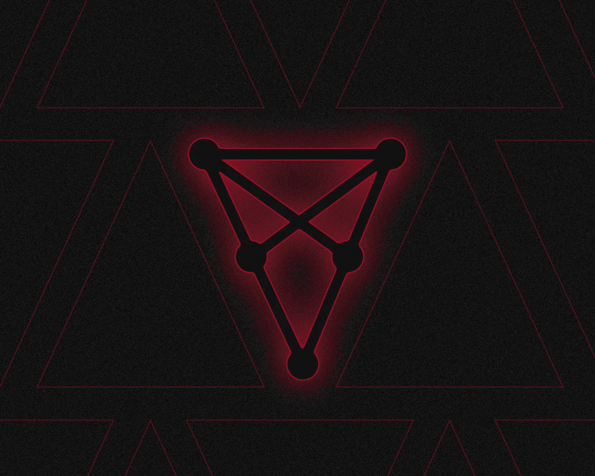
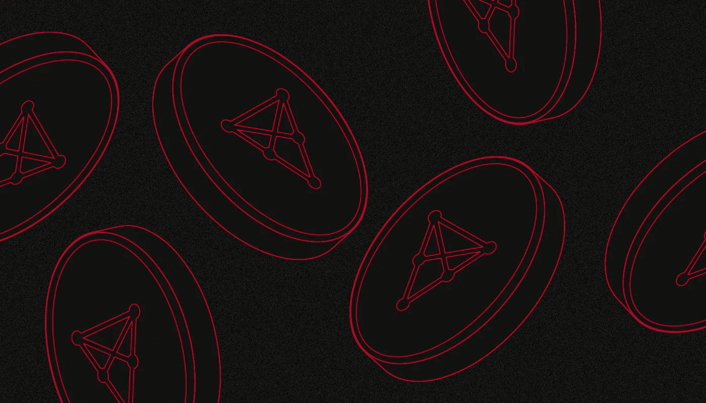
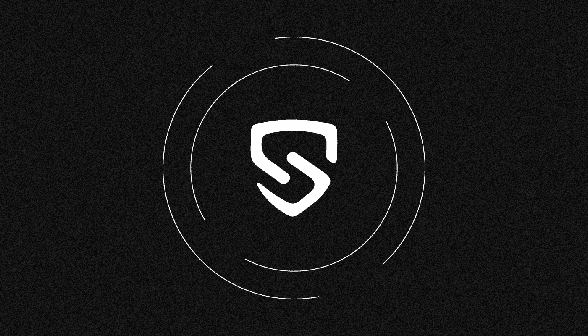

# 什么是奇利兹(CHZ)？

> 原文：<https://medium.com/coinmonks/what-is-chiliz-chz-5b165aa3edc1?source=collection_archive---------14----------------------->

***Chiliz (CHZ)是 Socios.com 平台的原生加密货币，用于粉丝代币的发行和交易。它是市值最高的 50 种加密资产之一。它是如何工作的？为什么会如此广泛？让我们一起来看看*** 。

Chiliz 公司运营 Socios.com，并与各种体育领域的大量知名球队合作，在平台上为他们的粉丝分发数字内容。

2021 年，Socios 的伙伴俱乐部创造了超过 2 亿美元的收入。

著名足球运动员莱昂内尔·梅西是该平台的官方代表。

# 谁创造了奇利兹·Socios.com？

Chiliz 由企业家兼密码爱好者 **Alexandre Dreyfus** 于 **2018** 成立，作为马耳他公司 Mediarex Group 的子公司，该公司经营体育和娱乐行业。

在 **2018** 年，Chiliz 通过封闭投资轮融资 6600 万美元。主要投资者是币安实验室、策源创投、Jump Capital 和 Kosmos Capital。

**2019 年 12 月底**，Chiliz 开发团队利用 Chiliz Chain 自有的区块链，推出了体育粉丝平台 Socios.com。该平台的主要资产是加密货币奇利兹(CHZ)。

**2020 年初**，一个集中的加密货币交易所开始在 Chiliz.net 运营，它被宣传为“世界上第一个体育和娱乐交易所”

目前，池莉的团队有 220 多人。该公司在西班牙、瑞士和马耳他设有办事处，在土耳其、美国、法国、英国、韩国和巴西也设有代表处。

# Chiliz 区块链连锁店是如何运作的？

**2019 年 10 月，** Chiliz 推出了名为 **Chiliz Chain** 的侧链，解决以太坊收费高的问题。

Chiliz 链中的平均块生成时间是 5 秒，并且交易是免费的。其主要目的是粉丝代币的发行和流通，目前已经发行了 70 多张。

为了实现最佳性能，奇利兹区块链使用授权证明(PoA)共识协议。这是利益证明算法的一个变体，不同之处在于有限的可信网络节点列表(主节点)参与生成块和批准事务，并且对批准块不给予奖励。为了提高生产率，分散化不得不被牺牲:Chiliz 连锁店只由该公司及其最大的合作伙伴拥有的七个主节点提供服务。

**截至 2022 年 9 月**，Chiliz 网络上的用户账号超过 160 万，大致对应手机应用 Socios.com 的下载次数。

自【2022 年 3 月起，新版 [Chiliz Chain 2.0](https://www.chiliz.com/en/chain/) 区块链一直在测试网络模式下运行。这是一个独立的一级网络，交易便宜快捷。据 Chiliz 称，由于与 EVM 完全兼容，第二版区块链将允许以太坊生态系统的开发者向 Chiliz Chain 发行 NFT 和粉丝代币，以及推出 DeFi 服务、区块链游戏和忠诚度计划。

# 我们为什么需要 CHZ？

原生 CHZ 令牌于 2018 年**秋季**在以太坊网络上发布，具有 ERC-20 标准。

CHZ 的最高报价为 88.8 亿代币，其中约 60 亿在 2022 年秋季**流通。自由流通的 CHZ 数量每年增长约 9400 万 CHZ，或 1.6%。根据以太网扫描，CHZ 的持有者大约有 15 万个地址。**

**首次发行的代币分配如下:**

*   **15% —战略收购；**
*   **15% —营销计划；**
*   **20% —为用户群预留；**
*   **7.5% —给种子轮投资者；**
*   **34.5% —给已完成的代币出售的投资者；**
*   **5% —给 Chiliz 和 Socios 团队；**
*   **3% —给项目顾问。**

**从出售粉丝代币、NFT 以及在 Chiliz.net 加密交易所收取的交易佣金中获得的部分 CHZ 正在被烧掉。总共有超过 6500 万枚代币以这种方式被烧毁。**

**Chiliz 用于平台 Socios.com 上的所有结算和交易:你可以购买和出售仅适用于 CHZ 的粉丝代币。未来，该令牌计划在 Chiliz Chain 2.0 中重新发行，之后还将用于网络管理、下注和支付交易费用。**

**从**1 月到 2021 年**4 月，CHZ 的价格从 0.02 美元涨到 0.77 美元，也就是涨了 38 倍多。尽管加密货币市场在 2022 年**有所下滑，但从 6 月到 9 月，CHZ 的价格有所回升。Chiliz 加密货币是仅次于 ApeCoin (APE)和 Flow 的第三大 NFT 项目令牌，指标为 14 亿美元。****

# **粉丝代币如何让 Socios 平台如此受欢迎**

**Socios.com 成为第一个开始发布专门面向体育迷的数字资产的区块链项目。**

****

**所谓的粉丝代币是 ERC-20 标准的可替代资产，在奇利兹连锁网络上发行。**

**每个球迷代币由某个运动队或组织“标记”,并且给予所有者参与其生活和活动的机会，例如，接收独家纪念品、比赛和封闭赛事的门票等等，**

**第一个在 Socios 平台上发放球迷代币的组织是来自意大利的著名尤文图斯足球俱乐部。跟随他，数十支欧洲著名足球队为球迷发布了他们的数字资产:马德里竞技、巴黎圣日耳曼、罗马、巴塞罗那、阿森纳等，以及阿根廷和葡萄牙的国家队。“足球”代币的完整列表[发布在](https://www.socios.com/fan-tokens/)socos 网站上。**

**借助粉丝代币，您还可以:**

*   **参与项目合作伙伴组织的 Socios.com[投票](https://www.socios.com/socios-polls/)；**
*   **在游戏结果上下[赌注](https://www.socios.com/socios-predictor/)；**
*   **为平台上的活动赢取“忠诚代币”,这些代币可以在比赛期间[用于](https://www.socios.com/fan-rewards/)额外的机会。**

**除了 Socios.com 平台和 Chiliz.net 交易所之外，粉丝代币还在几个中央加密交易所进行交易。**

**2020 年 12 月**Socios.com 和币安密码交易所建立战略合作伙伴关系。它通过 Launchpool 平台上的 BNB、BUSD 和 CHZ staking 分发粉丝代币，并为巴黎圣日耳曼和尤文图斯俱乐部推出代币拍卖。后来，其他一些粉丝代币也以同样的方式发行，并随后在币安上市。****

****2022 年 8 月**末，拜比特交易所进行了几个粉丝代币的挂牌。******

# ****Socios.com 有哪些类型的运动？****

****Socios 合作伙伴是来自世界 25 个国家的 150 多个组织、团队和协会。除了足球之外，还为许多运动项目发行了球迷代币:****

*   ****综合格斗:职业拳手联盟(PFL)，终极格斗冠军赛(UFC)；****
*   ****赛车:Roush Fenway Racing，阿斯顿马丁 Cognizant F1，阿尔法罗密欧 F1 车队 ORLEN****
*   ****篮球(美国):芝加哥公牛队、波士顿凯尔特人队、洛杉矶湖人队等。****
*   ****网球:戴维斯杯；****
*   ****足球(美国):费城老鹰队、纽约巨人队、芝加哥熊队等；****
*   ****拉格比:鲨鱼队、巴黎法兰西体育场、莱斯特老虎队等；****
*   ****曲棍球(美国):纽约流浪者队、底特律红翼队、匹兹堡企鹅队等；****
*   ****足球(美国和加拿大):奥斯汀队、洛杉矶银河队、亚特兰大联队、多伦多队等；****
*   ****Cyberpsort: OG，Endpoint CeX，Vitality 等。****

# ****智利和 Socios.com 发展的结论和展望****

****截至 2022 年 9 月**底**Socios.com 已经在全球 27 个国家拥有超过 150 家合作伙伴。除了几十个最受欢迎的足球俱乐部之外，还有可能吸引许多其他地区的体育组织。于是，回到 2021 年，UFC 混合武术联盟的粉丝代币被放出。与此同时，f1 车队阿斯顿·马丁和阿尔法·罗密欧的粉丝代币开始销售。****

****已签署合作协议的美国最大的体育联盟 NHL 和 NBA 尚未在 Socios.com 推出他们的粉丝令牌，但这可能会在主要的 Chiliz Chain 2.0 网络推出后发生。****

****【2022 年 5 月，著名足球运动员莱昂内尔·梅西(Lionel Messi)与 Socios.com 签下一份价值 2000 万美元的三年合同，成为品牌大使，参与广告宣传和促销活动。****

****奇利兹发展了元诗的方向。【2022 年 8 月，区块链公司[通过购买开发数字内容的巴萨工作室 24.5%的股份，向巴萨的数字世界投资](https://decrypt.co/106373/crypto-firm-chiliz-nabs-102m-stake-fc-barcelonas-digital-studio)1 亿美元。****

****球迷代币的概念在全球体育产业中引起了热烈的反响。根据 Socios 管理部门的数据，仅在 **2021** 年，平台[上体育俱乐部的收入就超过了](https://www.reuters.com/lifestyle/sports/benfica-join-crypto-craze-with-socios-2022-06-07/)2 亿美元。越来越多的著名体育代表正在加入这个项目。Chili 成功实现了体育迷与偶像互动的新途径，并创造了一个新市场。****

> ****你有什么想法？如果你对 Chiliz 话题有任何补充，请在下面留下你的评论！****
> 
> ****在[媒体](/@SunflowerCorpAdmin)或[推特](https://mobile.twitter.com/sunflower_corp)上关注[向日葵公司](https://sunflowercorp.com/)定期更新关于趋势加密新闻。****

********

****[*向日葵公司*](https://sunflowercorp.com/) *—专注于最佳交易体验和卓越技术的新型加密货币衍生交易所。*****

****我们提供杠杆高达 x100 的 BTC/USDT 永久期货，以及最具趋势性的工具。当您与我们交易时，您将获得一个可定制的交易终端、各种图表、技术分析工具、各种订单类型以及“止损”和“获利”订单选项。****

> ****交易新手？试试[密码交易机器人](/coinmonks/crypto-trading-bot-c2ffce8acb2a)或者[复制交易](/coinmonks/top-10-crypto-copy-trading-platforms-for-beginners-d0c37c7d698c)****