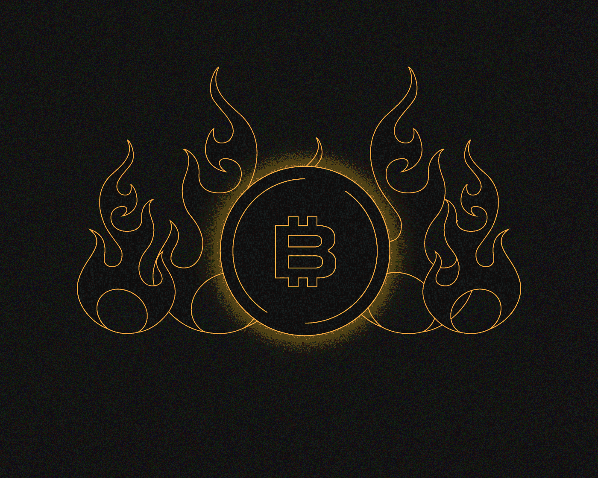
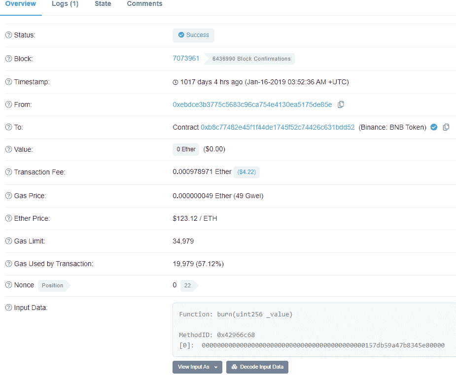
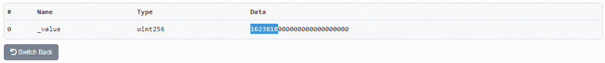
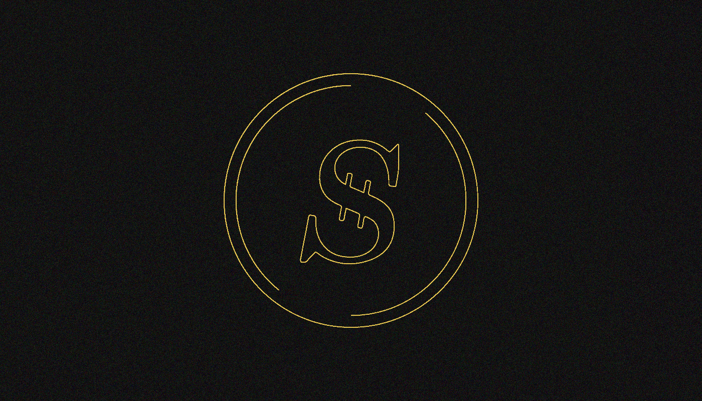
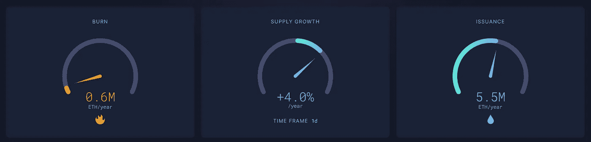
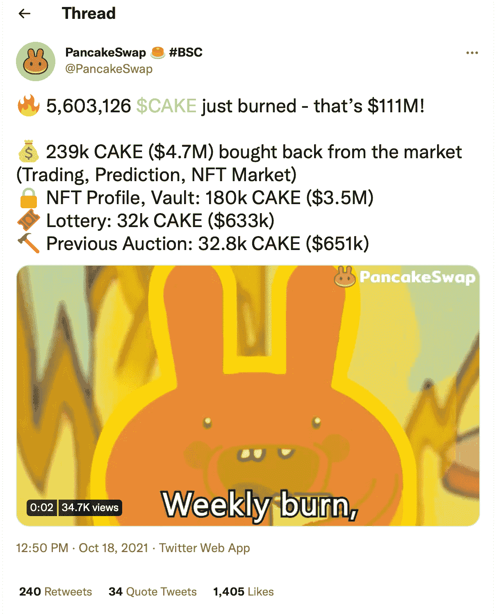

# 什么是硬币燃烧？

> 原文：<https://medium.com/coinmonks/what-is-coin-burning-e9d3b6bd5895?source=collection_archive---------61----------------------->

***这是根据所有者的决定或根据预定义的算法，不可撤销地从流通中收回特定数量的硬币。我们能从中获利吗？让我们一探究竟！***

特殊地址和智能合同可用于烧毁资产。这个过程也可以在交易过程中自动执行。

个人、公司、交易平台、去中心化的应用都可以回笼货币。许多加密货币的算法都包括烧录。

在提取时，使用各种资产。资金可以是托管或分散交易的利润的一部分。交易费用可以烧掉，就像一些加密货币一样。还有一个 PoB 共识机制，要求从流通中收回一些验证者的资产。

例如，这个过程被用来创造通货紧缩的货币。硬币燃烧可用于在资产所有者之间分配利润。它也是一个执行某些功能的工具，例如减少网络负载、防止垃圾邮件以及实现特殊的共识机制。

# **硬币燃烧的过程是怎样的？**

如果硬币被转移到的地址没有私人钥匙，硬币就会被烧掉。您可以将资金发送到不正确的或专门生成的地址，这很容易创建。

焚烧硬币的地址可以在各种信息资源上找到。他们存在于以太坊[比特币网络](https://bitcointalk.org/index.php?topic=917913.0)以及其他区块链。

例如，有一个比特币地址*1 bitcoineateraddressdontsendf 59 kue*就用于此目的。它已经积累了大量资金。您可以使用[区块链浏览器查看账户余额和交易详情。](https://www.blockchain.com/btc/address/1BitcoinEaterAddressDontSendf59kuE)

目前还没有一种技术可以让你在一个已知的收件人地址拿到一个私钥。这确保了发送到这些账户的任何硬币都是不可挽回的损失。很多人用这种方法来破坏数字资产。当分析各种区块链时，可以发现相似的地址和燃烧事务。

要销毁现代网络中的资金，应该使用专门的智能合约。在以太坊中，有一个燃烧功能，允许你从流通中移除以太以及各种标准的代币。

焚烧时，必须说明从流通中取出的硬币数量。如果用户的余额中有足够的资金，智能合约将阻止指定数量的令牌，永远销毁它们。

可以在[以太扫描](https://etherscan.io/tx/0xbf97244cf0c5709e0dd36e37bacb994f95c245aaf20a279595b5371ff592f4b0)上查看其中一个操作的详细信息。交易数据包含从流通中收回的硬币的信息(在本例中是 BNB)。

点击*解码输入数据*后可以看到更多信息:

这个数字有 18 位小数，表明有 1，623，818 BNB 被烧毁。智能合同的执行确保了这些资产不再流通。

在某些情况下，硬币燃烧内置于项目或加密货币的算法中。回笼是转移资产时的附加操作。交易费一般都是烧的(部分或全部)。

矿工也可以通过使用特殊的软件使硬币退出流通。在这种情况下，矿商在确认区块时应拒绝收取交易费。如果有关向采矿者转移资金的信息没有输入区块链，任何人都无法获得这些资产。

[Slimcoin](https://slimcoin.info/) 项目是第一批实现防烧共识机制的项目之一。该算法要求矿工将硬币发送到地址进行焚烧。事务的结果是一个特殊的散列，允许您形成 PoB 块。它们与工作证明(power)块交替出现。烧焦的硬币最终会“[分解](https://slimcoin.info/whitepaperSLM.pdf)”(腐烂)。从技术上讲，这是通过采用一个乘数来实现的，该乘数与从流通中取出的硬币数量以及从那时起已经过去的时间量成比例。例如，在 1000 天内，价值 60 个硬币的燃烧交易的乘数将增加两倍。当在指定时间后销毁 20 个令牌时，会获得相同的结果。从第一笔交易开始，已经有 40 枚硬币“分解”了

生成 PoW 块的可能性与消耗的计算能力成比例。像工作证明算法一样，找到 PoB 区块的概率与花费(烧掉)的硬币数量成正比。该算法使您能够拒绝购买计算设备，以换取更大的利益。作为交换，可以在不进行任何资本投资的情况下，通过焚烧硬币在未来获得高额收入。

# 烧的资金从哪里来？

燃烧的资产由所有者自愿退出流通。如果令牌的销毁内置于项目的算法中，开发人员会提前警告您。这些信息通常可以在白皮书中找到。因此，用户可以拒绝使用刻录令牌的项目(包括作为已付佣金的一部分)。

所有者通过执行燃烧(公开或隐藏)来实现特定的目标。可以披露资金来源以达到预期的效果。

项目可以烧掉一部分自己的收入。该方案被许多加密货币交易所用来以市场价值购买硬币。此类操作旨在增加对项目本机令牌的需求。硬币购买后会被烧掉。属于交易平台的资金退出流通是赎回的一种替代方式。

燃烧时总供应量减少。如果需求持续或不断增长，这对资产的价值有积极的影响。

燃烧时，总供应量减少。如果需求持续或不断增长，这对资产的价值有积极的影响。

烧录用于从各种平台、加密交换和其他项目的流通中移除佣金。【2021 年 8 月，以太坊网络上发生了伦敦硬分叉。他的创新之一是 [EIP-1559](https://eips.ethereum.org/EIPS/eip-1559) ，其中涉及燃烧部分佣金。因此，正在为 ETH 成为通货紧缩的加密货币创造有利条件。

随着 EIP-1559 的激活，引入了基本佣金(基本费用)，其根据特定算法而变化，并且对于每个区块而变化。即使在网络高度拥塞的时候，拥塞的程度也是可以预测和提前知道的。这防止了相邻区块的交易费用相差很大的情况。在当前的实现中，基本佣金完全被烧掉了。

除此之外还有一笔额外的优先权费。它赋予发送方确认交易的主要权限。矿工同时获得佣金和区块奖励。

Source: [Ultra Sound Money](https://ultrasound.money)

根据网络负载，总 ETH 供应量可能会减少或增加。它的动态变化可以使用[超声波跟踪。同时可能出现通缩块，为此基础佣金会超过优先费和块奖励。在这种情况下，花费的钱比释放的钱多。紧缩块与增加的网络负载(大量事务)相关联。使用](http://ultrasound.money/)[通货紧缩区块](https://carbono.com/deflationary-blocks/)互联网资源可以找到详细的分析。

燃烧佣金可用于实现各种目标，包括网络上的垃圾邮件保护。交易费在这种情况下部分或全部烧掉。类似的机制也在[雪崩](https://www.avax.network/)、[纹波](https://ripple.com/)等项目中实现。

在 ICO 期间， [Neblio](https://nebl.io/) 项目使用了焚烧。该操作允许销毁初次销售期间无人认领的[硬币。](https://bitcointalk.org/index.php?topic=2048414.0)

# **哪些项目定期烧币？**

币安平台进行硬币燃烧。[白皮书](https://www.exodus.com/assets/docs/binance-coin-whitepaper.pdf)计划将原生 BNB 代币退出流通，使用该代币在指定时期内利润的 20%。燃烧一直持续到总供应量减少到 1 亿枚硬币。

代币退出流通在平台上[公布和覆盖。最初，硬币在以太坊网络上被销毁，其数量是根据现货交易量计算的。BNB 目前正在币安链中燃烧。](https://www.binance.com/en/support/announcement)

平台的发展带来了新的收入来源。烧掉的资金量目前是根据总交易量来计算的。开发人员还提议对币安智能链进行增强，像以太坊一样，包括燃烧一部分交易费。

iFinex 旗下的 Bitfinex 交易所也在回收流通中的硬币。**2019 年**管理公司发行了 UNUS SED LEO(狮子座)token，其体积达 10 亿枚硬币。根据[白皮书](https://www.bitfinex.com/wp-2019-05.pdf)，iFinex 打算每月赎回和焚烧 LEO 代币，为此目的分配总收入的 27%以上。公司允许你[实时监控硬币退出流通](https://leo.bitfinex.com/)。

[PancakeSwap](/sunflowercorporation/what-is-pancakeswap-here-is-how-to-start-using-it-538b80268e2b) 非托管平台也定期烧币。来自不同来源的蛋糕代币被收回流通。

Source: [Twitter](https://twitter.com/pancakeswap/status/1450036514633646082)

各种项目定期焚烧硬币，提供这些事件的详细信息。您可以通过执行有针对性的搜索来使用其中一个加密货币日历，以了解硬币的计划销毁。例如，最新信息由 [Coindar](https://coindar.org/ru/) 服务提供(当选择了 burning 标签时)。

# **焚烧如何影响资产的价值？**

根据设定的目标和用于焚烧硬币的算法，这种操作可能会对资产的短期和长期价格产生不同的影响。

最大的影响来自交易所和其他项目，它们用一部分收入在市场上购买一项资产，然后摧毁它。价格与供求平衡的变化密切相关。因此，定期购买硬币会刺激价值增长。

在购买或消耗大量资金的过程中，资产比率可能会突然增加。从长远来看，这些行动可以让你产生额外的价格增长。类似于货币干预，这类事件会对市场产生影响。

一些项目将大部分资金放在本地令牌中。他们可以通过焚烧可获得的硬币来使用一部分利润。与此同时，总供应量下降，但你不必购买代币。这些行动产生了积极的新闻报道，但与硬币回购相比，它们的影响要小得多。尽管如此，供应量的减少会导致价格上涨。

电力加密货币的运作包括通过大宗奖励和交易费来奖励矿工。佣金或验证人的资金不能单独考虑。在这些条件下，燃烧与排放同时发生。因此，硬币的数量可能会波动。也有可能被烧掉的代币过一段时间后会重新流入市场。

这种行为对成本有间接影响。一般来说，流通中的硬币数量大幅减少是个好消息，因为这有助于资产的受欢迎程度和价值的增加。要理解这种情况，我们必须考察供给变化的动态以及通缩区间的数量。这些信息可以通过使用专门的分析资源获得。

> 你对硬币燃烧有什么想法？
> 
> 在下面的评论中写下哪些话题更吸引你去阅读

> 交易新手？试试[密码交易机器人](/coinmonks/crypto-trading-bot-c2ffce8acb2a)或[复制交易](/coinmonks/top-10-crypto-copy-trading-platforms-for-beginners-d0c37c7d698c)