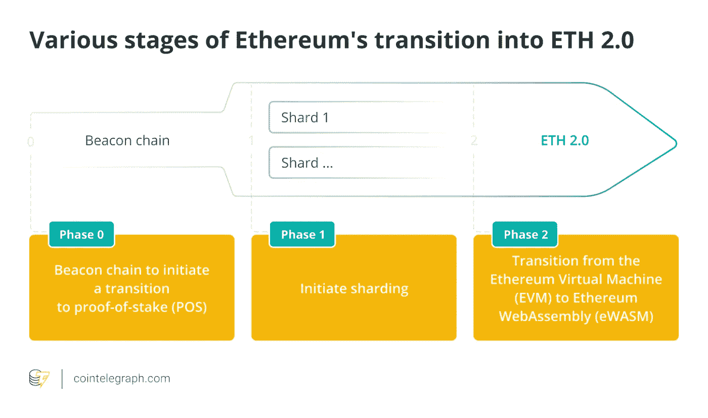

# 以太网带来的东西能让你成为百万富翁

> 原文：<https://medium.com/coinmonks/what-is-coming-for-etherum-can-make-a-millionaire-8e5a4bf98bed?source=collection_archive---------0----------------------->

如果你这次能行动

以太网正在从工作验证(PoW)走向利益验证(PoS)。2022 年 9 月 20 日，宣布进行最终合并。如果没有不可预见的情况，以太坊将从以太坊虚拟机(EVM)过渡到 WebAssembly (eWASM)。

以太坊跃迁旅程的第 0 阶段开始于 2020 年 12 月 1 日，伴随着 Beacon Chain 的推出。第一阶段经历了一个失败的日期，但在 2022 年 6 月完成，Sepolia 测试网络信标。

合并案的最后审判是在戈利网络上进行的。

作为投资者，这次合并对你意味着什么？

这种合并意味着以太坊将变得稀缺。经济学 101 说，如果对一件商品的需求很高，而供应很低，那么价格就会上涨。

让我进一步解释一下，

这次合并的非官方名称是“三倍减半”

以太坊社区称之为“三减半”，因为它不像比特币每 4 年减半一次，总是将供应减半。以太坊合并会带来 90%的降价，相当于 3 个比特币减半。

我们来看看数字。

根据 PoW 模型，以太坊每天发行大约 13500 个 Eth 这大约是每年 Eth 总供应量的 4.3%。

然而，PoS 发行模式是基于 Eth 在网络中的活跃程度。目前的预测是，当合并发生时，发行额将下降 0.3%至 0.4%。

发行量的减少和赌注机会的增加将减少流通中的 Eth，并带来价值的增加。

**我给你的建议**

投资时要考虑长远。不要买短期炒作。

这一合并传闻已经产生了预期的结果，Eth 价格上涨。当最终合并发生时，它可能会进一步推动价格上涨，或降低价格。但可以肯定的是，在 4 到 5 年内，Eth 将实现令人难以置信的盈利。

> 交易新手？试试[密码交易机器人](/coinmonks/crypto-trading-bot-c2ffce8acb2a)或者[复制交易](/coinmonks/top-10-crypto-copy-trading-platforms-for-beginners-d0c37c7d698c)