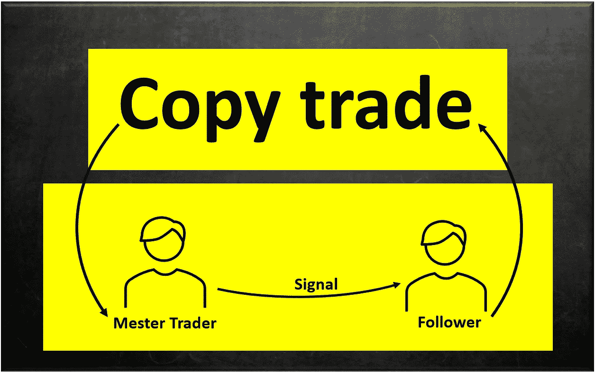

# 什么是复制交易，它是如何工作的？

> 原文：<https://medium.com/coinmonks/what-is-copy-trading-and-how-is-it-work-6911f3a1c1b9?source=collection_archive---------40----------------------->

在这篇文章中，我将谈论“复制交易”的方法。现在我们走吧。

加密货币市场是一个高风险的市场，必须特别小心谨慎地处理。有了这些定义，这个市场还有新手的一席之地吗？尽管风险很高，但不经过培训就能踏入其中吗？肯定是的。在这个视频中，我们将告诉你如何通过一个简单的副本加入这个市场的专业人士。

> "解决办法是复制交易."

复制交易的目的是让新手交易者拥有和你复制交易时一样的交易。

***复制交易是怎么做的？***

作为一个没有足够时间学习专业的新手，你可以跟着专业人士走，简单点说就是跟着他们走，直到学会市场的机制。这就是所谓的复制交易。

要开始，你只需要找到一个支持这一功能的经纪人或交易所。接下来，在所有成功的交易者中选择最好的，把你的资本的一定比例留给他。在这个阶段，系统自动为你复制他的所有动作和步骤。

***如何选择专业？***

当你打算追随一个人的时候，在投资之类的事情上，最好是选择那个特别用心和执念的领头人。下面，我们介绍优秀交易者的一些重要和有效的特征，帮助你选择。

*   活动历史

记住，你的首席交易员在这个金融市场有足够的经验。

*   库存:

如果交易者的策略是盈利的，交易者自己会投入大量的资本。所以，在选择交易者的时候，要注意他的平衡性。

*   损益金额:

人的获利金额是选择的重要因素，但不应该是唯一因素，而且无论如何，你都是为了获利而进入这个领域的，所以一定要查看所选交易者的获利金额。

*   份数:

跟踪交易者的人越多，这个人就越值得信任。

***复制交易的优缺点***

当然，这个市场上的每种方法都有自己的优点和缺点。作为一个新人，你应该小心翼翼，清楚它的优缺点。

# 优势

*   盈利能力:

如果你选择了一个具备优秀交易者所有特征的优秀交易者，你也会有不错的利润率。

*   简单舒适:

考虑一下只需按一个键就能轻松达成大笔交易。

*   你将很快进入交易市场:

交易是一门科学。要进入这个领域，你需要接受训练；所以你要花很多时间去学习和测试。作为复制交易者，你节省时间，换句话说，跳过这一步。

*   面向未来的实践:

交易者从不和别人分享自己的优势。但是通过注意购买点和准确性，你或多或少可以了解他的方法。

*   利用专业人员的经验:

这样，你可以利用你选择的交易者的经验，向他提问。当然，记住交易者不需要回应。

*   账户控制:

作为账户所有人，你可以在所有阶段控制和管理你的账户，交易者无权访问你的账户。

*   损失限额和资本冲突的明确性:

你可以在一开始就指定你的账户资金中有多少会被复制。为此，如果发生损失，您可以防止您的整个财产的损失。

*   选择的多样性:

你可以自由选择交易者及其策略。你面对的是一个交易者的名单，当然他们每个人都有启动的条件，在连接到他们之前你必须完整阅读。

*   一条清晰的道路:

当你进入一个交易所，打算选择一个交易者，这个人的所有信息、路线、历史都会显示给你。

# 不足之处

除了上面提到的所有优点，这种方法也有你要注意的缺点。

*   没有人是没有缺点的:

任何经验和技术水平的交易者都可能犯错。由于这个错误，你也将失去作为一个复制交易者。

*   策略是一个秘密:

Guide Trader 从不披露其交易策略，您也不会被告知已完成和正在进行的确切工作。

*   限制:

在收益部分，据说你可以将一定比例的资金投入到游戏中。同样的情况，连同它的优点，也可能是一个很大的缺点；因为在某些情况下，交易者打算投入的金额很大，但是你的资金限额不够。

# 拷贝交易的类型

复制交易有手动和自动两种模式，我们将在下面讨论。

*   自动地

在这种情况下，你把你的工作放在自动驾驶仪。你不需要再做任何事了。整个过程是自动完成的。

*   指南

在这种方法中，你必须手动输入信号，没有什么是自动完成的，你可以在任何阶段停止投资。

> 交易新手？试试[加密交易机器人](/coinmonks/crypto-trading-bot-c2ffce8acb2a)或者[复制交易](/coinmonks/top-10-crypto-copy-trading-platforms-for-beginners-d0c37c7d698c)