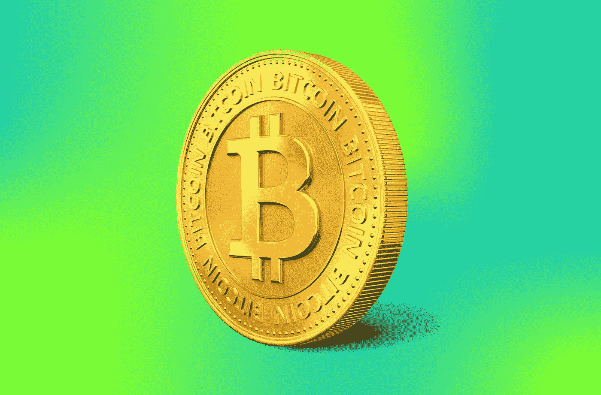

# 什么是加密货币？

> 原文：<https://medium.com/coinmonks/what-is-cryptocurrency-4a0b91d87fb8?source=collection_archive---------35----------------------->

Like, Comment & Subscribe

加密货币是一种数字货币，这意味着它没有物理纸币和硬币。它以数据的形式存在于你的电脑或智能手机上，可以通过互联网传输。这使得加密货币分散化，因此没有银行或政府等中介参与交易。加密货币也经过加密，以确保在线交易的安全性和隐私性。

# 什么是加密货币？

加密货币是一种不受中央机构控制的数字货币。相反，它是分散的，由区块链技术驱动。没有银行参与加密货币交易，也不受任何政府监管。

这意味着在你和你打交道的人或公司之间没有中间人，这意味着比传统金融机构提供的费用更少，麻烦更少。加密货币还提供匿名功能；如果你想在交易时保持匿名，使用加密货币很容易做到！

# 如何投资加密货币？

投资加密货币有几种方式。最常见的方式是购买，但你也可以将一种加密货币换成另一种。

通过比特币基地或币安等交易所购买加密货币:

*   你需要在这些交易所中的一个设立一个账户，并链接你的银行账户或信用卡。通过平台或货币兑换服务进行的购买也可能会收取费用。您支付的金额将取决于转账金额、使用的支付方式类型以及双方居住的国家(以及其他因素)。
*   在通过提供证明你超过 18 岁的证明和证明你住在银行账户开户地址的证明等文件来验证你的身份后，你将有权查看他们的订单簿，这样当有人出售价值 10 美元的比特币时，他们将在接受或拒绝他们的报价之前看到他们以什么价位出售了多少单位。

# 加密货币与法定货币

加密货币和法定货币是两种可以用来购买商品和服务的货币。虽然两者都被认为是货币类型，但两者之间有显著的差异。

法定货币是一种政府宣布为法定货币的货币，但它没有实物商品作为支持。法定货币的价值来源于供求关系，而不是黄金或其他贵金属的价值。至少从公元前 6 世纪开始，法定货币就一直在使用，当时吕底亚首次发行了由银金矿制成的硬币，银金矿是一种天然存在的金银合金。

自 2009 年以来，由于其分散性，加密货币被开发为法定货币的替代选择；它们允许用户转移资金，而不需要通过传统的中间人，如银行或贝宝(收取费用)。加密货币还提供了比传统形式更多的匿名性，因为用户在使用这些数字资产在线购物时，可能只需要互联网连接，而不是出示他们的物理身份证。

# 如何保护和访问您的加密货币？

所以，你终于决定开始买卖加密货币了。对你有好处！有几种方法可以储存你的数字现金，这取决于安全对你来说有多重要。

首先，钱包是存储加密货币的地方。加密货币钱包可以在电脑或移动设备上找到(桌面钱包)，可以通过应用商店下载(移动钱包)，作为硬件设备，如 USB 驱动器或外部硬盘驱动器(硬件钱包)，或从互联网打印出来的纸质文档(纸质钱包)，甚至可以存储在加密货币交易所，如果它支持多种类型的加密货币(交易所钱包)。

# 你投资的风险是什么，你如何减轻它们？

如果你是加密货币的新手，保护你的投资的最好方法是在进行任何投资之前进行彻底的研究并制定计划。以下提示可以帮助您保持安全:

*   投资前研究加密货币背后的技术。了解它的优势和劣势，以及它与市场上其他加密货币的不同之处。如果可能的话，找出是谁开发的，以及他们是否有成功或不太成功的项目经验。
*   如果这种货币变得足够受欢迎，可以在交易所上市，找出它将在哪里交易。这对于了解持有你的硬币而不是在 ICO 阶段(首次发行硬币)购买后立即出售它们可能有多少利润潜力是至关重要的。一般来说，交易所比点对点交易更安全，因为它们使用托管服务来保护买家免受试图出售自己制造的假币的欺诈者的伤害。"

# 了解投资的风险、条件和协议。

既然你已经意识到投资的风险、条件和协议，是时候了解如何保护自己了。最重要的是要小心。永远记住:如果价格上涨。如果价格下降呢？嗯…你可以想出当一辆汽车从飞机上掉到另一辆汽车上会发生什么！

*   通过在线和离线匿名保护您的身份
*   经常备份你的电脑或手机
*   留意谁能接触到你的电脑或手机(你的父母？)
*   确保其他人也有访问权限，以防万一！

# 结论

加密货币和区块链技术有许多不同的方面，我们在本文中没有涉及。我的目标是给你一个概述，它是什么，为什么人们投资它，有什么风险，你如何保护自己免受这些风险。

> 交易新手？试试[加密交易机器人](/coinmonks/crypto-trading-bot-c2ffce8acb2a)或者[复制交易](/coinmonks/top-10-crypto-copy-trading-platforms-for-beginners-d0c37c7d698c)