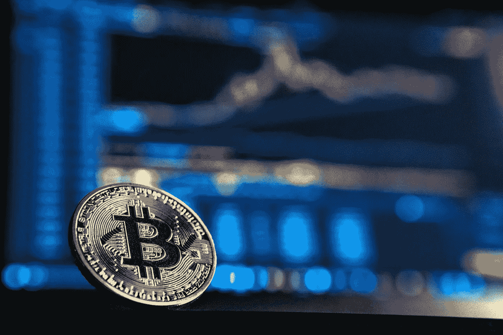

# 什么是加密货币？初学者指南

> 原文：<https://medium.com/coinmonks/what-is-cryptocurrency-a-beginners-guide-8fac78273459?source=collection_archive---------11----------------------->

Photo by [Kanchanara](https://unsplash.com/@kanchanara?utm_source=unsplash&utm_medium=referral&utm_content=creditCopyText) on [Unsplash](https://unsplash.com/s/photos/cryptocurrency?utm_source=unsplash&utm_medium=referral&utm_content=creditCopyText)

你可能偶然发现了流行的加密货币，如比特币、以太坊等。

作为在线交易和支付的替代方式，它们正变得越来越受欢迎。

了解这项技术的工作原理将有助于您理解其背后的宣传。

首先让我们了解一下加密货币是什么意思。

# 什么是加密货币？

加密货币，通常被称为密码或加密货币，是一种货币形式。

加密货币是一种数字或虚拟货币，它没有任何存在于现实世界中的部分。

这些加密货币运行在一种叫做区块链的技术上。用于验证和保护交易的分散式分类帐。

它还使用加密技术来保护区块链网络。

它们不需要像银行这样的中央机构充当中介。

运筹学

加密货币是一种在线支付系统，运行在一个分散的平台上。它不需要银行来监管。它还受到一种叫做密码术的技术的保护。

[据 Investopedia 报道，加密技术有多种用途](https://www.investopedia.com/tech/explaining-crypto-cryptocurrency/#:~:text=Cryptography%20is%20the%20mathematical%20and,the%20purpose%20of%20%22mining.%22)。安全性、验证、控制等。

> 有趣的事实:创造的第一种加密货币是比特币。成立于 2009 年的比特币仍然是最相关的加密货币。
> 
> 专家们将这种加密货币命名为“数字黄金”。

# 加密货币是如何工作的？

让我们从基层开始。每种加密货币都运行在一种叫做**区块链**的技术上。

区块链是包含在计算机网络的节点之间共享的交易列表的分布式分类帐。

在比特币的区块链上，任何人都可以查看交易记录。这让区块链更加安全。

*加密货币也被称为数字硬币。*

为了在区块链上创造新的硬币，一种叫做采矿的流行方法开始发挥作用。[挖掘](https://www.simplilearn.com/bitcoin-mining-explained-article)是创造新的加密货币和验证交易的过程。

参与这一过程的网络是矿工。

矿工是一个巨大的计算机节点网络，可以解决复杂的数学加密问题。他们解决这些加密问题，以验证区块链上的交易。

第一个验证交易的矿工以奖励的形式获得新的加密货币。

由于采矿产生了新的密码，矿工们可以保留它们作为奖励。

# 加密货币的例子

有数千种加密货币服务于不同的目的。让我们来看看其中的一些。

Photo by [André François McKenzie](https://unsplash.com/@silverhousehd?utm_source=unsplash&utm_medium=referral&utm_content=creditCopyText) on [Unsplash](https://unsplash.com/s/photos/cryptocurrency?utm_source=unsplash&utm_medium=referral&utm_content=creditCopyText)

# [比特币](https://bitcoin.org/)

正如你在上面看到的，这是第一种加密货币。一个名叫中本聪的匿名个人或实体创立了比特币。

这种加密货币的唯一目的是充当点对点支付系统。

> 有趣的事实:除了比特币，任何其他数字货币都是替代货币。它意味着比特币的替代货币。

# [以太坊](https://www.ethereum.org/)

以太坊是世界上第一个可编程的区块链。它之所以流行，是因为可以在它的基础上构建分散的应用程序。

这为另一波新技术打开了大门。

# [系绳](https://tether.to/)

这是一枚稳定的硬币。稳定币是一种与法定货币挂钩的加密货币，在这种情况下，法定货币是美元。

Stablecoins 对冲加密货币持有者对加密货币波动的风险。

这种稳定的货币与美元的比率为 1:1。

> 法定货币是传统货币的另一种说法。法定货币的例子有美元、欧元、NGN 等。

# [币安币](https://www.binance.com/en)

币安币是币安交易平台的原生加密货币。这是使用币安交易平台的费用。

它也是推动币安分散交易的费用。

# [Dogecoin (DOGE)](https://dogecoin.com/)

Dogecoin 是一个迷因币。创始人创造了这个硬币作为一个笑话，取笑加密市场的疯狂投机。

一些公司接受这种加密货币作为支付方式。

# 如何购买加密货币？

既然你已经了解了什么是加密货币，那我们就来看看如何购买加密货币。

你可以从加密货币交易所或经纪人那里购买加密货币。

# 什么是加密货币交易所？

加密货币交易所(CEXs)是一种加密货币交易所，可以方便用户进行交易。

CEX 通过维护订单簿来做到这一点，订单簿是交易所用户发布的买入和卖出订单的集合。

订单是用户提出的购买和出售特定数量的特定加密货币的请求。交易所使用软件来匹配这些买卖订单并执行它们。

例如，如果你下了 100 美元的买入订单，CEX 的软件会将你的订单与其他人 100 美元的卖出订单进行匹配。

一些已知的集中交易所有[比特币基地](http://coinbase.com/)、[北海巨妖](https://www.kraken.com/)、[币安](https://www.binance.com/en)和[双子星](https://www.gemini.com/)。

# 什么是加密货币经纪人？

加密货币经纪人是帮助初学者轻松进入加密之旅的个人或公司。它们作为一个平台，帮助初学者购买比特币、以太坊和其他加密货币。

虽然他们提供了一个易于使用的界面，但他们的费用比 CEXs 高得多。

当你和经纪人打交道时，你必须小心。

一些值得信赖的加密经纪人包括 Robinhood、Webull 和 eToro。

# 如何存储加密货币？

买了密码后，你应该把它们存放在安全的地方。这就是加密钱包的用武之地。

> 有趣的事实:你的加密货币并不存储在你的加密钱包里。这些加密钱包只给你私钥，这证明你在区块链上拥有一定数量的加密。
> 
> 加密货币总是存在于区块链。

# 什么是加密钱包？

加密钱包是帮助您与区块链交互的私钥。他们帮助你购买、发送、支付费用和交易。

一些中央交易所为你提供钱包服务，但不是每个交易所都这样做。

有两种类型的钱包，它们是热和冷钱包。

**热门钱包**:这是一款始终联网的钱包。它们让你能够促进交易。当你得到一个热门钱包时，你将获得[公钥和私钥](https://www.appviewx.com/education-center/what-are-public-and-private-keys/)。

热门钱包的例子包括[元掩码](https://metamask.io/)和[信任钱包](https://trustwallet.com/)。

**冷钱包**:又称硬件钱包。他们是热门钱包的对立面；他们离线工作。这样做是为了最大限度地提高加密货币投资的安全性。

冷钱包的例子包括[总账](https://www.ledger.com/)和 [Trezor](https://trezor.io/) 。

Photo by [Kanchanara](https://unsplash.com/@kanchanara?utm_source=unsplash&utm_medium=referral&utm_content=creditCopyText) on [Unsplash](https://unsplash.com/s/photos/cryptocurrency?utm_source=unsplash&utm_medium=referral&utm_content=creditCopyText)

# 用 crypto 可以买到什么？

第一种加密货币比特币的唯一目的是成为一种用于日常交易的技术。

从 2009 年至今，我们已经看到大公司大量采用这项技术。

这些公司已经将比特币作为支付手段之一。

这还不是结束。更多的机构正计划以我们无法想象的方式更好地利用这项技术。

*   几家公司，如微软、美国电话电报公司和易贝，都接受比特币。
*   新闻媒体接受加密货币来支付订阅费和其他服务。
*   奢侈品零售商已经开始接受加密作为一种支付方式。BitDials 就是其中之一。他们提供劳力士和其他昂贵的珠宝来换取加密货币。

你可以用加密货币购买的其他一些东西包括汽车、科技产品和保险。

# 加密货币是安全的投资吗？

加密货币市场往往比任何其他市场都更不稳定。市场相当不稳定。

这带来了人们对它是否是一种安全投资的不同看法。

虽然加密货币比我们的法定货币更安全，但它们仍然有风险。

大多数专家建议你只投资你能承受损失的钱。此外，在购买任何加密货币之前，你应该做足够的研究。

# 结论

加密货币是一个新兴的空间，你应该明白。

除了了解加密货币是怎么回事，还有更多东西需要了解。

当涉及到加密时，会有风险和骗局。

不要太担心它。我将很快写下它。

如果你喜欢阅读这篇关于加密货币的文章，请关注我。

别忘了给我鼓掌。

你有什么问题吗？把它们放到评论区。

> 交易新手？试试[加密交易机器人](/coinmonks/crypto-trading-bot-c2ffce8acb2a)或者[复制交易](/coinmonks/top-10-crypto-copy-trading-platforms-for-beginners-d0c37c7d698c)