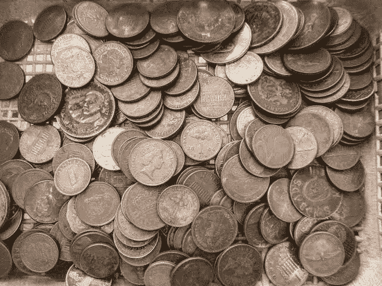
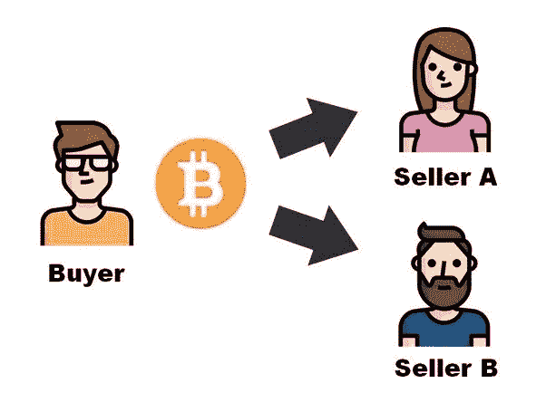
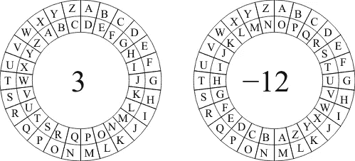
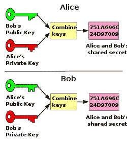
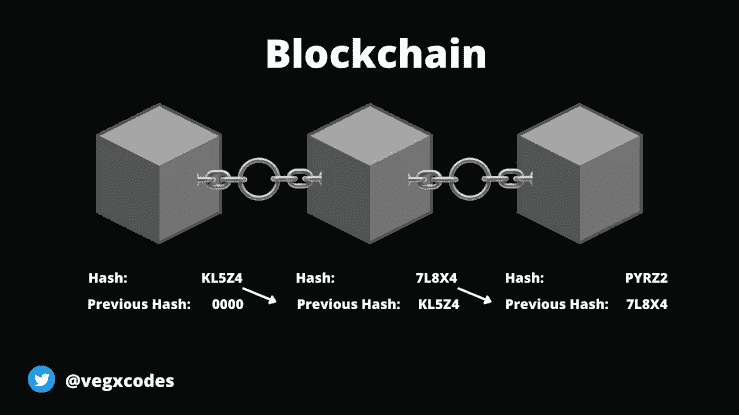
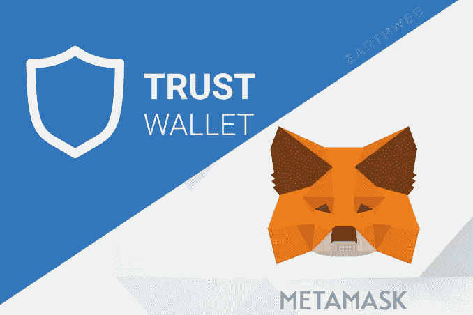
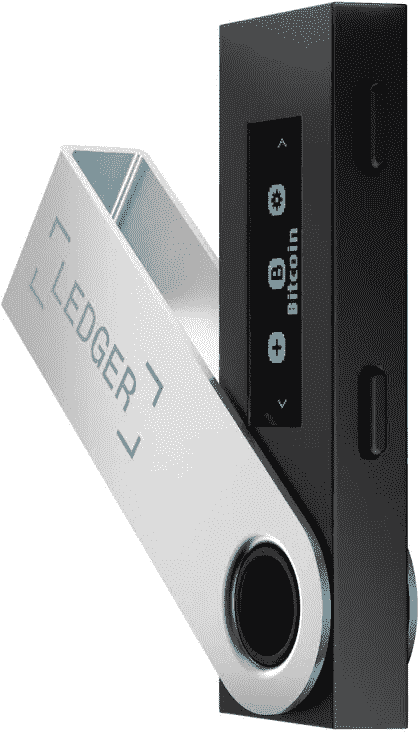
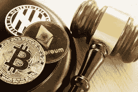

# 什么是加密货币？你只需要知道

> 原文：<https://medium.com/coinmonks/what-is-cryptocurrency-all-you-need-to-know-about-cryptocurrencies-9746d59f82?source=collection_archive---------11----------------------->

在每个角落，每个人都在谈论加密货币，吹嘘自己拥有这样或那样的硬币，还有对此一无所知的“你”。

但是，你猜怎么着？我们都曾经是新人！

这就是为什么我写这篇文章让你了解加密货币是怎么回事。所以跟着我一起探索这个秘密。

# **加密货币的历史**



Image of olden days currency

加密货币的起源可以追溯到 20 世纪 80 年代，当时人类寻找纸币的替代品。在计算机科学家和神秘英雄**中本聪**建造了**区块链**之后，流行的加密货币**比特币**于 2009 年诞生。区块链的建立是为了建立一个将控制权从政府手中转移给人民的体系。


The Block Chain

这种区块链技术使用加密哈希来记录、存储和保护交易。正是在这个前提下，第一种成功的数字货币诞生了。然而，在比特币之前，其他数字货币已经存在，但它们无法解决重复支出的问题。

# **什么是双倍消费？**



An example of double spending

当交易者花同样的钱两次时，就发生了双重花费。

想象一下:假设我想给你寄 5 美元，而我只有 5 美元，我把它寄给你，同时也把同样的 5 美元寄给另一个读者。这是早期数字货币面临的挑战。

然而，随着区块链技术的到位，它将扫描交易，并获得我的钱包里有多少钱，我想转移多少钱，以及交易后我会有提醒的信息。如果我在付给你 5 美元后剩下 0 美元，它将取消任何后续交易。

现在让我们详细讨论一下这种货币，到底是什么让加密货币不同于货币？

# **什么是加密货币？**


Few of the most popular cryptocurrencies in existence

不要让这个复杂的词吓到你。加密货币这个术语简单来说就是指数字货币。但是我说的“数字货币”到底是什么意思呢？

加密货币(Cryptocurrency)是一种仅以电子形式存在的货币，不能被处理、看到或打印。它是一种数字的**分散的**货币，用于支付，并通过加密哈希进行保护。

# **什么是去中心化？**


A network of people operating the network

所有法定货币，如奈拉、美元和欧元，都由一个被称为政府的中央集权实体管理。这种货币由他们发行和监管，这意味着所有法定货币都是集中的。

然而，去中心化是中心化的对立面，是加密货币建立的基础。

某天早上，有人醒来后决定，“不，我不想让政府控制我的血汗钱，决定我用它做什么，或者它是如何被创造出来的。我想完全控制我的钱。”

在此基础上，权力下放的概念出现了，其目标是将权力从政府手中拿走，交给普通人。

在这里，加密货币基于一种叫做区块链技术的分散技术运行。这项技术处理和存储加密交易，完全控制网络上由人设置的计算机。

# **什么是密码学？**



The Julius Caesar's Cryptographic method of encoding and decoding

这种方法可以追溯到历史上，并在公元前 1900 年凯撒大帝统治时期使用。在这个时代，远距离交流的唯一方式是通过书面笔记。然而，密码术的方法被用来编码和解码具有特殊数字(比如 2)的信息中的字母。双方(发送方和接收方)都知道这个号码。

比如 A 先生同意 B 先生的编解码数为“2”。

A 先生在表格中发送了一条文本

` ``" DJCC·DPMK·拉穆尔 RMUL "

在联系 B 先生时，他的解密号码是 2，他向前读了两格。

` ```现在就离开这里``

这是一种非常有效的传达敏感和重要信息的方法。

让我们回到加密货币，为什么我们需要对信息进行编码？我们在编码什么信息？


An example of transaction encryption

加密货币略有不同，在这里，我们对交易而不是消息进行编码。

在银行系统中，有适当的人员来监控交易并验证没有账户被泄露。



An example of encoding in cryptocurrency

加密货币不可能做到这一点，因为它建立在一个分散的网络上。这突出了加密的必要性，但是是以一种更高级的方式。这种加密技术由哈希函数创建的二进制数组成。这种被称为“SHA-256”的哈希表获取交易信息，并将其编码为 0 和 1，使黑客很难修改。

# **加密货币安全吗？**


Block chain Security

是啊！是啊！但是没有！…听我说完

区块链技术与执行验证任务的称为节点的计算机协同工作。当一批交易被送到网络时，这些计算机扫描交易以确保其真实性；证明这种技术依赖于计算机的完整性来验证交易。

根据中本聪写的白皮书(关于区块链的信息)，他指出这个系统有一个缺陷:如果超过 51%的计算机伪造交易，交易将被改变。

# **区块链如何工作**

区块链原理适用于最长的区块链。我什么意思？

块是保存网络上特定数量的事务的容器；例如，每个块 500 个事务。


Blocks of transactions

第一个完成的块(块 1)将由前述 SHA-256 算法产生的唯一数字保护。让我们假设唯一的数字是“00000111”

下一个块(块 2)完成后，块 2 的散列值将通过与 SHA-256 相同的过程生成，在这种情况下，我们假设为“00000001111”

对于要标记为完成的块 2，块 1 的散列号“00000111”和块 2 的散列号“0000001111”将被标记在块 2 上。



A perfect illustration of how it works

这个循环继续进行，下一个块采用前一个块的号码和它自己的散列号码；这整个过程叫做**挖掘**。

因此，对于要更改的块，它必须为块(1)生成新的哈希，在块(2)的下一个哈希中更改标记的块(1)哈希，然后对块 3 重复相同的过程，直到黑客遇到最长的可信块。

单独完成这个过程是非常不可能的，因为区块链只信任最长的链。随着更多计算机的加入，更多的块会以更快的速度产生，这使得黑客更难赶上。

但是，如果 51%的计算机决定欺骗区块链，它们将能够更快地遇到可信链。但是随着越来越多的计算机加入网络，这种可能性仍然很小，因此很难实现。

# **加密货币的使用**


Bitcoin as a payment method

加密货币主要用于支付。用户使用比特币或其他加密货币进行购物和支付。然而，由于其易变性，这还不是一种普遍接受的支付方式。在不久的将来，加密货币将会有更多的使用案例。

# **加密货币存放在哪里？**

加密货币存放在钱包里，就像货币和黄金存放在银行里一样。

有两种类型的钱包:

*   **热门钱包**



Trust wallet and Metamask

这是一个在线钱包，存在于应用程序或网站上。此钱包使用恢复短语和私钥来帮助保护您的资金。例如信任钱包和元掩码

注意:不要向任何人透露您的恢复/种子短语或私钥！

*   **冷钱包**



A ledger

这是一种离线钱包，以硬件形式存在于纸张、硬盘或账本上。

**重要信息:**除了比特币之外的任何货币都称为 Altcoin 意味着比特币的替代货币。

# **加密货币的优势**

我从哪里开始，我是如此的 emosh🥺

加密货币终于解放了我们，啊呀！！

让我们开始吧…

*   **匿名**

“没有人认识我；你终于看不见我了！！！！!"

加密货币可以让你的钱包里有 5000 亿美元，而不会被警察或金融机构破门而入。你的身份不明。他们所能看到的只是钱包地址形式的字母，没有名字…哈哈！

*   **分散式**

"再见，银行和他们的年龄规则，和交易限制，tch！"

使用加密货币，你可以在任何年龄开设银行，一天内进行数千笔交易，而且没有人用可疑的望远镜盯着你。没有政府或银行可以没收你的钱，你是自由的！！！

*   **点对点(P2P)**

“嘿柯林斯，我现在在火星上，你能给我的钱包寄 100 个比特币吗，需要贿赂这只恐龙让我清静一下”

当然，把你的钱包地址发给我

就像那样，你可以把钱汇往世界任何地方，而不需要经过银行和本国货币的兑换。平稳！

*   **投资**

"爆炸性新闻:以太坊的价格在过去的 24 小时内上涨了 100%,飙升至 4000 美元."

加密有能力让你一夜之间成为百万富翁。他们有投资的好的一面，就像股票一样，当价格上涨时，他们可以交易以获得未来的回报。

*   **低交易费用，无交易限额**

“什么？1 万美元手续费把 100 万美元转到我表哥的银行，没门！”

加密货币的交易费用不取决于转账金额，而且与银行相比很低，为什么你会满足于如此高的账单呢？

例如，索拉纳发送交易占用不到 1 美元，比特币交易费用无论交易大小都在 20-200 美元不等。并且没有交易限制，大额交易在几分钟内完成，而使用银行则需要数周。

# **加密货币的缺点**

呀！没有恶就不能有善吗？

不管怎样，我们走吧…

*   **骗子和犯罪活动**

而且他们肯定没有遗漏加密货币，tch！骗子向设备发送恶意软件，黑客攻击钱包，窃取资金。对你连接的网站要非常小心，不要放弃你的私钥或种子短语。

*   **钱包丢失**

"弟兄们，看哪，已经完了。"

一旦你丢了钱包——你的种子短语或私钥，或者你的硬盘或账本被破坏了——你将和你的基金吻别。没有适当的恢复系统来检索和取回您的种子短语，因此请确保您的种子短语是安全的。

*   **没有互联网服务**

如果我在沙漠中迷路了怎么办？或者，我被丢在一个不知名的地方，无法使用我的手机或互联网连接，我还能使用我的钱包吗？答案是否定的。没有互联网，加密交易是不可能的，因为它们只能在网上进行。

*   **波动性**

今天:“比特币的价格达到了 7 万美元的历史新高”

明天:“由于对布拉赫交易所的攻击，比特币价格跌至 45000 美元”

这显示了加密货币的不稳定性。虽然其他人建议这是赚快钱的最好方法，但谨慎是非常明智的，因为你可能会在一夜之间失去所有的养老金和一生的积蓄。

*   **环境危害**

一些加密货币通过采矿活动对气候构成了威胁。据说比特币开采和处理交易需要消耗一个国家的全部电力。这对气候有负面影响，因为在采矿活动中有毒的碳气体被释放到大气中。

# **加密货币合法吗？**



Regulations on Cryptocurrencies

加密货币的合法性因国家而异。在尼日利亚，加密货币被禁止，理由是它们是不稳定收入的非法来源，可能导致投资者终身负债。

即使在美国和英国，也对加密货币制定了严格的法律来监管其使用，并防止投资者损失金钱。

然而，俄罗斯和韩国等国家已经张开双臂欢迎加密货币，并期待它成为该国的法定货币。

因此，加密的合法化在不同的国家是不同的。

# **加密货币的未来**

*拿着我的双筒望远镜，展望未来。哈哈…糟糕的笑话。

*清嗓子

比特币的未来非常不确定，但对我来说，这是一个充满希望的未来，我迫不及待地想体验它。未来，在世界任何地方，只需点击我们的手机，几分钟内就可以完成无缝交易。在未来，有创造力的头脑会站出来，用创新的实用工具制造硬币，解决货币体系和其他领域的许多其他痛点。

# **结论**

热烈祝贺——————(*插入你的名字)，因为你刚刚从新手升级为初学者🤩。

更多类似的信息，请关注我，订阅我的电子邮件，如果你喜欢这篇文章，也请鼓掌。

在 Twitter 上关注我: [chizobaonorh_](https://twitter.com/chizobaonorh_?t=A3xOoaCFPZW-tXaufX5V_A&s=09)

LinkedIn:[Chizoba ononlemen](https://www.linkedin.com/in/chizobaononlememen)

> 交易新手？尝试[加密交易机器人](/coinmonks/crypto-trading-bot-c2ffce8acb2a)或[复制交易](/coinmonks/top-10-crypto-copy-trading-platforms-for-beginners-d0c37c7d698c)