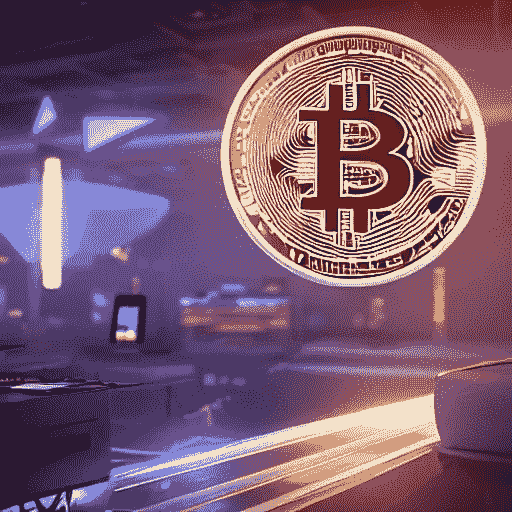

# 什么是加密货币，它是如何工作的？

> 原文：<https://medium.com/coinmonks/what-is-cryptocurrency-and-how-does-it-work-270d846b56b7?source=collection_archive---------44----------------------->

那么什么是加密货币，它是如何工作的？嗯，如果你听说过[加密货币](https://en.wikipedia.org/wiki/Cryptocurrency)，你可能想知道它是什么，它是如何工作的。近年来，加密货币越来越受欢迎，尽管这不是一个容易理解的概念，但它绝对值得了解。在本文中，我们将了解加密货币以及如何使用它。

首先，理解什么是加密货币很重要。加密货币是一种数字或虚拟货币，使用加密技术来确保安全，可用于在线购买商品和服务。加密货币存在于一个被称为区块链的分布式账本上，它以不变的形式记录双方之间的交易。加密货币使用分散系统工作，这意味着它不受政府或银行等任何单一实体的控制。加密货币交易快速、安全、匿名，无需银行等第三方即可完成。

> 交易新手？在[最佳加密交易](/coinmonks/crypto-exchange-dd2f9d6f3769)上尝试[加密交易机器人](/coinmonks/crypto-trading-bot-c2ffce8acb2a)或[复制交易](/coinmonks/top-10-crypto-copy-trading-platforms-for-beginners-d0c37c7d698c)

现在，您已经了解了加密货币的基础知识，让我们看看如何使用它。

# 什么是加密货币？

加密货币是一种数字资产，可以用作交易媒介。它使用加密技术来保证安全，可以直接从一个人发送到另一个人，而不需要银行或金融机构作为中介。比特币是 2009 年创造的第一种加密货币，但自那以后，许多其他加密货币相继问世。加密货币是分散的，这意味着它不受政府或银行等任何单一实体的控制。加密货币交易是安全和匿名的，可以在没有第三方的情况下完成。

加密货币使用区块链技术在分布式账本上存储交易记录，与传统支付方式相比，交易速度更快，成本更低。加密货币也是可分割的，这意味着它可以被分解成更小的单元，以便于交易。加密货币没有任何政府或中央银行的支持，使其成为一种分散的数字货币。

# 加密货币是如何工作的？

加密货币基于区块链技术，本质上是一个分散的数据库，以按时间顺序链接在一起的块记录交易。这种分散意味着没有一个实体控制数据库或其事务。区块链还确保所有事务都是安全和不可变的——一旦记录下来，就不能更改或删除。这使得加密货币成为安全金融交易的理想选择，也有助于防范诈骗或欺诈。

此外，加密货币使用加密技术来防止重复消费和其他欺诈活动。密码术是一种用于保护数据的加密形式，使得黑客难以访问或篡改数据。加密货币交易快速安全，无需银行或信用卡公司等第三方即可完成。加密货币钱包用于存储、发送和接收数字货币，可以使用移动应用程序或计算机程序进行管理。

加密货币由于其安全性、速度和匿名性，在过去几年中变得非常流行。加密货币也越来越被零售商和企业广泛接受，使其更容易在日常交易中使用。加密货币有可能彻底改变金融世界，提供一种安全高效的方式来发送和接收资金，而不依赖于银行或其他第三方。随着越来越多的人了解加密货币及其好处，我们可以期待看到更多的企业使用它作为支付方式。

# 使用加密货币有什么好处？

使用加密货币的主要好处是它们的安全性；由于其分散性和加密特性，它们可以提供强大的保护来抵御网络攻击和欺诈。此外，加密货币通常比传统支付系统更快，因为不需要银行或信用卡公司等第三方中介。最后，加密货币通常可以提供比传统支付系统更低的费用，因为在处理支付和向用户收取费用时没有中间人参与。加密货币还为用户提供了对其金融数据的更多控制，因为交易与任何个人信息无关。这使得他们成为那些希望在网上保持匿名的人的理想选择。

此外，加密货币可以帮助跨境支付；它们是无国界和全球性的，这意味着世界上的任何人都可以使用它们，没有任何限制或额外的费用。加密货币还可以用于在游戏中进行小额支付([元宇宙](https://infinityrealm.co/what-is-the-metaverse-and-why-should-it-matter/))或支付小额款项，这些款项通常太小，无法使用传统支付系统处理。

总体而言，加密货币比传统支付方式有许多优势，其受欢迎程度与日俱增。加密货币有可能彻底改变我们相互交易的方式，为用户提供一种安全、快速和匿名的方式来发送和接收资金，而不依赖于第三方。加密货币正被零售商和企业越来越广泛地接受，使其在日常交易中比以往任何时候都更容易使用。加密货币是货币的未来，随着越来越多的人了解它的好处并开始使用它来满足他们的金融需求，它将继续发展。

# 结论:

加密货币是一项令人兴奋的新技术，与传统支付系统相比，它提供了许多好处，如速度、安全和低费用。虽然理解加密货币的工作原理起初可能令人望而生畏，但花些时间了解它可以帮助你在投资或出于各种目的使用加密货币时做出明智的决定，如在线购买或国际转账。凭借其广泛的应用，加密货币可能会彻底改变我们对货币和金融系统的看法。加密货币是货币的未来，如果你想利用它的潜力，保持消息灵通是很重要的。

本文概述了加密货币以及它如何让用户受益。加密货币提供了一种安全、快速且通常匿名的方式来发送和接收资金，而不依赖于第三方，这使其成为那些希望在进行交易时保持匿名的人的完美选择。加密货币每天都在被零售商和企业越来越广泛地接受，所以如果你想利用它的潜力，保持消息灵通是很重要的。加密货币可能会彻底改变我们看待货币和金融系统的方式，因此了解其最新发展非常重要。加密货币是货币的未来，它有很多好处，看起来它会一直存在下去！

*原载于 2022 年 12 月 31 日*[*【https://infinityrealm.co】*](https://infinityrealm.co/what-is-cryptocurrency-and-how-does-it-work/)*。*