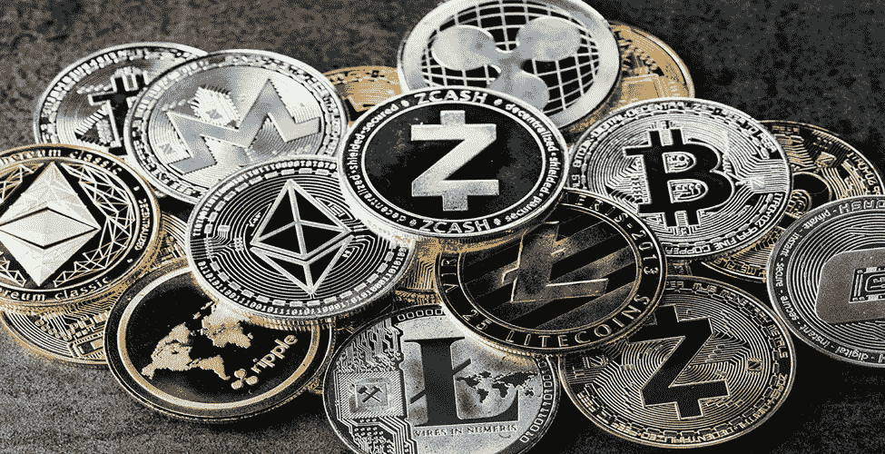

# 什么是加密货币/密码/加密货币？

> 原文：<https://medium.com/coinmonks/what-is-cryptocurrency-crypto-crypto-currency-3647f159c304?source=collection_archive---------45----------------------->

加密货币是使用加密技术制作的数字现金。因此，密码术或密码学可以被描述为将简单明了的文本转换成数学或计算机化代码的实践和方法。因此，加密货币可以定义为基于密码技术的去中心化数字货币。它是二进制数据的集合，旨在作为交换媒介。如今，加密被用作一种支付形式，它可以在不需要政府或中央银行等中央货币机构的情况下流通。

随着加密货币在全球范围内流行，大多数公众都知道加密。许多商业人士和投资者都在谈论和谈论这些数字货币。他们正在将这些货币确立为未来的货币。阿隆·马斯克(Alon Musk)等企业家对这些货币进行了评论，并告诉世界，这些货币可能是世界金融的未来。今天，金融市场的游戏已经改变，因为加密在投资者团体和组织中的流行。

虽然超过 800 万散户投资者通过 CoinSwitch 俱吠罗等平台充分利用加密投资，但印度和世界各地越来越多的公司正在接受加密货币。他们正急于通过将他们的业务与密码行业相结合，并创建让他们进入这个不断增长的数字经济的平台，来获得这个价值 1.5 万亿美元的行业的股份。Infosys 联合创始人兼董事长南丹·尼勒卡尼(Nandan Nilekani)等技术思想领袖对采用加密货币的呼声日益高涨。

# 1.比特币是什么？

2008 年，世界上出现了第一种被称为比特币的加密货币。这是电子货币，也可以不通过任何中介或中央机构(如中央银行)进行一对一的交易。因此，通信由网络节点通过加密来确认，并记录在称为区块链的公共分布式账本中。它是由一个名叫中本聪的未知个人或组织开发的。它于 2009 年作为开源软件发布，用于交易和转让。这是一种非常受欢迎的货币，因为它可以作为一种真实的货币在许多国家购买产品和服务。你可以在网上使用各种加密货币交易所轻松地将比特币兑换成现金。

在交易或投资这种加密货币的同时，对比特币的几个问题进行评估。第一个问题是生产比特币的采矿系统极其耗能。剑桥大学有一个跟踪能源消耗的在线计算器，在 2021 年初，估计每年使用超过 100 太瓦时。2016 年，英国总共使用了 304 太瓦时。比特币的第二个问题是，它也被与犯罪联系在一起，批评者指出，这是一种进行黑市交易的完美方式。在现实中，现金已经提供了这个功能几个世纪了，比特币的公共账本可能是执法的工具。许多国家禁止加密货币交易，这对比特币的投资者或用户来说也是一个问题。

> 交易新手？试试[加密交易机器人](/coinmonks/crypto-trading-bot-c2ffce8acb2a)或者[复制交易](/coinmonks/top-10-crypto-copy-trading-platforms-for-beginners-d0c37c7d698c)

# 2.加密货币的类型

全球有多种加密货币可供选择。比特币之外的十种重要加密货币可以列举如下。

以太坊

莱特币

卡尔达诺(阿达)

波尔卡多(点)

比特币现金(BCH)

恒星(XLM)

Dogecoin (DOGE)

币安硬币(BNB)

泰瑟(USDT)

莫内罗(XMR)

谢谢你的阅读

普拉卡什