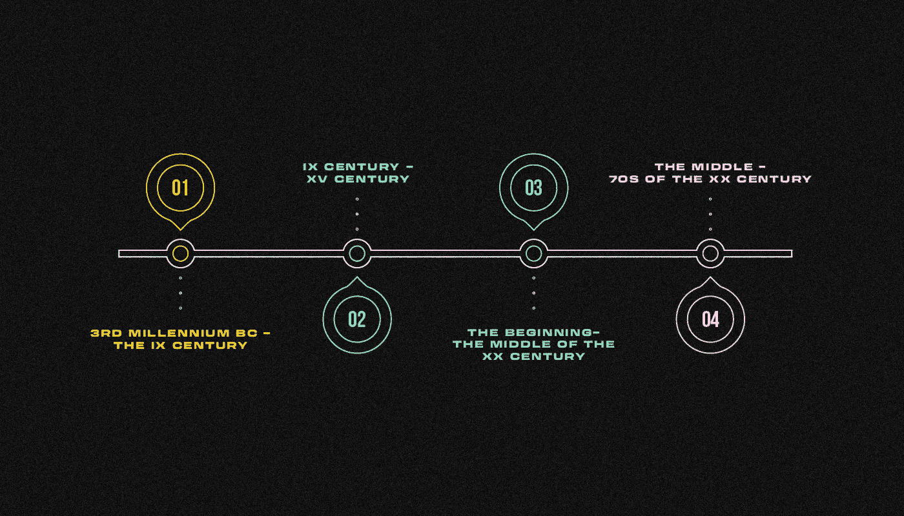
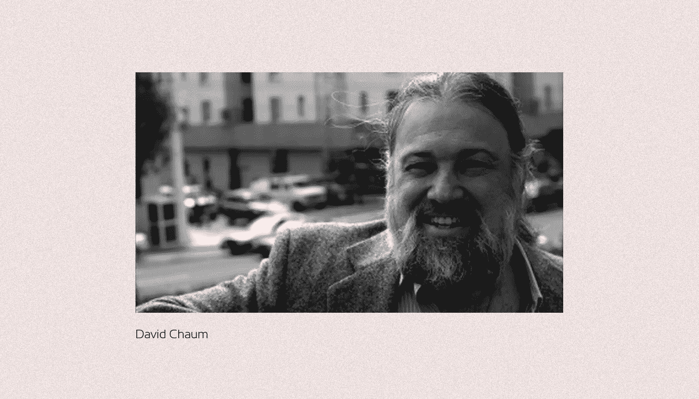
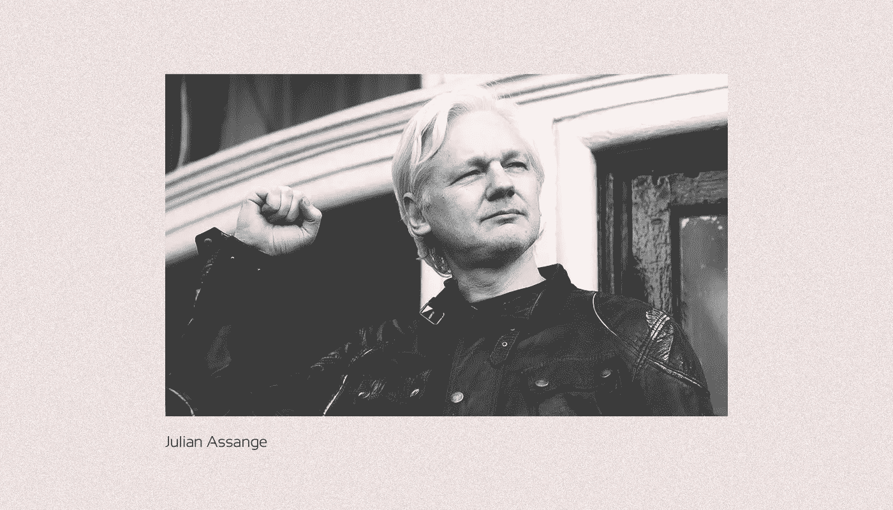
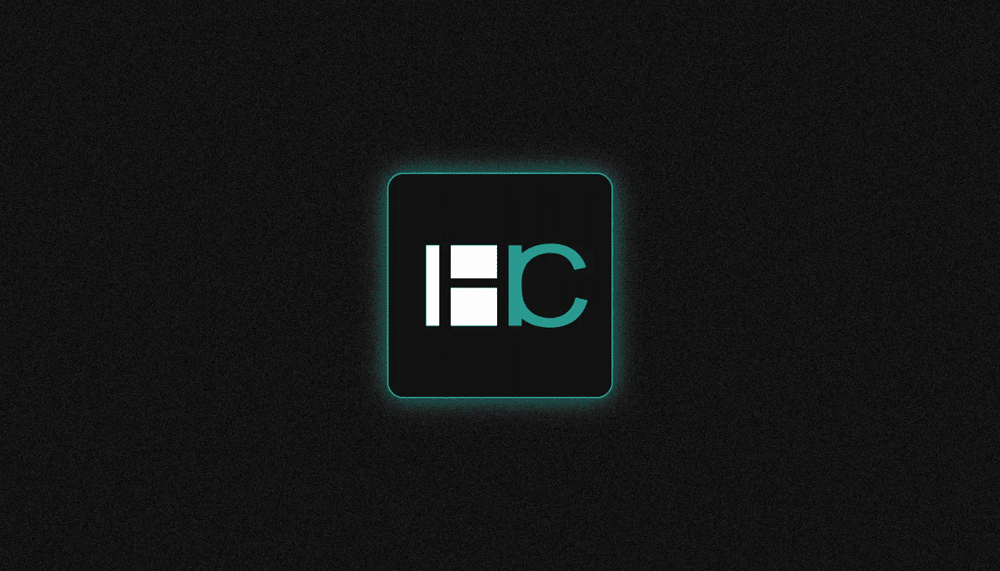

# 什么是密码学？

> 原文：<https://medium.com/coinmonks/what-is-cryptography-273da8138947?source=collection_archive---------39----------------------->

***密码学是确保数据的认证性、完整性和保密性的方法科学。为什么会存在？让我们来了解一下！***

# 密码学是如何发展的，何时发展的？

密码学作为一种文本保护技术随着书写的发展而发展；加密方法在古代文明中是已知的，如印度、美索不达米亚和埃及。

**在密码学发展的第一个时期**(大约从公元前三千年到九世纪)，主要使用单字母密码，其主要原理是通过用其他符号或字母替换字母，用另一个字母替换源文本的字母。

朱迪亚、斯巴达、古希腊和古罗马都有单字母密码。

**第二个** **时期，**多字母密码(一组单字母密码，用于按照一定规则对另一个明文字符进行加密)开始流行(从中东的九世纪到欧洲的 XX 世纪初)。

**第三时期** —多字母密码从 XX 世纪初至中叶仍在使用。与此同时，一种新的通信技术正在出现和发展:无线电通信。它可以传输大量数据，但不安全。可靠加密的问题在第一次世界大战期间变得紧迫，在第二次世界大战期间变得尤其尖锐，因为小型发射机和接收机被广泛使用，使交战方能够轻松截获敌人的消息。世界主要大国积极引进机电加密设备，竞相开发黑客技术。由于这些因素，几个世纪以来一直是间谍、数学家和外交官的领域的密码学开始作为一门科学出现。

**第四个时期**——从 XX 世纪中期到 70 年代——标志着向数学密码学的过渡。

到那时，数理统计、概率论、数论和普通代数已经建立，控制论和算法理论的基础也已建立。

美国数学家和密码分析学家克劳德·香农的《秘密系统中的通信理论》的出版是这一转变过程中的一个分水岭。

这是第一次将密码学作为数学科学提出。

Shannon 建立了它的理论基础，并引入了当今学生用来开始学习密码学的概念。

二战后，英国和美国政府建立了处理电子监控和信息安全的组织——英国政府通信中心和美国国家安全局。

在 20 世纪 70 年代早期，**英国政府通信中心的雇员 James Ellis** ，[提出了公钥密码学的概念](https://en.wikipedia.org/wiki/Public-key_cryptography)。

在该系统中，通过可被监控的不安全通道发送的公钥被用于加密消息和验证电子签名。英国数学家 Clifford Cox 为这个模型建立了数学基础。

因为没有允许这样做的技术，英国政府通信中心和美国国家安全局都没有采用公钥加密。然而，为此需要互联网，但这种系统在 20 世纪 70 年代尚未开发出来。

20 世纪 80 年代**和 90 年代**互联网的普及，普通用户已经面临在开放环境中保护数据的问题。****

与此同时，由黑客、数学家和密码学家组成的小组开始开发公钥加密技术。其中一个是科学博士大卫·乔姆，一个被称为“赛博朋克教父”的美国密码学家。

# 赛佛朋克运动是怎么出现的？

Chaum 在 1982 年开创了盲数字签名方法——一种公钥加密模型。这一发展使得人们能够建立一个数据库，这些人可以保持匿名，同时确保他们提供的关于自己的信息的准确性。乔姆幻想过数字投票，可以在不暴露投票者身份的情况下进行验证，但首先是数字现金。

Chaum 的想法引起了一群密码学家、黑客和活动家的兴趣。他们被称为 cypherpunks，是一个提倡使用计算机技术来削弱国家权力和中央控制系统的运动的成员。

美国密码专家、前英特尔首席研究员蒂莫西·梅 T20 是这场运动的理论家之一。1987 年，梅遇到了美国经济学家、企业家和未来学家菲利普·萨林，他创建了美国信息交易所(AMiX)，一个数据交易的网络平台。

另一方面，May 不喜欢电子平台的想法，在这个平台上，人们可以互相出售很少的有意义的信息(跨境和低佣金)。他设想了一个全球系统，允许匿名双向交换任何信息，类似于一个企业信息系统。

May 随后以 [BlackNet](https://web.archive.org/web/20020730044602/http:/cypherpunks.venona.com:80/date/1993/08/msg00538.html) 系统的形式敲定了这一概念，该系统需要一种非政府数字货币，并能够在其中进行不可追踪的支付。**1985 年**，他读了大卫·乔姆[的文章](https://chaum.com/security-without-identification/)《无身份证电脑的安全让老大哥过时》在文章中，Chaum 描述了一个使用加密方法隐藏买家身份的系统。对这个想法的熟悉促使 May 研究用公钥进行加密保护。

他很快得出结论，这种密码术与网络计算相结合，有可能“摧毁社会权力结构”。

1988 年 9 月，梅根据卡尔·马克思的《共产党宣言》写下了《秘密无政府主义宣言》(秘密无政府主义的幽灵，出没于现代世界)根据该宣言，信息技术通过使用加密技术、数字货币和其他分散工具，让人们能够在没有政府干预的情况下管理自己的生活。

**1992 年**，电子前沿基金会的创始人之一 May、 **John Gilmore** 和**加州大学伯克利分校的数学家 Eric Hughes** 邀请他们的 20 位密友参加一次非正式聚会。他们在会议上讨论了当时最紧迫的密码学和编程问题。这种集会变得越来越频繁，预示着一个更大的运动的开始。为了吸引与创始人集团有共同兴趣和基本价值观的其他人，创建了一个电子邮件简讯(邮件列表)。简讯很快发展到数百名订阅者，他们测试密码，交换想法，并讨论新的发展。通信是使用当时可用的最新加密方法进行的，如 PGP。这个小组讨论了政治、哲学、计算机科学、密码学和数学。

**1993 年**，埃里克·休斯发表了[《赛博朋克宣言](https://www.activism.net/cypherpunk/manifesto.html)，包含了这场运动的关键条款:

在电子时代，隐私对于一个开放的社会是必要的。[……]开放社会中的隐私也需要加密。[……]我们这些密码朋克致力于构建匿名系统。我们用加密技术、匿名邮件转发系统、数字签名和电子货币来保护我们的隐私。[……]密码学将不可避免地在全球传播，随之而来的是匿名交易系统。

保密性、匿名交易和密码保护的重要性后来都以一种或另一种形式实现了，在某种程度上，也是在加密货币中实现的。

**到 1997 年**，邮件列表有大约**2000 个**用户，每天 30 条消息。1995 年，维基解密创始人**朱利安·阿桑奇**在 Cypherpunk 发表了他的第一篇文章。**2016 年**，何[出版了](https://mailing-list-archive.cryptoanarchy.wiki/authors/julian_assange_proff_at_suburbia_net_/)一本关于赛博朋克运动的书，名为《赛博朋克:自由与互联网的未来》。

“密码朋克”一词最初是由黑客和程序员 Jude Milhon 用来称呼一群秘密无政府主义者的。赛博朋克和秘密无政府主义并不相同，但相关的潮流实际上有着相同的价值观。加密无政府主义(cryptoanarchy)是一种无政府主义，其中匿名化技术、数字假名和受密码学保护的数字货币被用来使自己摆脱国家控制——监控、审查和税收。

# 密码朋克的运动是如何影响加密货币的出现的？

DigiCash 于 1989 年由大卫·乔姆 T20 创立。它专注于数字货币和支付系统，eCash 数字货币系统和 CyberBucks 货币单位是其旗舰产品。eCash 利用了 Chaum 的盲数字签名技术。尽管事实上该系统已经过一些银行的测试，而且据称微软公司谈判将 eCash 集成到 Windows 95 中，但该公司在商业上失败了。

**1997 年**，英国密码学家**亚当·贝克**开发了 Hashcash，这是一种反垃圾邮件机制，基于要求发送的邮件具有一定的计算能力。结果，发送垃圾邮件变得无利可图。

一年后，计算机工程师戴伟发表了一项提议，要创建另一个名为 b-money 的数字支付系统。该系统的作者提出了两个概念。第一步是开发一个协议，其中每个参与者都保留一份关于用户有多少钱的数据库副本。第二个概念是前一个概念的变体，其中不是每个网络参与者都有注册表的副本。相反，引入了新的概念，如常规用户和服务器。同时，只有网络节点服务器保留了注册表的副本。与此同时，网络参与者的诚实通过向一个特殊账户存款来保证，该账户在出现不公平行为的证据时用于奖励或罚款。

第一个概念随后被比特币的创造者 T2·中本聪·T3 采用，而第二个概念被证明是最接近今天所谓的股权证明。

**2004 年**，cryptopunk **Hal Finney** 基于 Adam Beck 的 Hashcash 创造了[可重用工作证明(RPoW)](https://nakamotoinstitute.org/finney/rpow/index.html) 算法。

这个想法是创造独特的加密令牌，像未用完的比特币输出一样，只能使用一次。这种机制的缺点是验证和防止重复花费仍然由中央服务器执行。

**2005 年**，密码学家 **Nick Szabo** ，他在 20 世纪 90 年代开创了智能合约的概念，宣布创立比特黄金，一种数字收藏品和资本投资。Bit Gold 基于 Hill Finney 的 RPAW 提案，但他没有一次性使用硬币，而是假设硬币会根据创建它们所用的计算能力计算出不同的价值。

**2008 年 10 月**，中本聪向邮件列表发送了一份[白皮书](https://bitcoin.org/bitcoin.pdf)《比特币:一种数字化的点对点现金系统》。中本聪作品的内容证明了密码朋克和秘密无政府主义者的影响。比特币白皮书引用了亚当·布莱克和戴伟的话。根据中本聪的说法，比特币“代表了戴伟 b-money 要约和尼克·萨伯(Nick Szabo)Bit Gold 要约的实施。”反过来，戴伟的宣言中，他提出了 b 货币的想法，开头是这样的话:“我钦佩蒂姆·梅的秘密无政府主义。”文章发表后，中本聪继续他的工作，并于 2009 年 1 月 3 日创造了创世纪区块。

比特币的出现是众多技术改进和创新的开端，这些技术改进和创新基于一个已经运行的系统，密码朋克热情地开始扩展和修改这个系统。

# 赛博朋克运动发展如何？

现代的密码人包括密码学家和智能合约领域的先驱**尼克·萨伯**，BitTorrent 开发者**，Tor 浏览器创造者**雅各布·阿佩尔鲍姆**，维基解密创始人**朱利安·阿桑奇**，他在 2016 年出版了一本关于密码朋克运动的书，名为《密码朋克:互联网的自由和未来》，以及许多其他开发者和黑客。**

现在很多互联网流程都受到了 cypherpunk 活动的影响。Torrents、VPN 和电子签名都是由 cypherpunk 直接或间接创建的。

1993 年，埃里克·休斯在《塞弗朋克宣言》中指出:

*Cypherpanks 写代码。我们知道，为了保护信息，必须有人继续编写代码，因为我们看不到其他保护数据的方法，所以我们继续这样做[……]地球上的任何人都可以使用我们的代码。我们并不在乎有些人不喜欢我们的工作。我们知道我们的程序不能被摧毁，不断扩大的网络不能被阻止。*

> 如果您对密码学主题有任何补充，欢迎发表评论！
> 在跟踪更新方面，订阅我们的 [Medium feed。](https://medium.com/sunflowercorporation)
> 
> 敬请期待！

> 交易新手？尝试[加密交易机器人](/coinmonks/crypto-trading-bot-c2ffce8acb2a)或[复制交易](/coinmonks/top-10-crypto-copy-trading-platforms-for-beginners-d0c37c7d698c)