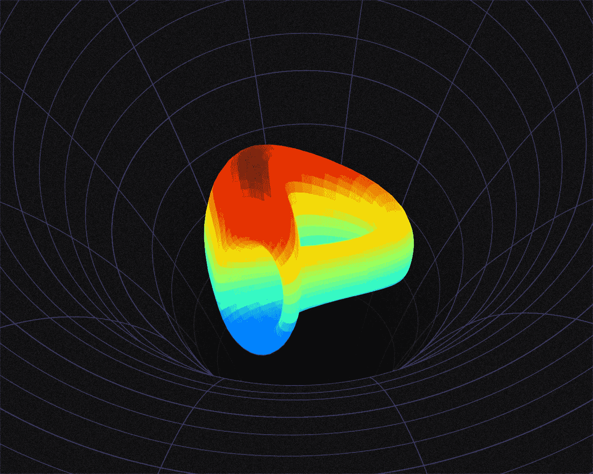
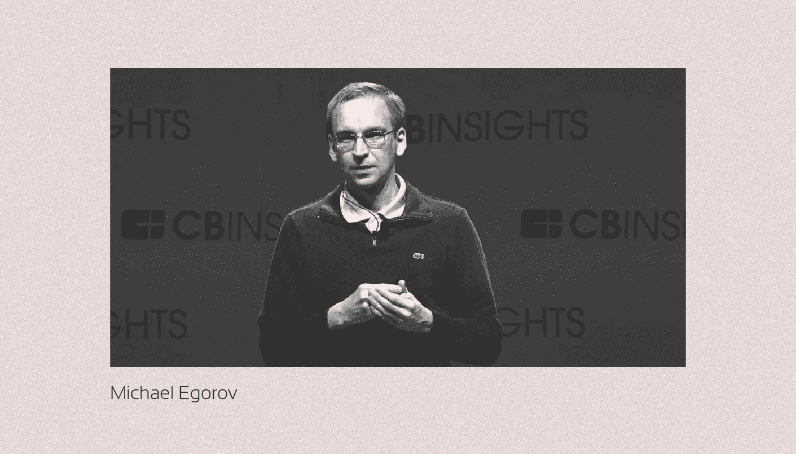
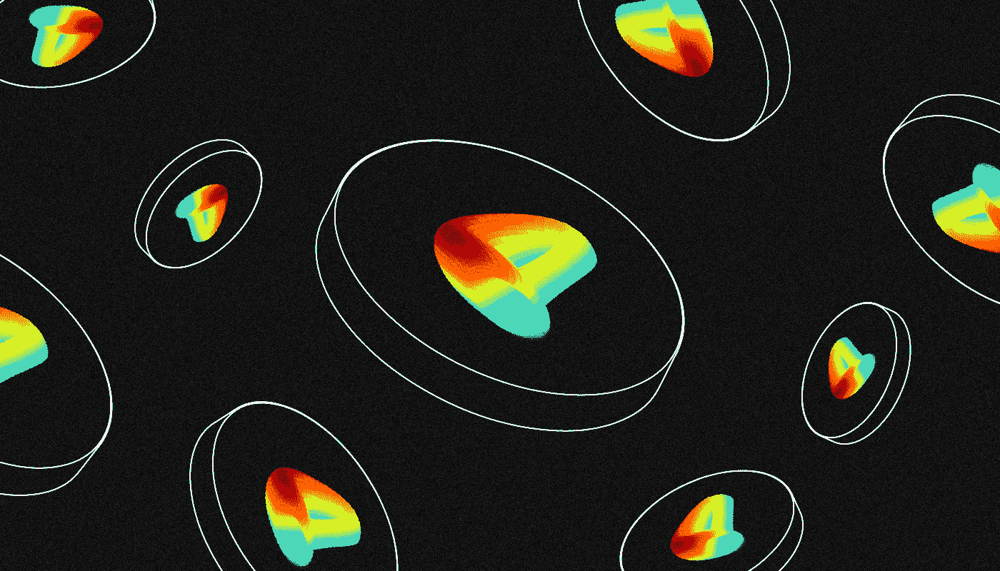
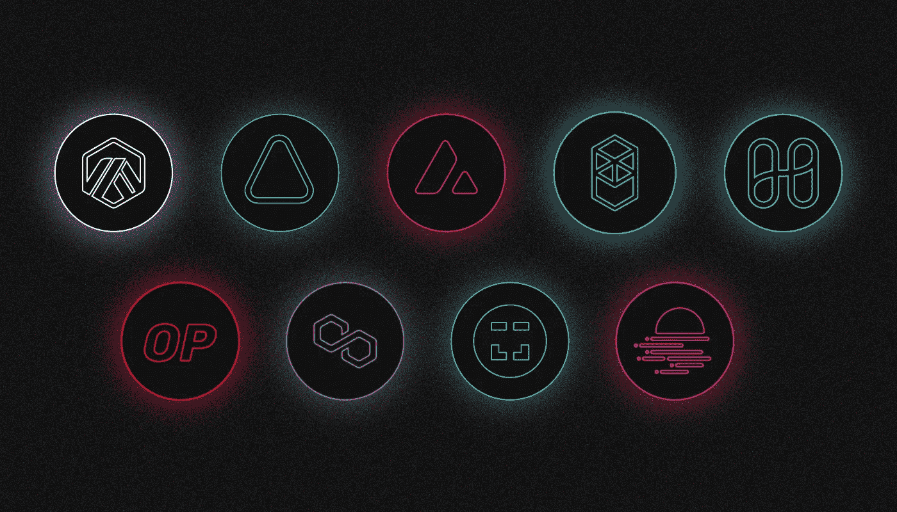

# 什么是曲线？

> 原文：<https://medium.com/coinmonks/what-is-curve-cad16f139059?source=collection_archive---------14----------------------->

[***曲线金融***](https://curve.fi/) ***是一种使用 AMM-德克斯技术的分散式交易所，最初在以太坊网络中推出。我们为什么需要它，它是如何工作的？让我们看看！***

它被设计用来以最小的滑点和佣金有效地交易稳定的硬币和其他相同价值的代币。

Curve 由分散的自治组织 Curve DAO 管理，该组织由 CRV 管理令牌的持有者组成。

就智能合约(TVL)中冻结的资金量和活跃用户数量而言，Curve 是领先的 DeFi 协议之一。

截至 2022 年 7 月，Curve 协议支持超过 40 种资产的交换，可用于十个网络:以太坊、Arbitrum、Aurora、Avalanche、Fantom、Harmony、乐观、Polygon、xDai 和 Moonbeam。

# **谁创立了 Curve？**

曲线金融分散加密交易所是由迈克尔·叶戈罗夫创建的。

他之前毕业于莫斯科物理技术学院，获得了 Swinburne Technology 大学的物理学博士学位，从事与量子计算和密码学相关的研究，并且是 fintech 公司 [NuCypher](https://www.nucypher.com/) 和 LoanCoin 项目的联合创始人。

**2019 年 11 月**，叶戈罗夫发布了[一份技术文件](https://curve.fi/files/stableswap-paper.pdf)，描述了为交易稳定债券创造稳定的 wap 流动性的有效机制。

使用这种方法的曲线金融交易所于 2020 年 1 月推出。项目团队位于瑞士。据创始人称，截至 2020 年年中，该公司只有 5 名员工，其中两名是开发人员。

# 曲线是如何工作的？

与其他 AMM 指数一样，曲线金融中的资产交易基于流动性池。这些智能合约包含两个或更多资产，用户可以使用简单的界面和任何 Web3 钱包自动交换。

使用一个数学公式来计算相对资产价格，交换过程中的滑动量(价格变化)与池的大小成反比关系。

3Pool 是首批推出的 Pool 之一，由戴、、三人组成。其他稳定币(BUSD、TUSD、HUSD、USDN)和相关[包装代币](/sunflowercorporation/what-are-wrapped-tokens-f1805a4a0cc6)如 wBTC/renBTC 的交换池随后出现。

平台上每笔交易收取佣金(交易额的 0.04%)，佣金的一部分在流动性提供者之间分配。任何用户都可以向池中贡献资产，并获得一部分费用。从 2020 年 8 月 13 日**开始**，流动性提供者还将获得 CRV 代币形式的额外补偿。

该协议的第二个版本“曲线 V2”于 2021 年 6 月在 T2 发布。它现在有能力交换不相关的资产。特别推出了韦瑟/WBTC/USDT 联营公司。

新版本还增加了围绕当前价格自动集中流动性的能力。因此，用户能够以最小的滑点兑换大笔金额。

# 曲线表征组学是如何工作的？

在以太坊网络上，曲线金融发行了 ERC-20 **CRV** 管理令牌。CRM 的主要目标是通过有利可图的农业刺激流动性提供者，同时让用户参与协议相关的决策。

《CRV》将于 2020 年 8 月 13 日**上映**，但并不像《曲线》团队计划的那样。程序代码提前公布在 GitHub 服务上，被一个匿名开发者用来独立部署 token 智能合约。

因为发布进行得很顺利，项目组觉得必须正式宣布。

CRV 的最高报价为 30.3 亿代币，将在 2026 年 8 月前分配如下:

*   62%给流动性提供者；
*   33%给团队和投资人；
*   5%在曲道储备。

每年，代币发行率下降约 30%。大约是 2021 年 8 月第一次减少后每天 **633，126** CR V。

令牌持有者可以通过三种方式使用它们:

*   曲线道中的提案投票；
*   参与堆叠，收取 50%的协议佣金；
*   在提供流动性的情况下，将收益率提高 2.5 倍。

所有这三种功能都需要 CRV 阻断 1 周到 4 年的时间。作为回报，发行 veCRV 存款代币。此外，被封锁一年后，所有者只能获得 0.25 veCRV 兑换 1 CRV。只有封锁 CRV 最长 4 年，你才能得到 1:1 的 veCRV。

截至 2022 年年中，约 47.6%流通中的 CRV 代币已被冻结。该令牌的市值排名前 100 位，并在大多数最大的加密交易所进行交易。

# 曲线是如何管理的？

与曲线融资协议开发相关的所有问题均由自治组织 Curve DAO 处理，该组织在 2020 年 8 月**CRV 代币发行开始后立即成立**。

要参与 Curve DAO，用户必须将其 CRV 锁定 1 周到 4 年，并获得一个 veCRV。

如果您至少有一个 veCRV，您可以对现有的提案进行投票，或者创建“信号票”,让您可以衡量社区对任何问题的兴趣。

至少 2500 个 veCRV 的存在提供了提出新建议的机会，例如开设新的和关闭过时的池或在它们之间重新分配奖励。

每次投票为期一周。要被采纳，至少 30%的现有 veCRVs 必须投票，至少 51%的人支持。Curve Finance 团队根据 Curve DAO 的决策修改 DEX 操作的参数。

大多数 Curve DAO 投票属于三个 DeFi 协议(Convex、StakeDAO 和 Earn)，这些协议围绕盈利农业、提供流动性和赚取交易佣金以及 CRV 建立了盈利战略。

# Curve 是如何发展的？

自从推出有利可图的农业以来，曲线融资已经成为最成功的流动性和交易周转的 DeFi 协议之一。

它在【2022 年 1 月的人气峰值没有超过**240 亿美元**，单月交易量超过 60 亿美元。然而，即使在加密货币市场到 2022 年年中崩溃之后，Curve 仍然是五大 DeFi 服务之一，冻结资金量超过 57 亿美元。

Curve 的巨大流动性允许许多其他 DeFi 服务在其生态系统中使用其池。尤其是 Curve Finance 与 1inch 流动性聚合器以及最大的租赁协议 Aave 和 Compound 相集成。

**2021–22**，除了以太坊区块链，Curve 协议还被部署在 9 个 EVM 兼容网络中:Arbitrum、Aurora、Avalanche、Fantom、Harmony、乐观、Polygon、xDai 和 Moonbeam。

Curve 的流行，加上协议的开放代码，导致了众多分叉(复制协议)的出现。以 BNB 连锁店为基础的 Ellipsis Finance 和以 Klaytn 网络为基础的 Kokonut Swap 是最大的两家。

优先考虑智能合约安全性和用户便利性的 Curve 平台，仍然是低滑点和低佣金的分散稳定币交易的最有用的工具之一。

> 如果你对曲线话题有什么补充，欢迎评论！
> 在跟踪更新方面，订阅我们的[媒体提要。](/@SunflowerCorpAdmin)
> 
> 您也可以在我们的平台[向日葵公司](https://sunflowercorp.com)上尝试使用加密货币。
> 敬请期待！

> 交易新手？尝试[加密交易机器人](/coinmonks/crypto-trading-bot-c2ffce8acb2a)或[复制交易](/coinmonks/top-10-crypto-copy-trading-platforms-for-beginners-d0c37c7d698c)