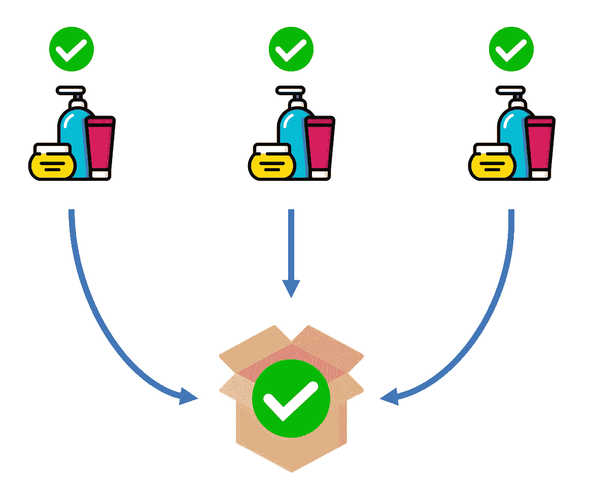
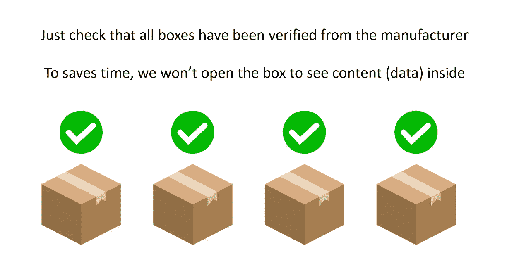
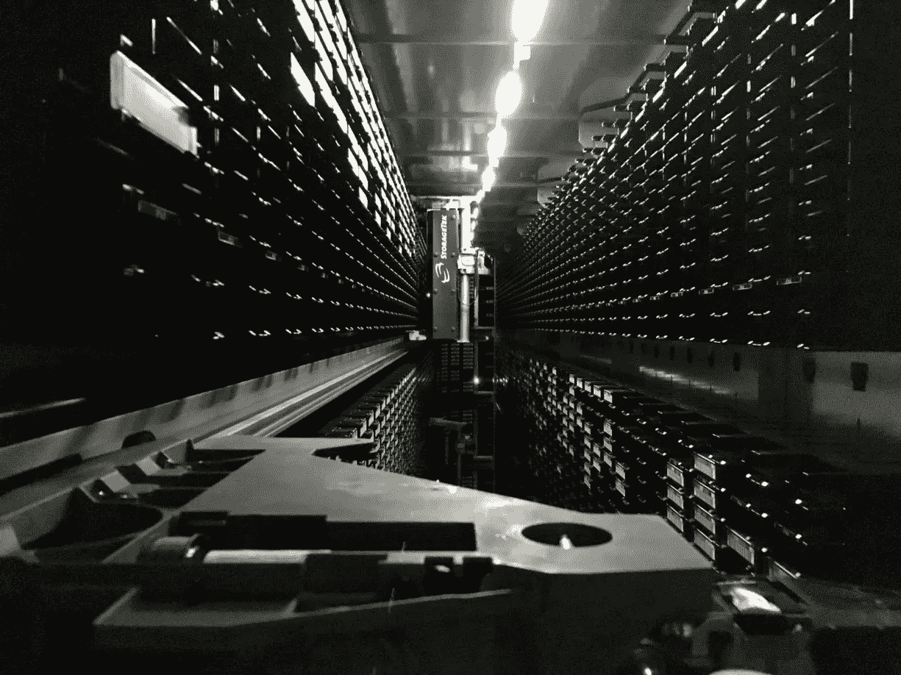
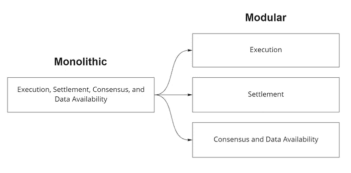

# 什么是数据可用性，我们为什么需要它？

> 原文：<https://medium.com/coinmonks/what-is-data-availability-and-why-do-we-need-it-7993c039fc44?source=collection_archive---------18----------------------->

# 什么是数据可用性？

在区块链世界中，数据可用性是指在任何时候获取与特定编码头相关的原始数据的能力。例如，如果一个汇总只存储事务的散列，我们就不能查询被计算成散列的底层事务。在这种情况下，无法查询意味着我们没有可用的数据。但是如果我们存储了与每个散列相关联的任何事务，我们就可以随时查询这些事务。在这种情况下，我们有数据可用性，因为我们可以查询它们。

# 数据可用性和质量控制过程之间的相似性

我们可以通过与 QC 过程的比较来解释区块链世界的数据可用性。

验证过的产品放入贴有验证标签的盒子中

从制造商开始。一旦厂家生产出产品，每一件产品都会进行 QC。然后将多个产品包装在一个包装中，并贴上标签作为验证证明。打包是乐观汇总的汇总过程。

客户可能不会拆箱检查每个产品

制造商将把这些盒子寄给顾客。顾客可以检查所有包装上是否都有经过验证的标签。类似地，在乐观汇总中，Merkle root 可以与提交到 Mainnet 中的已验证标签进行比较，以验证汇总中的每个事务。注意，我们不能使用 Merkle root 来反转底层的查找事务。

在 QC 过程中，如果你想检查盒子里的产品是否有效，你打开盒子检查。物理世界总是有数据可用，因为我们可以看到里面的内容。

在区块链，盒子可能无法打开。如果我们不能打开盒子看到里面的内容，我们可以说它缺乏数据可用性。

在乐观汇总中，制造商不负责验证每个产品(交易)。制造商把它装进一个盒子里(一卷)。有时，如果挑战者发现恶意产品(交易)，他们可以拆箱并提交欺诈证据。拆箱过程需要数据可用性。

# 为什么不存储所有事务数据来获得数据可用性？

[https://www.flickr.com/photos/adactio/46349424774](https://www.flickr.com/photos/adactio/46349424774)

存储所有事务数据会占用每个节点太多的资源，并牺牲可伸缩性。比特币和以太坊等传统单片区块链需要矿工和全节点运营商下载整个区块链。它占用了太多的磁盘空间，需要巨大的内存。只有专业的节点操作员才能操作如此强大的节点。这是对权力下放的威胁，因为它限制了参与网络的机会。必须关心数据可用性导致区块链开发变得更加复杂。因此，在未来，我们将转向模块化的区块链设计，开发人员在开发新的区块链时不必关心数据的可用性。

# 如何不存储所有交易数据？

这个课题还在繁重的研究中。Celestia 率先发布了名为“**数据可用性采样”的解决方案**这是通过多轮对小块随机数据进行采样来实现的，允许节点以统计确定性来验证数据可用性。

更多细节请见 https://celestia.org/glossary/data-availability-sampling/

# 数据可用性和模块化区块链。

[https://celestia.org/static/54fa3c4c5754c057c4fbcd751d15c21e/c8502/article-1-image-2.png](https://celestia.org/static/54fa3c4c5754c057c4fbcd751d15c21e/c8502/article-1-image-2.png)

模块化区块链是区块链开发的一个新概念，它将区块链分成不同的层，与经典的单片区块链(如以太坊，包含所有层)形成对比。每个图层都可以重复使用和合成，以创建新的区块链。

模块化区块链的层可以以不同的方式设计。 [Celestia 文档](https://celestia.org/learn/basics-of-modular-blockchains/)中的设计是最常见的。区块链由 3-4 层组成，包括执行层、结算层(可选)、共识层和数据可用性层。一些设计可能有应用层，让开发人员在区块链上开发 dApps。

*   **应用层**是一个允许外部开发者在区块链之上开发他们的 dApps 的层。智能合约是应用层的一个例子。
*   **执行层**是处理事务的层。该层将由每个 dApps 定制。
*   **沉降层**是构建第二层区块链时需要的可选层。这一层负责在以安全和性能为中心的链之间传递消息。最常见的消息是这两个链之间的令牌桥。
*   **共识层**是管理共识的层。如果链使用利益一致的证明，这一层使用户能够标记所需的令牌，以帮助验证交易。上层可以共享共识层，以帮助减轻设计共识的工作量。
*   **数据可用性层**是充当区块链存储的层。这一层维护数据的可用性，以允许在任何时候获取数据的任何部分。

数据可用性是模块化区块链设计的底层。在 Celestia，这一层与一致层相结合。另一方面，执行和结算层留给开发人员去开发。

# 数据可用性层的示例用例

实际的用例目前需要共识层和数据可用性层的结合。天青石文献中写了两个例子:[https://docs.celestia.org/category/optimint](https://docs.celestia.org/category/optimint)。

[https://lagged.com/th/th/g/wordle](https://lagged.com/th/th/g/wordle)

开发人员可以构建一个以应用为中心的区块链，具有独立的数据可用性和一致性层。最基本的例子是沃尔区块链。开发人员只负责开发执行和结算层。同时为 Celestia 通过共识和数据可用性工作。共识对于开发者来说是痛苦的，因为开发者也必须应用业务开发来建立共识。将数据可用性传递给其他人后，开发人员可以使用普通计算机(如 Macbook Air M1)来运行区块链。

Cosmos SDK 模块有助于加速执行层的开发。开发者可以从提供结算层的 [Celestia](https://docs.celestia.org/) 克隆 [Optimint](https://docs.celestia.org/category/optimint) ，并使用定制模块开发执行层。

# 结论

在区块链世界中，数据可用性是指在任何时候获取与特定编码头相关的原始数据的能力。如果您不能打开盒子查看里面的产品，那么 QC 流程示例就缺乏数据可用性。存储所有事务数据会占用每个节点太多的资源，并牺牲可伸缩性。 [Celestia 提出了一个“**数据可用性采样**方案](https://celestia.org/glossary/data-availability-sampling/)来解决数据可用性问题。数据可用性是模块化区块链层的底层，通常与共识层结合在一起。分离这些层可以让开发人员高效地开发。最基本的例子是沃尔区块链。开发者还可以从提供结算层的 [Celestia](https://docs.celestia.org/) 中克隆 [Optimint](https://docs.celestia.org/category/optimint) ，并使用自定义模块开发执行层。

> 交易新手？尝试[加密交易机器人](/coinmonks/crypto-trading-bot-c2ffce8acb2a)或[复制交易](/coinmonks/top-10-crypto-copy-trading-platforms-for-beginners-d0c37c7d698c)