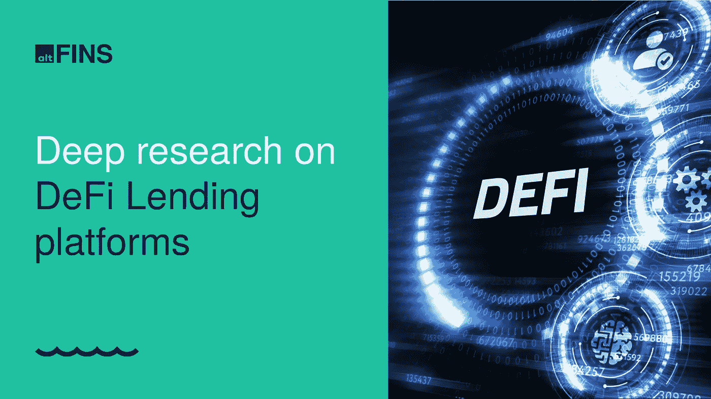
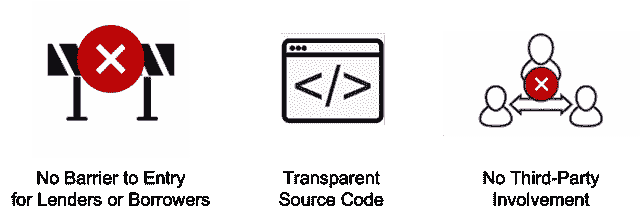

# 什么是 DeFi lending？

> 原文：<https://medium.com/coinmonks/what-is-defi-lending-5abe81473501?source=collection_archive---------29----------------------->

Source: altFINS

分散金融，或“DeFi”已经发展成为各种综合和分散的金融服务和工具的网络。几个 DeFi 贷款平台已经成为加密领域强大的金融工具。这些贷款平台是什么？它们是如何运作的？它们与中央银行或“CeFi”有什么不同？

**简而言之，DeFi 借贷协议允许用户借出和借入加密货币，而无需通过中央中介，完全没有许可，同时保持对其资产的完全监管。**DeFi 的美妙之处在于，贷款不再是银行和机构的专利，在全球范围内，任何人都可以成为贷款人，并从借款人那里赚取利息。

贷款人将他们的数字资产存入“流动性池”，然后这些资产成为协议借给借款人的资金。就像传统银行一样，贷方从他们的存款中赚取利息，而借方为他们借入的资金支付利息。贷款人和借款人的利率通常是可变的，由存款金额的使用情况决定。DeFi 平台之间的利率可能会有所不同。整个借贷过程是在没有中介(去中心化)的情况下执行的，完全基于智能合约(即编程)。

另一方面，CeFi 平台，如 BlockFi 和最近的 bankcrupt Celsius，也被称为“加密银行”，因为它们的功能与传统银行模式非常相似。他们保管存放的资产，并将其借给机构参与者，如做市商或对冲基金，或其他用户。一些 CeFi 贷款人甚至将存款投资于其他高风险的加密项目和流动性池。CeFi 模型容易因被黑客攻击或其他形式的疏忽(例如，不良贷款、管理欺诈、资金管理不善、内部人员作案等)而失去客户的存款。)而且它们都违背了区块链理工大学的价值主张，即用户保持对其资产的完全保管。

DeFi 借贷平台通常提供完全抵押的贷款，这意味着希望借贷资金的用户必须首先存放一些数字资产(又称抵押品:ETH 等。).因此，一个用户存入价值 15，000 美元的 10 个 ETH，然后可以像戴一样借入价值 5，000 美元的另一项资产。如果他们不偿还贷款(5000 DAI)，他们的抵押品就会减少。DeFi 贷款平台的三大优势:

altFINS 发布了一项关于 DeFi lending、DeFi lending 如何运作、市场概况、前三名、风险和挑战以及增长潜力的深入基础研究。它被分发给所有阿芬斯·霍德勒和阿尔特芬斯的订户。你可以成为其中的一员，每月获得 2 份基础研究报告，并在 altFINS 平台上获得付费功能。了解更多[。](https://platform.altfins.com/subscriptions)

> 交易新手？试试[加密交易机器人](/coinmonks/crypto-trading-bot-c2ffce8acb2a)或者[复制交易](/coinmonks/top-10-crypto-copy-trading-platforms-for-beginners-d0c37c7d698c)