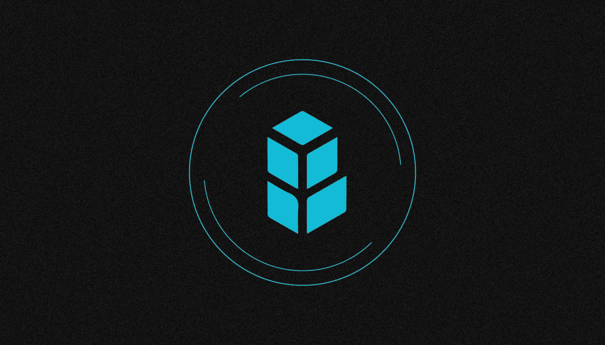

# DEX 是什么？

> 原文：<https://medium.com/coinmonks/what-is-dex-1e4ab5210fc4?source=collection_archive---------14----------------------->

***分散式交易所(DEX)是一种用于交易加密资产的应用，其中交易所和其他交易通过智能合约而不是集中式交易系统来处理。集中交易所更好吗？让我们来了解一下！***

DEX 与集中式交易所的主要区别在于，DEX 不存储用户资金，不控制交易。资金直接从用户的钱包里转出，他已经链接到平台上了。分散式交换机也缺乏用户验证程序。

分散式交易所已经成为分散式金融领域的重要组成部分。现在有 200 多个 dex 在几十个区块链运作。

# 德克斯和 CEX 的区别是什么？

集中式加密货币交易所(CEX)，如**比特币基地**、 **Bitfinex** 和**北海巨妖**，其结构与传统证券交易所相同。它们由负责平台运营、用户资金安全和遵守法律的特定法律实体管理。

因此，集中的外汇管理机构有权使用客户的资金，如有必要，可以阻止单个用户、特定操作或整个方向，如取款。此外，每个新用户都必须通过身份验证(KYC)过程。

另一方面，分散式交易所不充当交易的中介，也不存储用户的资金或个人信息。通常使用区块链地址和与应用程序关联的非保管钱包来识别客户。智能合约用于贸易交易和其他行为。

此外，关键决策不是由创始人和开发人员团队做出的，而是由在 DAO 中投票的管理令牌持有者社区做出的。尽管 DEX 有一个创建和开发智能合同和应用程序协议的关键开发人员。同时，关键组件的源代码也是可用的。

# 德克斯是什么时候出现的？

最初，加密货币交易是集中的。第一个去中心化的交易所 NXT 资产交易所于 **2014** 登场。

与此同时，类似的项目如同行 DEX 和 Block DX 也出现了，但它们很少受到关注。

由于 2017-2018 年的 ICO 热潮，成千上万的新加密资产出现在市场上。他们经常交易新的指数，如以太三角洲，IDEX，DDex 等。他们主要致力于以太坊区块链和支持 ERC-20 代币。然而，当时 DEX 的标准问题是流动性低、利差大、交易速度慢和交易费用过高。

自动做市商技术推动了分散式交易所的普及(AMM)。与传统的订单簿不同，它采用了由资产对组成的所谓流动性池，根据池中资产对的比率，使用数学公式计算价格。这使您能够构建一个分散的架构，并通过智能合约保证链上交易，这在执行速度方面可与集中式平台相媲美。

Bancor 项目首次引入了 AMM 技术。然而，真正受欢迎的去中心化交易所是 [Uniswap](/sunflowercorporation/what-is-uniswap-2ab17b51b63b) 交易所，于 **2018** 在以太坊区块链推出。**维塔利科·布特林**支持项目的发展。

随后，德克斯-AMM 模型成为分散式交易所的标准，它被复制应用于其他网络，包括 BNB 连锁( [PancakeSwap](/sunflowercorporation/what-is-pancakeswap-here-is-how-to-start-using-it-538b80268e2b) )和 Fantom (SpookySwap)。AMM-德克斯也在索拉纳、宇宙、地球和其他生态系统中工作。

流动性池提供者从同一对资产的资产交换中获得佣金。AMM-德克斯还逐渐增加了新的功能，如农业，其中管理令牌自动支付给流动性提供者。然后，他们可以被分配到股份，用于参与道，或干脆出售。

自 **2021** 起，新一代 DEX 一直在研发中。他们也使用 AMM 技术，但是他们也允许来自不同区块链的加密资产的交换。例如，该功能在共生金融协议中使用合成(“包装”)令牌来实现。THORChain 项目的 DEX 采用了另一种方法，交换来自不同区块链的本地资产池。

# DEX 的优势在哪里？

分散式交易所的大多数优势都与其架构有关。以下是一些关键优势(尽管其中一些也可能是劣势):

*   一个极其简单的交易界面，没有眼镜，没有不同类型的订单；
*   客户完全匿名，因为与 DEX 合作不需要注册、开立个人账户或验证(KYC)个人数据的提供；
*   DEX 不存储用户的加密资产，因此无论是交易所开发商还是当局都不能冻结资金或对用户的账户施加其他限制；
*   当相应的流动性池得到补充时，新资产立即在 DEX 上上市；
*   用户通过将资产存入流动性池获得被动收益的可能性；
*   DEX 用户可以通过管理令牌农场参与其管理。
*   因此，分散的交易平台让用户完全控制他们的资金，同时也让他们对自己的行为完全负责..

# DEX 的缺点是什么？

使用分散式交易所有几个缺点和风险:

1.  大多数现代 DEXes 只允许在一个区块链内进行加密资产交换。交叉链桥有时用于将来自不同网络的加密资产添加到 DEX，但这使交易过程变得复杂。
2.  分散交易所的交易功能有限，没有熟悉的选项，如不同类型的订单(例如，限价或止损)或带杠杆的交易。没有额外的工具，如磁带或一杯应用程序。
3.  任何交易，包括错误或欺诈交易，都将通过区块链自动执行，并且不能在支持服务中取消或质疑。网络犯罪分子经常使用这种方法来出售被盗的加密货币。
4.  DEX 上的交易操作速度由区块链中的交易确认速度决定，可以从几秒钟到几分钟不等。因此，高频交易不可能在分散的交易所进行。
5.  一般来说，分散式交易所的流动性低于集中式平台。因此，当在低流动性对中买入或卖出大仓位时，用户可能会经历所谓的价格滑移，这降低了用户的受益；
6.  DEX 的交易费用高于集中交易。此外，用户还被迫支付网络佣金。
7.  当大量交换资产时，用户可能会成为使用 MEV 机器人进行价格操纵的受害者。
8.  由于大多数现代 dex 缺乏集中的资产列表系统，这被骗子利用，他们发行伪造的代币以实施犯罪计划，如泵转储和地毯拉。
9.  由于智能合约代码或 web 界面中存在漏洞，DEX 容易受到黑客攻击和黑客攻击。例如，2022 年 6 月 8 日，价值 500 万美元的资产从 1。渗透指数的流动性池。此类事件不会危及交易所用户的资金，但可能导致流动性提供者的资金损失。

# DEX 是如何监管的？

分散交易所目前在“灰色地带”运营，因为立法尚未考虑到这些平台架构的所有细微差别，监管当局也没有找到有效的方法来监管它们。

监管分散式交易所最困难的一个方面是，它们并不总是与特定的法律实体相关联，也不受任何管辖。甚至一些 DEX 的创建者也不公开他们的身份，这使得在发生违规事件时很难确定责任人。

> 我们希望在下面的评论中听到你对 DEX 的看法。如果你喜欢这篇文章，请订阅我们的[媒体提要](https://medium.com/sunflowercorporation)以获取更多内容。敬请期待！

> 交易新手？试试[密码交易机器人](/coinmonks/crypto-trading-bot-c2ffce8acb2a)或者[复制交易](/coinmonks/top-10-crypto-copy-trading-platforms-for-beginners-d0c37c7d698c)