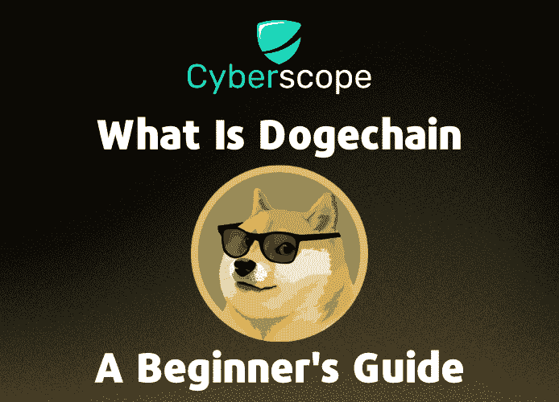
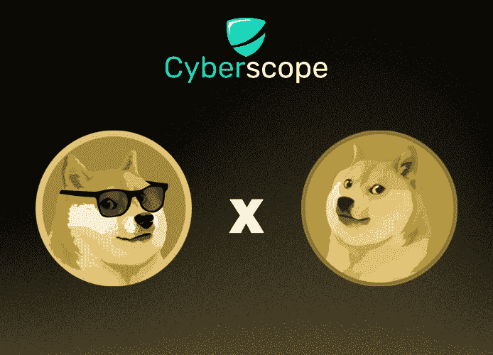
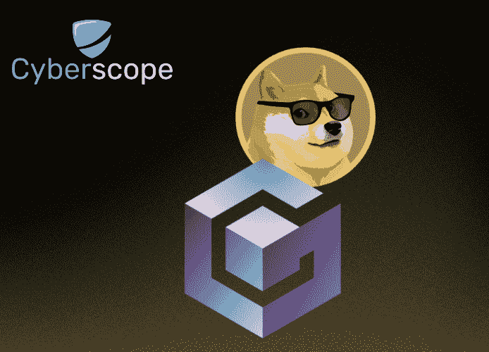

# 什么是 Dogechain —初学者指南

> 原文：<https://medium.com/coinmonks/what-is-dogechain-a-beginners-guide-52242dfd917c?source=collection_archive---------49----------------------->

# 介绍

甚至在发布之前很久，Dogechain 就已经是一个讨论的话题，部分原因是迷因币 Dogecoin 的巨大人气。在过去的两个月里，它成功创造了 24.4 万个独特的钱包和 5000 万笔累计交易的新高。在本指南中，我们将讨论 Dogechain 是什么，它是如何工作的，以及它与 Dogecoin 有什么联系。

# Dogechain 是什么？

Dogechain 是 Dogecoin 项目的非官方[第 2 层解决方案](https://www.cyberscope.io/blog/what-are-layer-1-and-layer-2-in-blockchains)，旨在跨越 Dogecoin，并允许用户访问不断增长的分散金融(DeFi)生态系统。它运行在多边形网络上，并与 EVM 兼容，这使得它成为参与 DeFi 的一种安全可靠的方式。

这是一个独立的区块链，致力于增强 Dogecoin 持有人。使用[桥](https://www.cyberscope.io/blog/what-is-a-crypto-bridge)，Dogecoin 持有者可以访问区块链游戏、NFTs 和大量其他 DeFi 应用程序。这使得他们能够以多种不同的方式使用自己的货币，并获得新的投资机会。

# 什么是 Dogecoin，它与 Dogechain 有什么关系？

**Dogecoin (DOGE)** 是一种加密货币，在全球范围内越来越受欢迎。这个名字来自柴犬品种，这是硬币的标志。Dogecoin 最初是作为一种笑话/迷因货币而产生的。尽管起源如此，它已经发展成为世界上最受欢迎的加密货币之一，其价值在过去几年中增长了 1000%以上。这种增长是由多种因素推动的，包括社交媒体的关注和名人的支持。

另一方面，Dogechain 是一个独立的项目，旨在通过为货币提供更多的实用性来改善 Dogecoin 的功能。虽然没有正式隶属于 Dogecoin，但 Dogechain 与其加密货币同行有许多相同的目标，并将对 Dogecoin 令牌产生重大影响。

投资者仍然关注 Dogechain，尽管已经证实它不是 Dogecoin 的官方二层网络。该项目的本地加密货币 DC 代币的价值在推出后的头五天里增长了六倍。这表明投资者对 Dogechain 的发展感兴趣，不管它归谁所有。

最重要的是，在 DC token 推出之前，关于 Dogechain 是 Dogecoin 的第二层网络的传言导致后者的价格在一天内上涨了 10%以上。自那以后，价格已经回落，但未来增长的潜力仍然存在。

# Dogechain 是如何工作的？

Dogechain 是与以太坊虚拟机(EVM)兼容的区块链协议。它使用多边形边缘框架为构建分散式应用程序提供可伸缩性和灵活性。此外，它还保留了其父协议的一些属性，如安全性和不变性。

使用父协议有一些好处。例如，它是 EVM 兼容的，这意味着开发人员可以在区块链上创建 ERC-20 令牌。此外，该框架使 Dogechain 能够使用 PoS (Proof of Stake)机制，这比 PoW(Proof of of Work)更快、更具可扩展性。此外，该协议的智能合同功能允许令牌持有者用 DOGE 支付燃气费。

Dogechain 还使用以太坊虚拟机(EVM)来支持其运营。这使得开发人员可以在 Dogechain 平台上快速构建和部署解决方案。这种建筑在区块链是独一无二的。当大多数其他区块链使用 Polygon 的“安全性作为特性”功能时，Dogechain 依靠自己的验证器集来实现安全性。同样，[多边形](https://www.cyberscope.io/polygon-smart-contract-audit)的主链契约和检查点机制特性也被停用。

值得一提的是，Dogechain 使用的跨链协议允许用户以 1:1 的比例用 wDOGE 令牌交换 DOGE。当 DOGE 令牌被钉住时，DOGE 链铸造相应的 wDOGE 令牌。类似地，当一个 wDOGE 令牌被销毁时，一个 DOGE 令牌可以从区块链的 DOGE 中收回。

# 结论

多边形边缘框架和 EVM 的结合为 Dogechain 提供了以以前不可能的方式增强 Dogecoin 的能力。Dogecoin 需要一个秤，而 Dogechain 提供的不仅仅是第 2 层解决方案。它为 Dogecoin 持有者提供了一个独特而强大的体验，因为它给了他们以多种不同方式利用 DOGE coin 的机会。

*……*

*原载于*[*www . cyber scope . io*](https://www.cyberscope.io/)

> 交易新手？尝试[加密交易机器人](/coinmonks/crypto-trading-bot-c2ffce8acb2a)或[复制交易](/coinmonks/top-10-crypto-copy-trading-platforms-for-beginners-d0c37c7d698c)