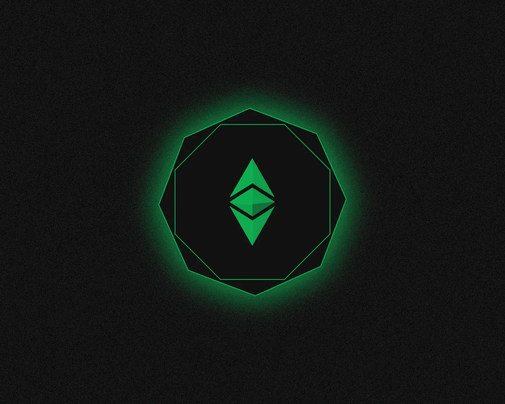
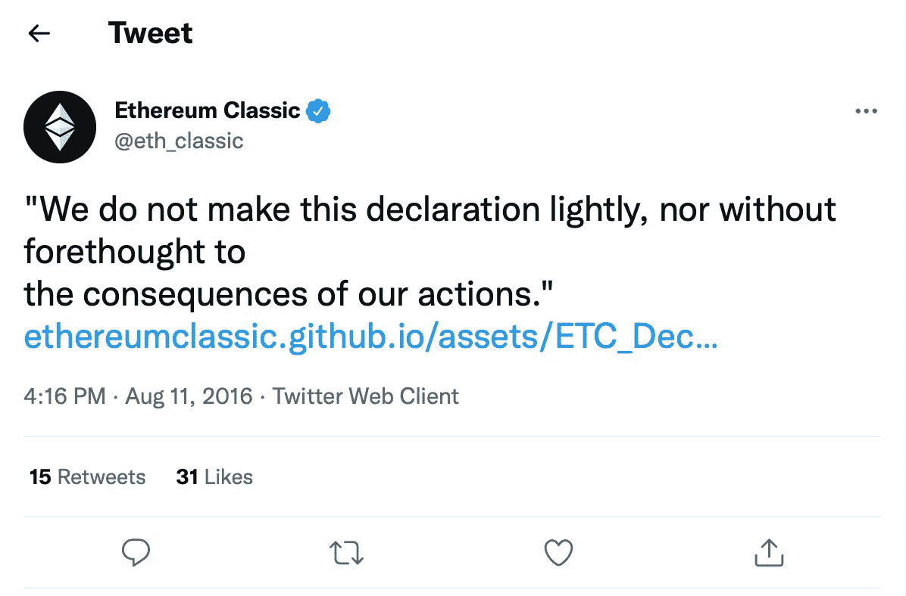
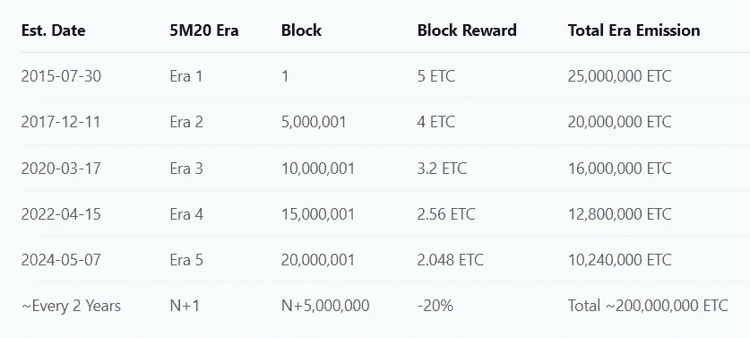
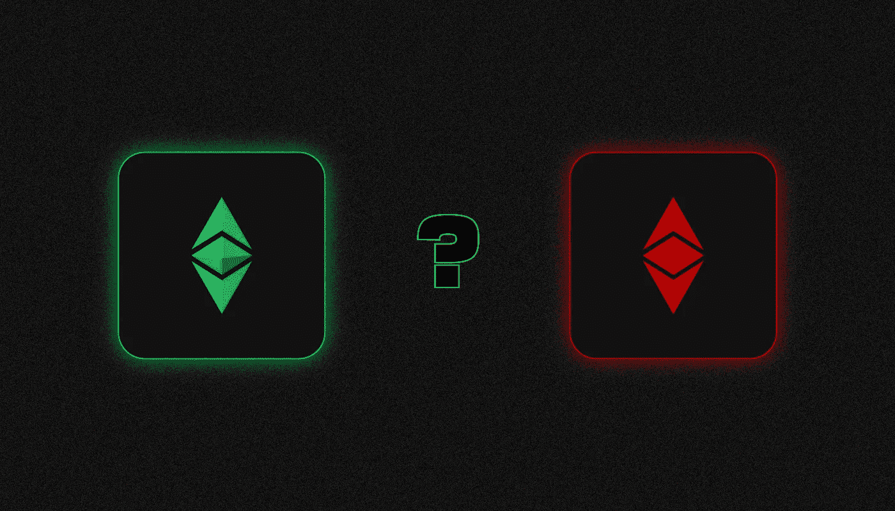
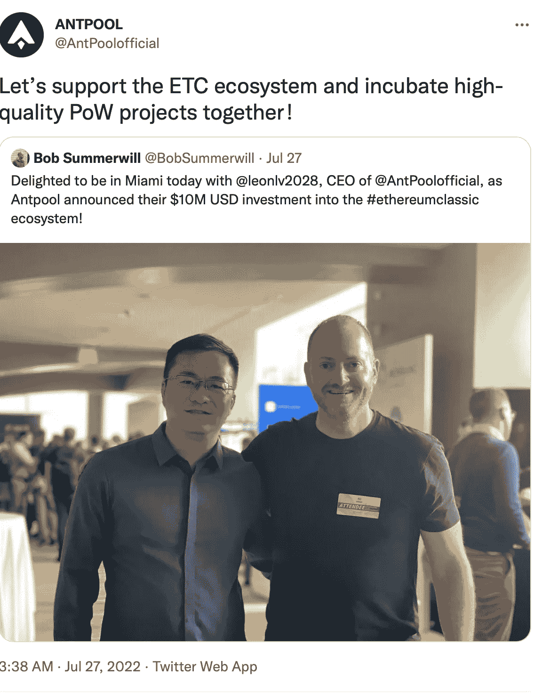

# 以太坊经典是什么？

> 原文：<https://medium.com/coinmonks/what-is-ethereum-classic-3ad8681558c1?source=collection_archive---------32----------------------->

***以太坊经典是一个拥有智能合约的区块链平台。它的原币是 ETC。以太坊和以太坊经典有什么区别？为什么会存在？一起来了解一下吧！***

该项目源于以太坊社区在 **2016** 的道黑客事件引发的硬分叉之后的分裂。

以太坊经典的特点是保留了以太坊最初的架构，特别是工作证明算法。

# **以太坊经典是谁在什么时候创造的？**

以太坊经典网络是继 2016 年 6 月**DAO 项目**黑客攻击之后发生的有争议的以太坊硬分叉的结果。黑客随后窃取了大约 5000 万美元的加密货币。开发人员在以太坊联合创始人**维塔利克·布特林**的支持下，决定执行一次硬分叉，以便将被盗资金返还给用户。社区的一部分人反对，声称区块链的完整性和不变性必须得到保护。

经过几周的辩论和计划，以太坊出现了一个硬分叉。在**2016 年 7 月 20 日**，网络被拆分为两个独立的分支。不同意这个决定的人组成了**以太坊经典**网继续原来的链条。

Source: [Twitter](https://twitter.com/eth_classic/status/763725845139775488?ref_src=twsrc%5Etfw%7Ctwcamp%5Etweetembed%7Ctwterm%5E763725845139775488%7Ctwgr%5E4cf55ad433890e9fde4cd99bba01933178cea619%7Ctwcon%5Es1_&ref_url=https%3A%2F%2Fforklog.com%2Fnews%2Fsoobshhestvo-ethereum-classic-opublikovalo-deklaratsiyu-nezavisimosti)

**2016 年 8 月**《以太坊经典独立宣言》发表，该宣言描述了对以太坊硬分叉的主要主张，也明确了网络发展和存在的根本原则，包括排除审查、交易注册处不可侵犯和遵守“代码即法律”原则。

# **以太坊经典有哪些特点？**

以太坊经典版是一个开源的区块链平台，它基于工作验证共识算法，旨在部署和使用智能联系人，使用[以太坊虚拟机(EVM)](/@SunflowerCorpAdmin/what-is-an-ethereum-virtual-machine-evm-450ffe44e815) 执行。

以太坊经典开发者监控“母”网络的更新，并定期对其网络实施更新。据螳螂雇员 **Stevan Lohja** 称，项目社区不能忽视密码行业的发展，必须借鉴以太坊的创新。因此，以太坊经典版支持与 EVM 兼容，以便于将智能合约从一个网络传输到另一个网络，反之亦然。

以太坊经典共识算法是基于工作证明的。采矿被用来创造新的区块，这就需要使用专门的设备。区块链的交易是使用当地的加密货币等进行的，矿工们发现一个区块会得到这些货币作为奖励。

ETC 的发行仅限于**2.107 亿币**。以太坊经典有一个放气机制:大约每两年一次，采矿奖励减少 20%，直到达到最大供应量。

The schedule of changes in the issue and rewards for the Ethereum Classic block. Source: [ethereumclassic.org](https://ethereumclassic.org/why-classic/sound-money).

# **以太坊经典的主要开发步骤是什么？**

尽管以太坊与以太坊有着共同的历史，但以太坊经典社区还是成功地实施了许多重大变革，为实现《独立宣言》的目标做出了贡献。以下是项目开发的主要阶段:

**拆除“复杂性炸弹”**

2018 年年中，旨在将原始以太坊过渡到利害关系证明算法的机制被移除。“复杂性炸弹”旨在加速以太坊原始版本从利害关系证明算法到工作证明的过渡，使 PoW 挖掘在未来成为不可能。以太坊经典社区拒绝改变算法，而是决定坚持使用当前的算法。

**排放限制等**

2017 年上半年，以太坊经典网络将 ETC 代币的发行限制在 2.107 亿代币，并降低了区块奖励。该倡议的作者认为，这样的货币政策将在投资者、开发商和企业代表的长期利益之间保持平衡。

**改变挖掘算法**

**2019 年 1 月至 2020 年 11 月**，以太坊经典网络遭到一系列区块链攻击，导致区块链重组。为了提高网络安全性，开发人员需要实施协议更新。变化之一是增加了一个新的挖掘算法，etcash，它取代了 Ethereum 中使用的 Ethash 算法。

# **以太坊 2.0 更新会对以太坊经典产生怎样的影响？**

以太坊和以太坊经典类似的代码库和挖掘算法表明，第二大加密货币向股权证明的过渡将导致矿工从一个网络迁移到另一个网络。

研究人员认为，来自以太坊的无人认领的采矿动力将在另一个具有工作证明算法的网络中使用。以太坊经典是最有可能，但不是唯一的，这个角色的候选人。加密市场上其他适合迁移的项目包括 Grin、Ravecoin、Beam 等。

以太坊创始人 Vitalik Buterin 表示，以太坊经典是一个“非常好的链”，适合 PoW mining 的支持者。

值得注意的是，机构投资者对该平台感兴趣。以太坊经典信托(ETHC)是 gray Investments 资产规模第三大的基金。**截至 2022 年 8 月 19 日**，ETHC 账户中有近 1200 万个 ETC，总计 4.85 亿美元。

摩根大通分析师认为，股权证明的激活将对以太坊的 PoW 竞争对手产生短期积极影响。升级的主要受益者之一被称为以太坊经典矿工，由于采矿等的盈利能力。根据 Huobi 的说法，与其他 PoW 区块链相比，以太坊硬分叉具有最高的 hashrate 和 capitalization 指标。

# **以太坊经典由什么组成？**

以太坊经典区块链在运行的应用程序和资产数量以及流动性方面无法与以太坊竞争。根据[以太坊经典网站](https://ethereumclassic.org/services/apps)的报道，在本文发表时，只有不到 40 个活跃的应用程序在网络上运行。根据 DeFi Llama 服务，在[以太坊经典 DeFi 环节](https://defillama.com/chain/EthereumClassic)中被冻结的资金总额刚刚超过 130 万美元。

尽管缺乏基于以太坊经典的应用和服务的发达生态系统，大型投资公司正在推动该项目。

数字货币集团(Digital Currency Group)首席执行官巴里·希尔伯特(Barry Silbert)的子公司 Grayscale Investments 就是其中之一。根据 gray[文件](https://grayscale.com/wp-content/uploads/2022/02/ETCG-Trust-Fact-Sheet-February-2022.pdf)，以太坊经典信托投资基金高达三分之一的收入可以通过投资以太坊直接用于 ETC 生态系统的发展。以太坊经典合作社。

Source: [Twitter](https://twitter.com/AntPoolofficial/status/1552090925785968642?ref_src=twsrc%5Etfw%7Ctwcamp%5Etweetembed%7Ctwterm%5E1552090925785968642%7Ctwgr%5Ec13f70ea86544236b9c46b20e67a78d5bbb37e1e%7Ctwcon%5Es1_&ref_url=https%3A%2F%2Fforklog.com%2Fnews%2Fantpool-investiruet-10-mln-v-ekosistemu-ethereum-classic)

比特大陆附属矿池 AntPool 宣布向以太坊经典生态系统投资 1000 万美元。AntPool 的首席执行官还宣布了增加未来投资的计划。区块链开发商 cardano Input Output Hong Kong(IOHK)也为生态系统的发展做出了贡献。

> 如果你对以太坊经典话题有什么补充，欢迎评论！
> 在跟踪更新方面，订阅我们的 [Medium Feed。](/@SunflowerCorpAdmin)
> 
> 您也可以在我们的平台[向日葵公司](https://sunflowercorp.com)上尝试使用加密货币。
> 敬请期待！

> 交易新手？试试[加密交易机器人](/coinmonks/crypto-trading-bot-c2ffce8acb2a)或者[复制交易](/coinmonks/top-10-crypto-copy-trading-platforms-for-beginners-d0c37c7d698c)