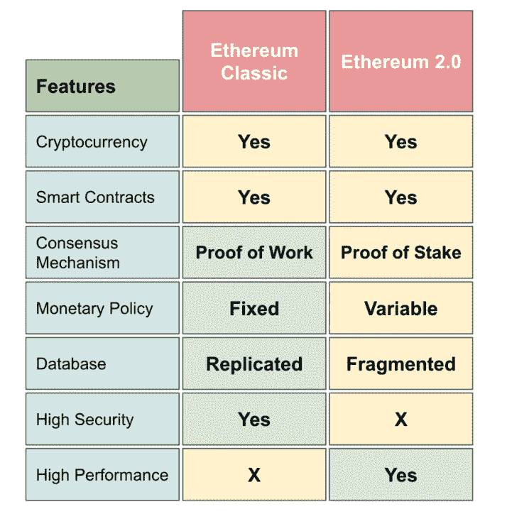

# 以太坊经典(ETC)是什么，与以太坊 2.0 有什么不同？

> 原文：<https://medium.com/coinmonks/what-is-ethereum-classic-etc-and-how-is-it-different-from-ethereum-2-0-eth-894da9e58c8?source=collection_archive---------32----------------------->

## 以太坊(ETH)的一个硬分支，被称为以太坊经典(ETC ),能够托管和启用分散式应用。它的主要功能是作为智能合同网络(DAPPs ), ETC 是其本地令牌。

从一开始，以太坊经典就努力将自己与以太坊区分开来，随着时间的推移，这两个网络的技术路线图变得越来越不一样。

以太坊经典基金会是一套指导决策的原则，旨在促进 ETC 的持久性并防止其被接管，这与其他区块链不同，后者的发展受到腐败的中央机构的控制。这是一个强大的概念，能够经受住无数的攻击，经得起时间的考验。

以太坊经典中缺乏自上而下的控制导致了反脆弱性，这是通过成员坚持和磨练分散化原则来实现的，这一原则可以简单地陈述，清楚地理解，并随着时间的推移而持续。

对于 Ethereum Classic 来说，原则是第一位的，术语“代码就是法律”在项目历史的开始就被用来概括它的基本原则。

# **以太坊经典(ETC) vs 以太坊 2.0 (ETH)**

以太坊经典和以太坊的主要区别在于，以太坊经典是保守运行的系统，侧重于安全性，而以太坊是进步的操作系统，侧重于性能。这清楚地区分了两个区块链的商业姿态。

以太坊 2.0 似乎是一个能够更好地服务于需要处理大量低价值、高容量交易的消费者和企业的系统。对于以太坊经典版，处理低交易量、高价值的交易将得到完美处理。

与以太坊不同，以太坊经典版无意切换到利益证明(PoS)挖掘流程，而一些开发人员仍在致力于潜在的升级，如缩放选项。

以太坊经典试图实现的目标可以通过结合以太坊和比特币区块链技术的简单理念来展示。

# 组

由于以太坊经典是以太坊的遗产链，所以它的真正创造者是以太坊最初的开发者 Vitalik Buterin 和 Gavin Wood。

以太坊经典基金会是一个想法，而不是个人的集合。

据开发人员称，这个项目没有“正式”的团队。

# **路线图**

以太坊经典的全部历史可以在[这里](https://ethereumclassic.org/knowledge/history)找到。更值得一提的近期事件包括:

*   12/02/2022-ETC block 14，525，000 上的 Mystique Hard Fork 为了保持与其姐妹链的运营一致性，以太坊经典的核心开发人员纳入了 ETH 的伦敦网络协议改进
*   18/03/2022 — ETC 欢迎新的 Hashrate —以太坊经典承诺支持 ETChash 挖掘算法和当前的采矿业。随着 ETH 网络转向股权共识证明，Ethereum Classic 现在处于与大多数被剥夺权利的 Ethash 矿工竞争的有利地位
*   2022 年 11 月 4 日—随着以太坊基金会在 2016 年放弃以太坊经典赛，稳定和长期的资金成为一个挑战。以太坊经典 DAO 的目标是通过开源开发基金来解决网络的 LTS 融资问题，从而使网络的发展面向未来。使用托管在 EthereumClassic.com 的 ETC DeFi 堆栈，创建资金
*   18/06/2022 — ETCswap —经典以太坊推出 ETCswap，DAO 首款产品。因此，该网络将向以太坊经典上的开源开发提供可靠的资金更近了一步。以太坊经典平台将用于创建专业的分散式协议栈
*   31/08/2022-ETC 哈希率激增-随着即将到来的以太坊合并继续在加密领域引起兴奋，以太坊的姐妹以太坊经典(ETC)自 2022 年 6 月以来哈希率增长了 83%
*   15/09/2022 — ETH 转向股权证明—EVM 最大的网络被以太坊基金会升级为股权证明共识。最大的工作证明 EVM 网络现在是以太坊经典感谢这次合并事件。作为所有 Ethash 衍生挖掘技术的领先网络，以太坊经典版的网络安全性有所提高

随着生态系统的自然发展，独立的开发团队和网络用户受到使以太坊经典成为如此独特的网络的价值观的引导。这个网络是真正不变的，分散的，不可阻挡的。法律就是法典。

# **在哪里存放以太坊经典(ETC)**

## 以太坊经典可以存储在许多目前最流行的钱包。其中包括:

*   《出埃及记》
*   信任钱包
*   元掩码
*   原子钱包
*   数学钱包
*   分类账(冷藏)
*   Trezor(冷藏)

我们总是建议我们的客户对他们希望开始使用的任何平台进行尽职调查和研究。您可以在我们的钱包指南页面上找到一些关于各种钱包的一般信息。

# **哪里有买卖以太坊经典(ETC)**

你可以在 [BC 比特币](https://www.bcbitcoin.com/)这里买卖以太坊经典(ETC)。

您可以前往我们网站的[购买硬币](https://www.bcbitcoin.com/buy/)页面购买 ETC。$ETC 可在 BC 比特币交易平台上兑换主要法定货币:英镑和欧元。购买以太坊经典(ETC)从未如此简单。只需下订单并提供您的钱包地址。一旦您的付款到达，ETC 将直接发送到您的钱包。

如果您选择出售以太坊经典(等)，您可以发送硬币给我们，并收到付款到您的银行帐户。详情和实时估价可以在出售硬币页面找到。

# **以太坊经典(ETC)资源**

网址:【https://ethereumclassic.org/ T3

街区探险家:【https://blockscout.com/etc/mainnet/ 

GitHub:[https://github.com/ethereumclassic](https://github.com/ethereumclassic)

推特:[https://twitter.com/eth_classic](https://twitter.com/eth_classic)

> **免责声明:本文提供的信息仅供参考。完成自己的研究和尽职调查是读者的责任。**

> 交易新手？尝试[加密交易机器人](/coinmonks/crypto-trading-bot-c2ffce8acb2a)或[复制交易](/coinmonks/top-10-crypto-copy-trading-platforms-for-beginners-d0c37c7d698c)