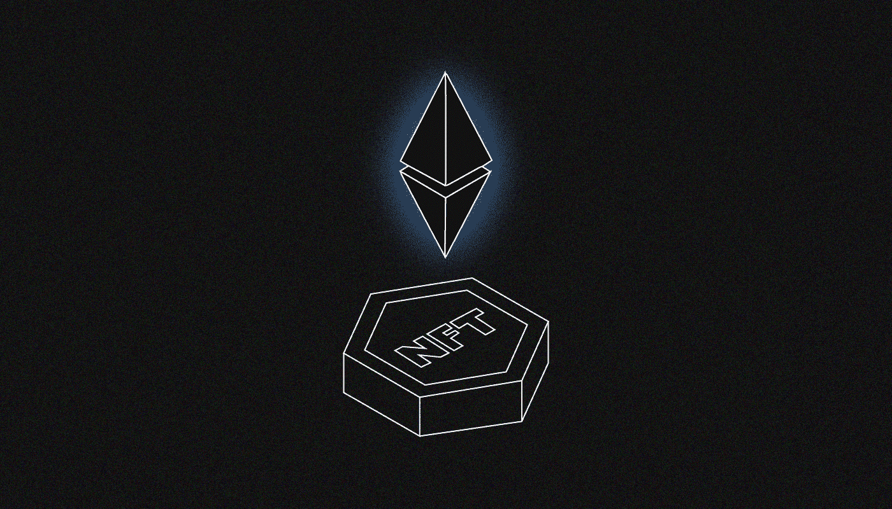
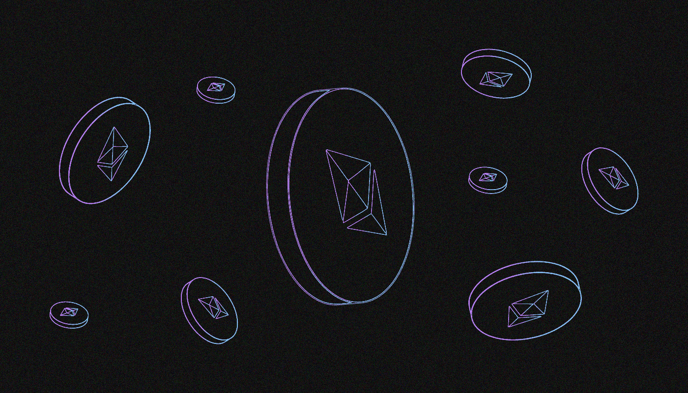

# 以太坊(ETH)是什么？

> 原文：<https://medium.com/coinmonks/what-is-ethereum-eth-37e0ff2c7af1?source=collection_archive---------64----------------------->

***以太坊是一个用于去中心化应用的区块链平台，也是资本化程度第二高的加密货币(ETH)。为什么会这样呢？为什么这么多人用？让我们来了解一下！***

这个网络被大多数受欢迎的 DeFi 和 NFT 项目所使用。

# **谁在何时创造了以太坊？**

**Vitalik Buterin** 被认为是以太坊的主要创造者和‘代言人’。1994 年，他出生在莫斯科郊区的科洛姆纳。他六岁时随父母移居加拿大，至今仍居住在那里。他从小就对编程和计算机科学感兴趣。他在大学学习密码学。

**2011 年，**维塔利克·布特林创办了《比特币》杂志，这是最早的加密货币相关出版物之一。

**2013 年，**他发布了以太坊[白皮书](https://ethereum.org/en/whitepaper/)，这是一款基于智能合约开发去中心化应用的区块链。以太坊的其他联合创始人有**加文·伍德、查尔斯·霍金森、安东尼·迪·伊奥里奥、**和**约瑟夫·卢宾。**

白皮书发表后，布特林从企业家彼得·泰尔创立的泰尔奖学金基金会获得了 10 万美元的资助。他把这笔钱交给了 ICO。在代币拍卖中，获得了 31 550 BTC，在当时大约价值 1850 万美元。

2015 年**夏天，主以太坊网络上线。[以太坊基金会](https://ethereum.org/en/foundation/)，一家在瑞士注册的非商业机构，自成立以来一直负责项目开发。**

# **以太坊有什么特点？**

Smart contracts

以太坊和比特币之间的主要区别已经演变成完全成熟的智能联系。这是一种计算机算法，使交易能够在没有第三方参与的情况下进行。实际上，这是一个“数字契约”，预先定义了特定情况下必须满足的条件。这使您能够将业务运营转移到区块链，消除“人为因素”智能合约有无限多的应用场景。

Virtual machine (EVM)

EVM(以太坊虚拟机)是一台执行智能合同的“分布式计算机”。如果比特币网络的主要功能是分布式注册系统中账户之间的交易，那么 EVM 可以处理智能合约中编程的复杂得多的操作。

# 用户令牌

以太坊的用户可以创建自己的代币。对于这样的令牌，开发了单一的 ERC-20 标准。用户令牌的价值来源于特定应用程序中的利益可用性。以太坊是第一个广泛用于初创公司的区块链，这些公司用自己的代币赚钱。

此外，由于 ERC-721 标准，以太坊作为 NFT 的区块链越来越受欢迎。这些是具有唯一信息的不可替换的令牌，例如图像或文件。NFT 是一个独一无二的数字对象，无法复制。

# **什么是以太？**

**以太(ETH)** 是以太坊的俗称——一种本土加密货币。在这个网络中，分散应用的操作和交易费用的支付都需要它。

最近，以太赌注已经开始运作:以太持有者可以阻止硬币并从中获利。然而，你只能在**以太坊 2.0** 网络更新结束后才能恢复它们。要参与以太赌注，你必须要么启动自己的节点(需要装备和 32 EHT)，要么使用特殊服务，如 **Everstake、Lido 或币安**。

按市值计算，ETH 是加密货币市场中第二大数字资产。到 2022 年 4 月**日**末，流通中的以太币总数将超过**3620 亿美元**。在不到两年的时间里，以太坊汇率增长了 10 倍:2020 年 7 月，一枚硬币价值 300 美元；到 2021 年**年底**，其价格被定在**3000 美元**或以上。以太坊几乎可以在任何加密货币交易所购买。

# **什么是劈刀？**

以太坊的第一个重大危机是道黑客。这是一个分散的自治组织(DAO ),旨在通过成员投票来管理投资基金。DAO 工作计划建立在以太坊智能合约之上。根据 2016 年**举行的首次公开募股(ICO)的结果，其创始人筹集了**1.5 亿美元**。**

****2016 年 6 月，一名**黑客利用漏洞攻击了该项目的智能合同，从中移除了价值**5000 万**美元的 DAO 令牌。之后以太坊团队进行了网络硬分叉，将被盗资金返还给受害者。不同意这一决定的社区的一部分继续以前的分支，将其项目命名为**以太坊经典**。**

# ****token sales 是因为以太坊而出现的吗？****

****2017 年**，加密货币市场开始快速增长，世界上所有人都意识到了这一点。包括散户在内的人们开始投资数字资产。当时出现了数百个项目，都试图通过发布白皮书和举办 ICO 来复制以太坊的成功。因为 ERC-20 是可用的，任何人都可以创建自己的令牌。**

****2018 年第一季度**出现了最高水平的代币销售活动，费用总额约为**70 亿美元**。但后来他们实际上不再持有 ico:加密货币价格开始下跌，代币销售受到各国当局的批评。**

**投资者对 ico 失去了信心，因为 ico 已经成为骗子的热门工具。**

**渐渐地，新的代币销售形式出现:**(首次交易所发售)** —通过交易所的特殊服务销售项目代币， **IDO(首次分散发售)** —通过资产养殖吸引投资者。**

# ****以太坊是怎么导致 DeFi 的？****

**以太坊主要促成了**去中心化金融(DeFi)** 的诞生。2017–2018 在这个区块链的基础上出现了几个标志性的项目，为 DeFi 的普及做出了贡献:**

****

1.  **[**马克尔道**](https://makerdao.com) 。第一个广泛使用的协议使任何用户都能创建由各种加密资产支持的算法 DAI 稳定币。该协议由 DAO 管理，在 DAO 中，**制造者令牌(MKR)** 的持有者可以投票。**
2.  **[复合**复合**。](/@SunflowerCorpAdmin/what-is-compound-4b2614031ef5)流动性池在该项目中首次用于各种加密资产。此外，Compound 通过 farming 分发 COMP 管理令牌，为其用户托管了第一个 IDO。**
3.  **[**Uniswap**](/sunflowercorporation/what-is-uniswap-2ab17b51b63b) 。首次使用自动做市商机制的加密货币交易协议。它创造了某种深度的市场，无需使用订单簿就能匹配订单。Uniswap 是第一个允许相对快速交易的区块链协议。**
4.  **今天，DeFi 被数百个项目使用，包括 Aave、Curve Finance、Balancer、dYdX、Notional 等。他们使用各种各样的区块链技术，但以太坊是第一个。**

# ****以太坊有竞争对手吗？****

**区块链平台模式已经证明了自己，以太坊和比特币已经成为占主导地位的加密项目。然而，以太坊的主要组成部分已经有几年没有改变了，密码行业在这段时间里已经走过了漫长的道路。主区块链平台的性能已经不够用了。**

**现在，以太坊的网络每秒只能处理 13–15 个交易(TPS)，它多次因过载而出现故障和延迟，并且转让费一直很高。**

**与此同时，它的现代“杀手锏”比它们强几十倍甚至几百倍。**泰佐斯**区块链速度超过 **1000 TPS** ，**波尔卡多特**速度高达 **3000 TPS** ，特拉速度高达**10000 TPS**，**索拉纳**速度高达**50000 TPS**。**

**每个区块链平台都提供了自己的可伸缩性解决方案，即随着负载的增加而增加吞吐量的能力。例如， **Solano** 采用了实用的拜占庭容错一致性算法的实现，而 **Polkadot** 由几个互连的区块链组成。**

**然而，增加可伸缩性的好处被区块链三难困境中描述的缺点抵消了。它指出，分散式网络只能同时提供三个关键属性中的两个:性能、安全性和分散性。以太坊和它的竞争对手都在试图解决这个问题，但是到目前为止还没有普遍接受的解决方案。**

# ****以太坊是如何进化的？****

**以太坊的开发者已经设计了几种方法来增加它的带宽。其中一个方向是二级解决方案(第二层)。**

**这些是运行在主要的“第一级”区块链(第 1 层)之上的应用程序和框架。一个额外的“层”可以让您在提高交易速度的同时降低转账费用。**

**在以太坊区块链上，L2 解决方案是使用汇总技术实现的，它允许您将通过第二级的数百个交易包含在单个第一级交易中。Arbitrum One、乐观和 dYdX 就是这种应用的例子。**

**侧链是另一种选择。这些是与主区块链相连的“平行”网络，允许它们之间进行交易。 **Polygon** 是以太坊兼容侧链的一个例子。**

> **在跟踪更新方面，订阅我们的 [Medium feed。](https://medium.com/sunflowercorporation)敬请期待！**
> 
> **您也可以在我们的平台[向日葵公司](https://sunflowercorp.com/)上尝试使用加密货币。**

****

# ****以太坊 2.0 是什么？****

****以太坊 2.0** 是一个重大更新，旨在通过架构的全球变化来增加这个区块链平台的可扩展性。**

**以太坊 2.0 的主要变化:**

*   **切换到利害关系证明共识算法；**
*   **实施分片技术:将区块链划分为多个管理段(分片),并在每个管理段中并行执行操作；**
*   **一个新的 eWASM 虚拟机将支持用流行的编程语言开发的智能合约。**
*   **切换到利害关系证明共识算法；**
*   **实施分片技术:将区块链划分为多个管理段(分片),并在每个管理段中并行执行操作；**
*   **一个新的 eWASM 虚拟机将支持用流行的编程语言开发的智能合约。**

**更新分几个阶段实施，所有时间点的确切时间是未知的。据粗略估计，这项工作将于 2023 年**至 2024 年**完成。**

> **交易新手？尝试[加密交易机器人](/coinmonks/crypto-trading-bot-c2ffce8acb2a)或[复制交易](/coinmonks/top-10-crypto-copy-trading-platforms-for-beginners-d0c37c7d698c)**