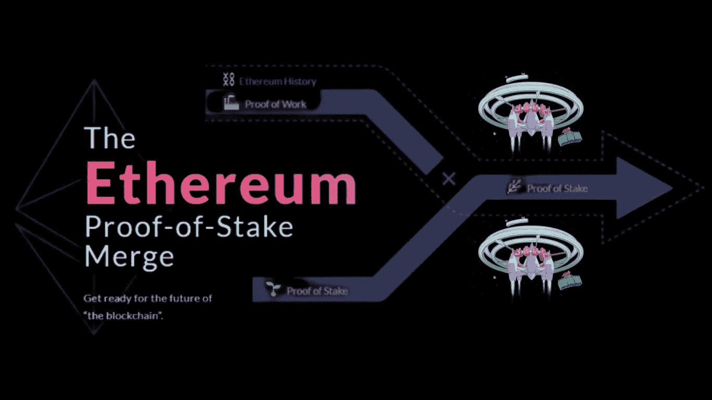

# 什么是以太坊合并和主要的误解？

> 原文：<https://medium.com/coinmonks/what-is-ethereum-merge-and-the-major-misconceptions-19f75195aaa8?source=collection_archive---------23----------------------->

# 介绍

在去年 EIP-1559 升级之后，整个以太坊生态系统一直渴望看到被称为“合并”的以太坊升级。

很多人已经在猜测，升级将使以太坊的价格飙升，而一些人说，这将使区块链更快，并减少汽油费，尽管所有这些意见都是猜测。

此次合并是区块链以太坊历史上的一次重要升级。

# 什么是合并？

合并是以太坊区块链从工作证明(POW)到利益证明信标链的移动的名称。

这次合并是两个区块链——Mainnet ether eum 和 Beacon Chain 的合并。

当合并发生时，以太坊将不依赖于矿工来验证交易。相反，网络的交易将由称为验证器的实体来验证。

通过使用 PoS 共识机制，以太坊验证器通过拥有 32 个以太来选择，并且它们需要运行三个不同的软件，包括验证器、执行客户端和共识客户端。

# 对合并的误解

**1。合并将导致整个网络停机**。

以太坊基金会团队的开发人员向人们保证，随着以太坊区块链从工作证明过渡到利益证明，不会出现网络宕机。

**2。合并将使交易减少**

与许多密码交易员和投资者的情绪相反，合并不会降低交易费用。

合并不会扩大网络，也不会提供更有效的交易结构。

**3。合并将使交易更快**

合并将会给以太坊带来一些变化，但是更快的交易并不是升级所期望的。

虽然以太坊的开发者说，随着以太坊转向股权证明，将会有 10%的批量生产，但这一增长并不意味着什么。

**4。合并后，投资者将可以撤回持有的股份**

由 ETH 1:1 支持的加密货币 Staked ETH (stETH)目前被锁定在信标链上。虽然用户希望能够收回他们的 stETH 资产，但是开发者社区已经确认升级并不能促进这种改变。

stETH holdings 的退出将在合并后的下一次重大升级期间进行，即所谓的上海升级。因此，在合并后的至少 6-12 个月内，这些资产将保持锁定和非流动性。

**5。在合并后，预计 APR 将增加两倍**

这不是真的，合并不会使赌注 APR 增加。

以太坊基金会的开发者并没有做出任何关于增加 4 月赌注的声明。

**6。在上海升级之前，验证者不能提取 ETH 奖励**

虽然在上海升级后恢复提款之前，staked ETH 对投资者仍然是封锁的，但验证者将可以立即从执行层或以太坊 Mainnet 获得费用奖励和在大宗提议期间赚取的最大可提取价值(MEV)。

由于费用补偿不是新发行的令牌，它将立即对验证器可用。

# 作为以太坊用户，我需要做些什么？

合并是一个协议升级，作为一个以太坊用户，你不需要在合并前后做任何事情。你钱包里的乙醚不会有任何变化。

# 合并什么时候发生

许多开发者、投资者和交易者多年来一直期待的大升级现在到来了。

合并将发生在 2022 年 9 月 15 日至 17 日之间。

# 如果合并出了问题怎么办？

许多人一直在问，如果合并出了问题，它将对以太坊链造成一些破坏，如果发生这种情况，一般的市场情绪可能是悲观的。

但是合并不太可能出错，因为负责的开发人员有能力成功地将以太坊交付给股权证明。

# 结论

这是区块链以太坊历史上备受期待的升级。

合并将在 2022 年 9 月 15 日左右，或者总难度达到 58750000000000000000 的时候，在以太坊的主网上实现。届时，该网络将与应用于信标链的 PoS 共识机制以及测试网 Ropsten、Sepolia 和 Goerli 合并。

> 交易新手？试试[密码交易机器人](/coinmonks/crypto-trading-bot-c2ffce8acb2a)或者[复制交易](/coinmonks/top-10-crypto-copy-trading-platforms-for-beginners-d0c37c7d698c)