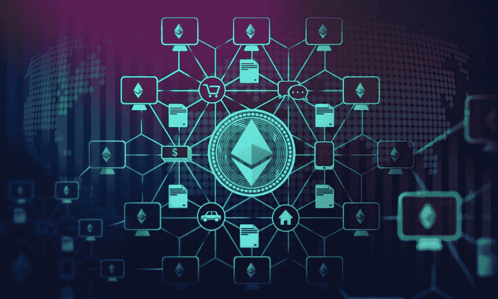
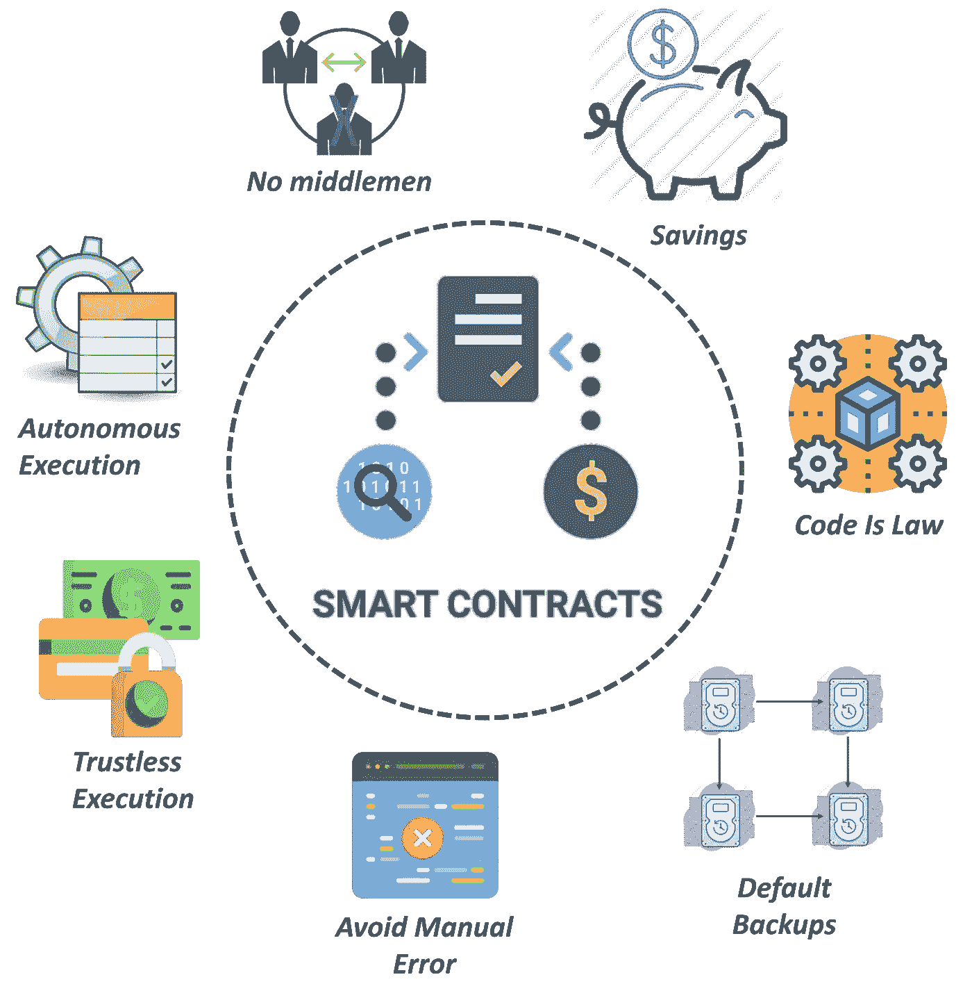
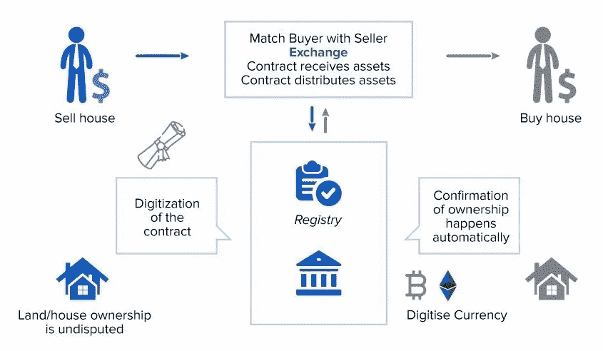

# 以太坊是什么？第 1 部分:智能合约

> 原文：<https://medium.com/coinmonks/what-is-ethereum-part-1-smart-contract-74f259708792?source=collection_archive---------27----------------------->

在[区块链](/coinmonks/what-is-blockchain-a7082404caa2)科技宇宙中，如果有一个名字对去中心化空间的发展影响最大，那就是以太坊。就受欢迎程度和市值而言，它仅次于[比特币](/coinmonks/what-is-bitcoin-e98b2b77c81b)。以太坊区块链的范围及其对创新应用的适应性使其成为一个经久不衰的话题。

**起源与进化**

比特币推出后不到 5 年，尽管它取得了成功并被广泛采用，但该协议的局限性变得不可否认。原因是比特币除了作为数字价值转移的分布式账本之外，没有太多的未来。在 2013 年发布的一份革命性白皮书中，Vitalik Buterin 首次提出了一个开源区块链生态系统来帮助构建去中心化应用程序(dApps ),并提出了以太坊的名称。

2014 年，以太坊将智能合约集成到区块链技术的软件开始开发。同年，联合创始人加文·伍德撰写了黄皮书，正式确定了以太坊虚拟机 (EVM)及其协议的起源。不久之后，区块链本土的加密货币以太发行，人们可以用比特币购买。经过超过 18 个月的广泛原型测试，以太坊于 2015 年 7 月正式推出其平台，这也标志着区块链的[创世纪积木](https://coinsbench.com/understanding-the-architecture-of-a-blockchain-f50ad412bdc4)的诞生。

> 因此，简而言之，以太坊是一个去中心化的生态系统，它探索了区块链可以自动执行智能合同的方式，并提供了一个允许的平台，以促进其他 dApps 的构建和运行。

自推出以来，该平台经历了多次协议升级。最值得注意的是 2016 年的硬分叉事件，其中传统的区块链版本继续作为以太坊经典，分叉的区块链网络成为人们今天所知道的以太坊。该平台目前正处于向以太坊 2.0 演进的过程中，并且已经成功地将其测试网与主区块链集成在一起。除了开发其功能外，这还将导致网络的[共识模型从工作证明(PoW)到利益证明(PoS)](/coinmonks/understanding-the-role-of-consensus-in-blockchain-db724fa63a53) 的最终转换。

[**Ethereum ecosystem concept**](https://www.pymnts.com/blockchain/2021/what-is-a-smart-contract/)

**以太坊和智能合约**

有趣的是，智能合约的概念在以太坊在其平台上使用它之前就已经存在了。在 20 世纪 90 年代初，Nick Szabo 首先提出了智能合同，作为一种可编程的协议，以数字方式执行给定合同的条款，而不管其复杂性如何。这可能与涉及电子支付的数字交易一样简单，也可能与衍生品或债券等合成资产的操作一样复杂。

当区块链科技公司抓住这个概念时，它用去中心化、分布式的网络参数来定义智能合同。因此，智能合同(本质上是一段代码)通过触发双方之间协议条款的自动验证和执行来发挥作用。当事人，通常是买方和卖方，保持匿名，并且合同执行不需要任何第三方的参与，如中央机构或任何法律框架。

[**Smart contract**](https://mundotokens.com/smart-contract/)

以太坊的智能合约协议使用一种非限制性的编程语言，使开发人员能够通过实现广泛的条款和条件来运行和加速支持区块链的流程。因此，任何人都可以通过定义任何一组特性和功能来创建任何类型的智能契约。此外，智能契约不必是只管理单个交易的孤立契约。可以使用不同但相互依赖的跨职能智能合同的组合。这是构建 dApps 的基础。

**特点**

以下特征强调了智能合约的优势，从而强化了以太坊将其作为其生态系统焦点的原因。

[**Smart contract characteristics**](https://www.govp2p.com.au/blog/procurement-blog/smart-contracts/)

● **不信任**——智能合同消除了对中介的需求。

● **自治** —智能合同是在双方履行预定义条款的前提下自动执行的。

● **速度**——无需文书工作或人力代理，智能合同以数字方式执行，没有时间延迟。

● **不可变代码** —这保证了透明性，并赋予智能契约所有实现的最终仲裁者的角色。

● **无错误** —由于智能合同是由计算机程序运行的协议，因此确保了准确性。

● **经济高效** —开发和部署智能合同消除了任何第三方，从而节省了资金。

● **区块链协会**——分散的分布式账本确保智能合约的副本同时存在于[区块链](/coinmonks/what-is-blockchain-a7082404caa2)网络的所有节点上。

● **安全性** —每个[节点](https://coinsbench.com/understanding-the-architecture-of-a-blockchain-f50ad412bdc4)上的智能合同副本增强了安全性，因为如果不改变整个区块链来篡改哪怕一条记录，就不会有黑客攻击。

**适用性**

智能合约有各种实际应用，其中包括:

1.使用智能合约来彻底改变传统金融是以太坊生态系统上许多 dApps 的唯一目标。这就创造了[分权财务](/@DC.600/what-is-ethereum-part-3-applications-12097472b9f9) (DeFi)的领域。

2.对等交易是使用区块链的数字资产转移的本质。智能合约的采用可能会让传统的法定货币变得多余。

3.智能合约在基于区块链的游戏开发中具有巨大的适用性。

4.分散自治组织(Dao)是智能合同创新企业结构的直接应用。

5.使用智能合同来维护区块链网络上的医疗记录正在重新定义数据存储和安全性。

6.智能合同可以通过将假冒商品市场拒之门外，改变原创产品的认证方式。

7.房地产是另一个实施智能合同潜力很大的行业。下图是一个典型的例子。

[**Example of real estate application of smart contract**](https://2muchcoffee.com/blog/what-is-a-smart-contract-and-where-to-use-it/)

8.依靠合同和协议蓬勃发展的法律部门发现了智能合同特性和功能的巨大用途。

9.保险领域在保单发起、执行和索赔处理方面都有巨大的智能合同应用可能性。

**临别赠言**

仅通过了解智能合约，以太坊上的对话仍不完整。下一篇文章将继续深入这个主题。

**也读作:**

[*什么是区块链？*](/coinmonks/what-is-blockchain-a7082404caa2) *|* [*什么是以太坊？第二部分:设计*](/@DC.600/what-is-ethereum-part-2-design-c9b9f1b39fda) *|* [*什么是以太坊？第三部分:应用*](/@DC.600/what-is-ethereum-part-3-applications-12097472b9f9)

跟随我:

[**LinkedIn**](https://www.linkedin.com/in/a600dc/)|[**Twitter**](https://twitter.com/dc_111)

联系人:**arnab.dc111@gmail.com**