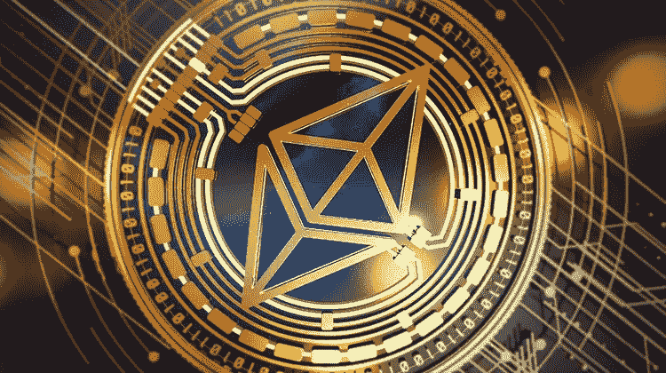
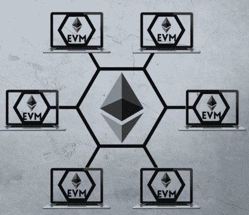
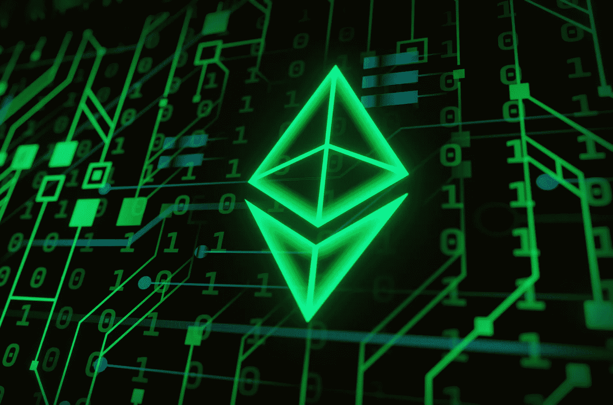
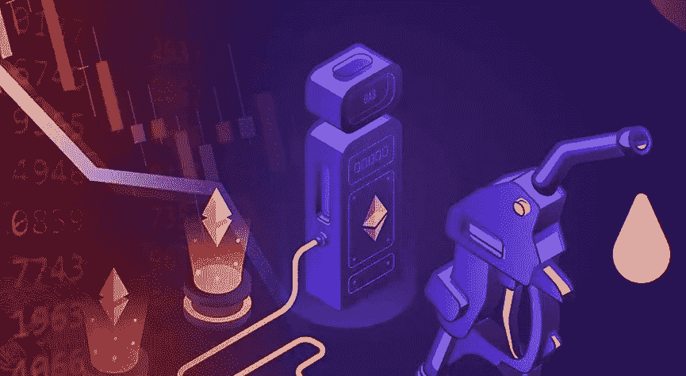
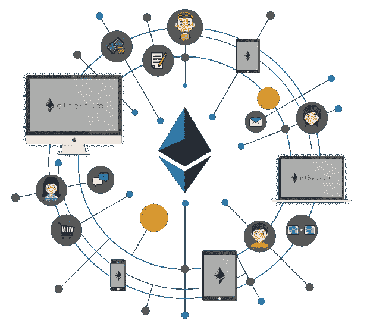

# 以太坊是什么？第二部分:设计

> 原文：<https://medium.com/coinmonks/what-is-ethereum-part-2-design-c9b9f1b39fda?source=collection_archive---------41----------------------->

以太坊的定义特征是其生态系统与[智能合约](/@DC.600/what-is-ethereum-part-1-smart-contract-74f259708792)功能的集成。上一篇文章对此做了简要介绍。本文主要讨论以太坊背后的设计以及它的各种组件。

**设计**

以太坊遵循一般的[区块链](/coinmonks/what-is-blockchain-a7082404caa2)设计，所有与积木相关的活动都发生在相互连接的节点上。它建立了对等网络，其中每个对等节点都参与传播公共分类帐中的交易记录。[挖掘节点](https://coinsbench.com/understanding-the-architecture-of-a-blockchain-f50ad412bdc4)是那些专门参与验证最终构建和维护链的组件块的事务的节点。整个流程遵循[工作证明(PoW)共识模型](/coinmonks/understanding-the-role-of-consensus-in-blockchain-db724fa63a53)。

有时，分散和分布式设计会导致一系列块竞争成为链上的下一个附加块的情况。在这种情况下，节点运行验证过程，并根据链的长度跟踪所有结果链。它还不断地从结果中删除最短的链。以太坊协议规定，多个竞争链中最长的链将成为未来的标准。

**以太坊虚拟机(EVM)**

[**Ethereum virtual machine (EVM)**](https://globalcoinresearch.com/2022/03/28/a-deep-dive-into-the-ethereum-virtual-machine-part-i/)

作为 Vitalik Buterin 的白皮书《以太坊愿景》的后续，联合创始人 Gavin Wood 在其著名的黄皮书中提出了以太坊虚拟机(EVM)的概念。简单地说，虚拟机是一种理论上的构造，它以虚拟软件的形式代表真实的计算机。因此，在以太坊的设计层次中，EVM 是网络中最关键的组件，因为它是开发和部署[智能合约](/@DC.600/what-is-ethereum-part-1-smart-contract-74f259708792)的关键。

EVM 基于堆栈的设计就像一台全球规模的计算机，具有永久数据存储的记忆功能，由以太坊无数分散的节点管理。EVM 的计算引擎能够管理数百万条命令的执行，并不间断地更新网络状态。它还处理区块链的[哈希](https://coinsbench.com/understanding-the-architecture-of-a-blockchain-f50ad412bdc4)算法。EVM 编程手册的代码是用高级图灵完全语言编写的。这使得开发人员能够实现自定义算法，并调整智能合约设计，以运行无限的排列和组合。

当以太坊 2.0 成熟时，以太坊网络组件(eWASM)将会用现实世界的适用性取代 EVM 的理论构建。这可能会以当前成本的一小部分，通过提高速度和效率彻底改变网络吞吐量。

**乙醚**

[**Ether concept**](https://www.coindesk.com/learn/what-is-ether/)

以太坊的原生加密货币是 Ether (ETH)。作为网络内所有操作接受的唯一令牌，它是整个生态系统不可或缺的一部分。ETH 的生产方式与[比特币](/coinmonks/what-is-bitcoin-e98b2b77c81b)相同——作为对[矿工](https://coinsbench.com/understanding-the-architecture-of-a-blockchain-f50ad412bdc4)的集体奖励。此外，以太坊矿商还收取 ETH 作为交易费，为不断增长的[区块链](/coinmonks/what-is-blockchain-a7082404caa2)处理不断出现的新交易。与比特币相比，以太坊提供了一种更可分割的加密货币，因为其最低单位称为 10^(–18 以太坊。

根据以太坊的协议，以太网的供应和生产没有限制，这有可能导致通货膨胀。为了解决这一问题，该网络采用了以太坊改进提案(EIP)第 1559 号，以部分燃烧天然气费。这已经导致 200 多万个 ETH 被烧毁，价值超过 50 亿美元。此外，一旦系统完成合并升级并开始遵循[利益证明(PoS)共识机制](/coinmonks/understanding-the-role-of-consensus-in-blockchain-db724fa63a53)，新令牌的发行可能会下降。

**气体**

人们在以太坊交易中经常听到的一个术语是气体，理解它在讨论中的位置很重要。虽然以太是网络加密货币的代言人，但该系统也有一个内部货币系统来促进其内部的操作。这是气体。仅使用乙醚即可购买。一个气体单位称为 Gwei，其值为 10^(–9 eth。

以太坊的气体概念就像燃料利用。这种资源的消耗为负责执行智能合约或运行应用程序的系统计算功能提供动力。

[**Ethereum gas**](https://web3.hashnode.com/glossary/what-is-eth-gas)

因此，任何希望经营 EVM 或进行任何交易的人都必须支付网络使用费。这个费用是汽油费。每笔交易还需要明确的气限，气限乘以气费，就决定了运营成本。用户在发起交易时规定燃气限额和燃气费的数量。然后，他必须使用他的 ETH 余额提前支付全部价格。成功完成后，他将获得未使用汽油的退款。如果交易因燃气不足而失败，用户只能取回未使用的燃气，而不能取回已经在系统中花费的交易成本。

**账户和地址**

以太坊支持两种类型的账户。

●用户账户是进行交易的外部账户。

●合同账户负责所有[智能合同](/@DC.600/what-is-ethereum-part-1-smart-contract-74f259708792)功能，无论是创建新合同还是访问和引用已创建的合同。

两个账户都支持 ETH balance，因为网络内的任何活动都需要付费。以太坊帐户地址是复杂的十六进制字符串，由带有前缀“0x”的字母数字字符组成。

**治理**

[**Ethereum governance**](https://blockchaindevs.github.io/MeetupDAO/meetupdao/UI/web3/index.html)

Buterin 是链上治理的公开反对者，因为它有可能通过让[联营实体积累大量令牌](/coinmonks/what-is-staking-7ca67fa9d4da)并获得影响管理的过度权力来破坏分散化。因此，以太坊的首选治理模式是通过 EIP 进行链外治理。在这种安排下，所有关于正在进行的服务、新功能的添加和调试的决策都要在机构群体投票批准之前进行彻底的讨论。整个过程发生在一个公开的 GitHub 论坛上，而不是区块链的平台上。

当过渡到以太坊 2.0 时，以太坊设置为将其[共识协议从 PoW 切换到 PoS](/coinmonks/understanding-the-role-of-consensus-in-blockchain-db724fa63a53) 。这将牢固地确立桩作为网络使用的唯一机制，与当前用户同时获得开采和/或[桩](/coinmonks/what-is-staking-7ca67fa9d4da) ETH 的选项的情况形成对比。

**临别赠言**

以太坊的对话并没有随着理解它的设计和组件而结束。本系列的[最后一篇文章](/coinmonks/what-is-ethereum-part-3-applications-12097472b9f9)将通过讨论其多种用途以及快速研究[侧链](https://coinsbench.com/what-is-sidechain-4d4dc912ec50)和第 2 层解决方案的发展来结束本主题。

**亦读:**

[*以太坊是什么？第一部分:智能契约*](/@DC.600/what-is-ethereum-part-1-smart-contract-74f259708792) *|* [*什么是以太坊？第三部分:应用*](/@DC.600/what-is-ethereum-part-3-applications-12097472b9f9)

跟随我:

[**LinkedIn**](https://www.linkedin.com/in/a600dc/)|[**Twitter**](https://twitter.com/dc_111)

联系人:**arnab.dc111@gmail.com**