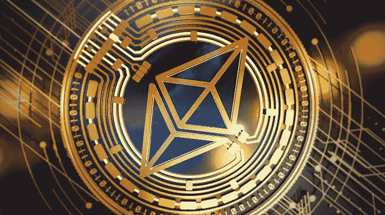

# 以太坊是什么？第 3 部分:应用

> 原文：<https://medium.com/coinmonks/what-is-ethereum-part-3-applications-12097472b9f9?source=collection_archive---------44----------------------->

了解它的[智能合约](/@DC.600/what-is-ethereum-part-1-smart-contract-74f259708792)特性和[功能设计](/@DC.600/what-is-ethereum-part-2-design-c9b9f1b39fda)是学习以太坊不可或缺的。前两篇文章详细讨论了这些方面。这篇文章详细阐述了生态系统的许多应用。然而，在讨论它们之前，了解一下以太坊的[区块链](/coinmonks/what-is-blockchain-a7082404caa2)网络以[侧链](https://coinsbench.com/what-is-sidechain-4d4dc912ec50)和第二层解决方案的形式的附带发展是很有趣的。

**侧链**

[**Ethereum sidechain**](https://wazirx.com/blog/what-are-sidechains/)

以太坊平台的庞大通常是可伸缩性和互操作性的障碍。侧链是实现操作简易性的一个很好的变通方法。以太坊侧链的 USP 包括与主链的兼容性、可移植合同，以及通过双向跟踪实现数据和资产的平滑跨链传输。侧链的平行但独立的性质通过合并单独的积木式标准、[共识机制](/coinmonks/understanding-the-role-of-consensus-in-blockchain-db724fa63a53)和验证器选择过程确保了快速交易。突出的例子包括:

● Plasma 由子链框架组成，用于开发和部署可扩展的分散应用程序(dApps)

● POA 符合权威共识模型的证明

● Loom Network 为 dApps 和分散金融(DeFi)提供平台即服务(PaaS)

● TokenBridge 应用程序提供互操作功能

**第二层解决方案和分片**

以太坊的特性和功能使得它的网络被广泛采用。同时访问平台通常会导致拥堵，进而导致交易费用增加。在这种情况下，第 2 层解决方案和/或分片可以提供比分叉成新分支或创建可沟通的[侧链](https://coinsbench.com/what-is-sidechain-4d4dc912ec50)更好的答案。

分片本质上是将一个区块链分割成更小的分片链，能够在不牺牲可负担性的情况下加快交易速度。但是，对于平台来说，它仍然是一个理论概念。只有当以太坊 2.0 开始起作用时，它才会完全生效。

[**Ethereum layer 2**](https://www.finextra.com/blogposting/21237/top-ethereum-layer-2-networks)

因此，目前，通过智能合约在传统的第 1 层网络之上构建第 2 层是最佳的发展方向。这种实施已经取得了巨大成功。在这里，第二层协议享有以太坊的安全特权，并且只需支付少量[气体](/@DC.600/what-is-ethereum-part-2-design-c9b9f1b39fda)费用即可获得。最受欢迎的第二层解决方案提供商是 Polygon、optimistry 和 Arbitrum。虽然它们都提供互操作性，但乐观的 USP 是其链上事务和链外计算功能，确保低成本的加速吞吐量，Polygon 因更好的灵活性而受到开发人员的青睐，而 Arbitrum 因其汇总支持而受到青睐。

**以太坊应用**

有了智能合约功能和[以太坊虚拟机](/@DC.600/what-is-ethereum-part-2-design-c9b9f1b39fda) (EVM)的图灵完整手册，人们可以开发如下众多应用程序:

●创建可替代和不可替代的令牌(NFT)

●定制 dApps、DeFi 和分散式交易所(DeX)、分散式互联网(Web3)、现实世界以及虚拟现实(VR)和增强现实(AR)中支持区块链的三维游戏，以及元宇宙

●通过初始硬币发行(ICO)和初始 DeX 发行(IDO)实现众筹

建立分散的自治组织

●构建与以太坊[公共区块链](/coinmonks/what-is-blockchain-a7082404caa2)无关的企业软件和网络

简单看一下以太坊生态系统的一些最普遍的用途将有助于更好地理解它们。

**ERC-20 代币**

[**ERC-20 tokens**](https://coinquora.com/what-is-an-erc20-token/)

以太坊使其他区块链网络能够利用[智能合约](/@DC.600/what-is-ethereum-part-1-smart-contract-74f259708792)来创建他们自己的加密货币并进行分发。以太坊注释请求或 ERC 是发布这些令牌的协议标准，而数字 20 是协议请求的唯一标识。区块链平台如此生成的 ERC-20 代币是可替换代币，表示所有代币具有相等且固定的价值。例如，系绳(USDT)是一个典型的 ERC-20 令牌。一个 USDT 的价值和另一个是一样的，不可能有不一样的。根据使用情况，ERC-20 令牌可以是具有货币价值的公用事业令牌，也可以是非财务治理令牌，由 Dao 用于向其持有人授予管理权限。

其他受欢迎的 ERC-20 代币包括 UniSwap 的 UNI、Maker 的 MKR、Chainlink 的 link、Wrapped Bitcoin 的 WBTC、Basic Attention Token 的 BAT 和 Augur 的 REP。用户需要兼容的[钱包](/coinmonks/learning-about-crypto-wallets-897a30f8f79a)来存储或交易 ERC-20 代币，并且必须在[以太](/@DC.600/what-is-ethereum-part-2-design-c9b9f1b39fda)支付交易费用。

**不可替换令牌**

[**Non-fungible tokens (NFTs)**](https://www.kiplinger.com/investing/602743/nfts-what-are-they-and-how-do-they-work)

以太坊智能合约有助于开发不可替代令牌(NFT)。根据定义，非功能性交易是独特的，不可分割的。NFTs 的两个主要协议标准是 ERC-721 和 ERC-1155。NFT 没有内在价值，但通过代表具有价值的数字资产而变得有价值。因此，它们是处理数字艺术、数字时尚、体育纪念品的[区块链和处理房地产、游戏收藏品和头像等的元宇宙的理想选择。顶级 NFT 项目包括分散的土地，沙盒，奇利兹，金恩和，ApeCoin。](/coinmonks/what-is-blockchain-a7082404caa2)

**DeFi**

[**Ethereum and decentralized finance (DeFi)**](https://pixelplex.io/blog/top-12-ethereum-defi-lending-dex-payment/)

以太坊的生态系统配备了[智能合约](/@DC.600/what-is-ethereum-part-1-smart-contract-74f259708792)来构建 dApps，在将传统金融部门转变为现代 DeFi 方面发挥了关键作用。这也导致了点对点市场或 DeX 平台的兴起。UniSwap 是一个突出的例子。

以太坊的生态系统及其第 2 层 Polygon 支持 200 多种 DeFi 协议，在以下领域提供广泛的服务:

●数字资产管理工具(金恩加密钱包、DeFi Saver、dHEDGE)

●衍生品、期权、期货市场和保证金交易(NFT20、NFTX、镜像协议、Hegic、dYdX、保证金 DDEX)

●预测市场(Augur、Gnosis、Omen.eth、PlotX、Polymarket)

●分散式借贷(Aave、复利、流动性、扭矩、TrueFi)

●数字支付解决方案(Celer Network、OmiseGO、Connext、Superfluid)

●稳定硬币(戴、真美元、美元硬币、双子星美元)

●收益聚合器(Harvest、向往. finance、Vesper、Idle、Pickle)

●分散保险(Nexus Mutual，InsurAce 协议)

●资产令牌化(Harbor、Polymath Network、TokenSoft、证券化)

●数字身份(identity.com、3Box、BrightID、Bloom、Blockpass、Hydro、SelfKey)

● DeFi 基础设施建设和开发工具(Chainlink、Kyber Network、Ren、0x Protocol、Alchemy、Hummingbot)

● DeFi 和 DeX 分析平台(APY。视觉，德班克)

**结论**

无法统计有多少现有的[区块链](/coinmonks/what-is-blockchain-a7082404caa2)平台依赖以太坊的生态系统，并在不同程度上参与探索和整合其协议。它的[智能合同](/@DC.600/what-is-ethereum-part-1-smart-contract-74f259708792)能力、[设计](/@DC.600/what-is-ethereum-part-2-design-c9b9f1b39fda)和应用构建能力使它成为一个发电站，甚至传统的非区块链公司也试图利用它。因此，毫不夸张地说，在区块链网络中，以太坊是一个绝对的梦想家。

**也读作:**

[*什么是 Sidechain？*](https://coinsbench.com/what-is-sidechain-4d4dc912ec50) *|* [*什么是以太坊？第一部分:智能契约*](/@DC.600/what-is-ethereum-part-1-smart-contract-74f259708792) | [*以太坊是什么？第二部分:设计*](/@DC.600/what-is-ethereum-part-2-design-c9b9f1b39fda)

跟随我:

[**LinkedIn**](https://www.linkedin.com/in/a600dc/)|[**Twitter**](https://twitter.com/dc_111)

联系人:**arnab.dc111@gmail.com**