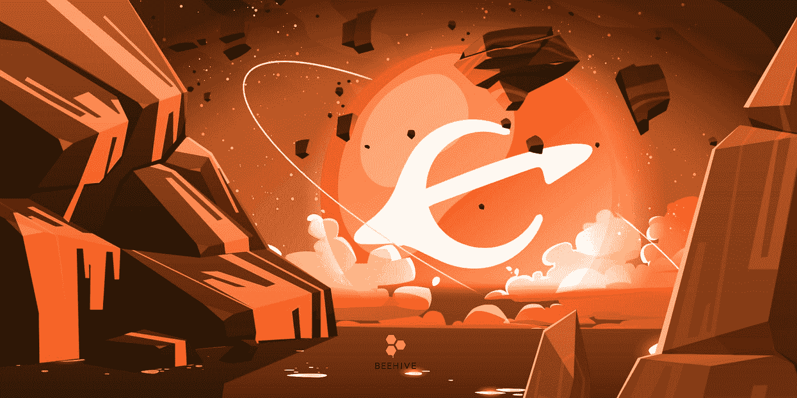
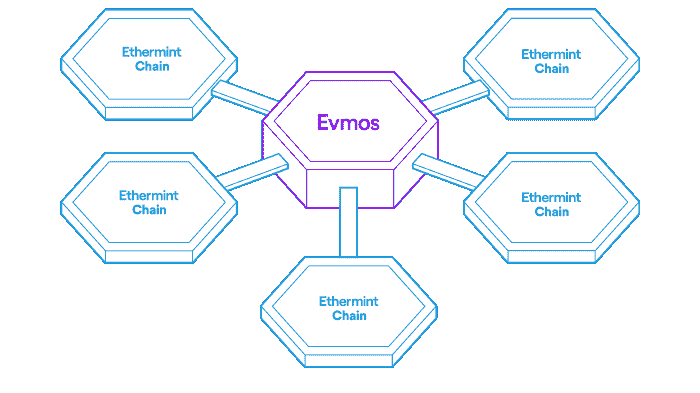
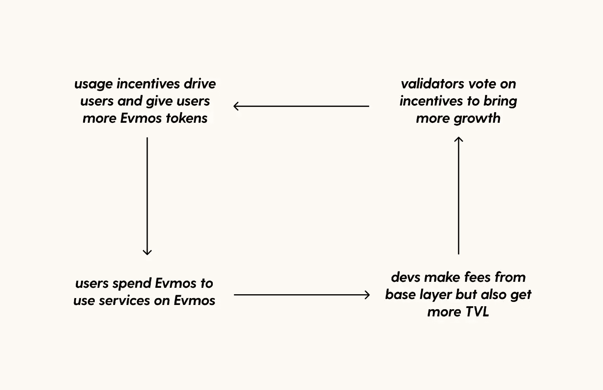
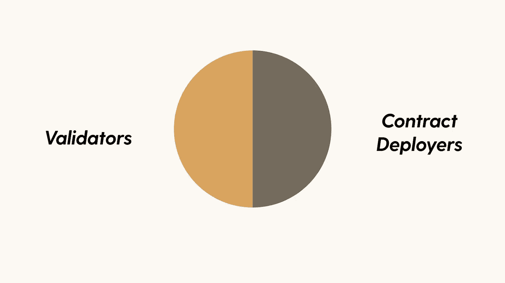
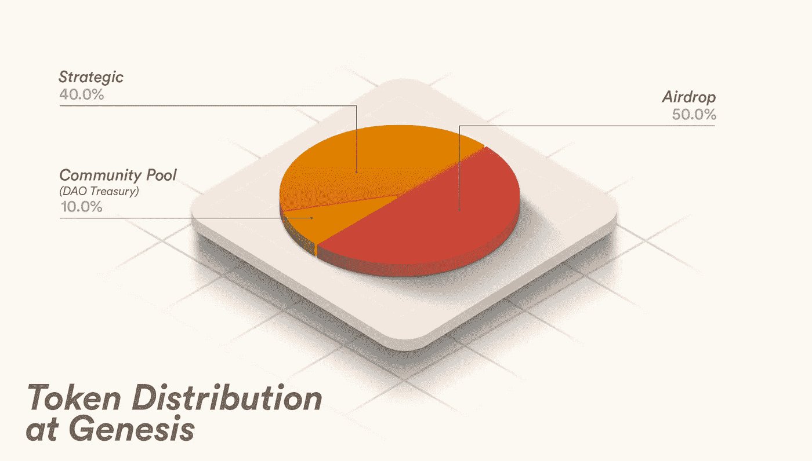
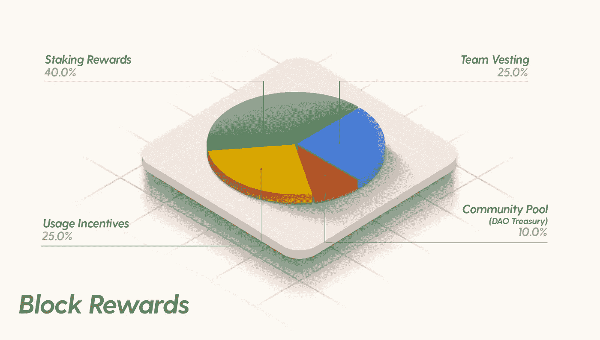
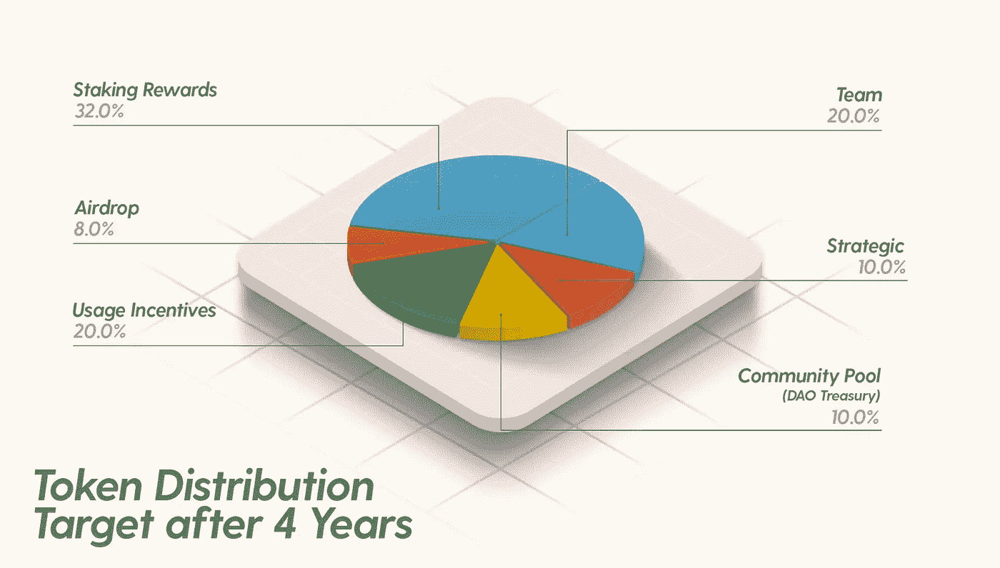
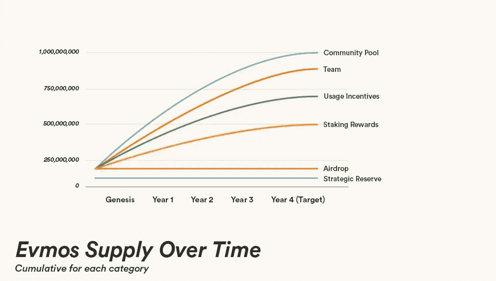

# 什么是 Evmos (EVMOS)？关于 Evmos 的一切

> 原文：<https://medium.com/coinmonks/what-is-evmos-evmos-all-about-evmos-f0bbbf921095?source=collection_archive---------5----------------------->

宇宙上的 EVM 协议弥合了 EVM 链和宇宙生态系统之间的差距。那么，这个项目最重要的方面到底是什么？

让我们来看看 Evmos，这是一个通过为多系统宇宙提供解决方案来促进生态系统增长的项目。

> 从顶级交易者那里复制交易机器人。免费试用。

# 什么是 Evmos？

Evmos 是一个可靠的区块链，具有可伸缩性、高吞吐量，并且与以太坊完全兼容和互操作。它是用运行在 Tendermint 核心共识引擎之上的 Cosmos SDK 构建的。

Evmos 使得标准以太坊作为宇宙特有的区块链运行成为可能。这使得开发者可以使用以太坊的所有特性，同时还可以利用 Tendermint 的 PoS 实现。此外，由于它建立在 Cosmos SDK 的基础上，它将能够通过内部区块链通信协议(IBC)与 Cosmos 生态系统的其他部分进行价值交易。

# Evmos 的显著特征

## 延期天然气回扣

Evmos 正试图建立一个由经济驱动并协同工作的应用程序网络。他们通过延期天然气补贴和流动性开采来做到这一点。

首先，Evmos 上的使用激励池将帮助最终用户支付购买的天然气。为了鼓励人们在 Evmos 上使用智能合同，社区将能够通过治理注册特定智能合同的激励，以便在一定时间内使用使用激励池的一部分。

目标是给使用合同的人奖励，这样它就像一种汽油补贴。这基本上是网络如何决定哪些分散应用(dapp)将为其用户获得天然气补贴，令牌持有者是向这些 dapp 驱动流量的最佳人选。

## 流动性挖掘

未来的目标是通过专注于使用推动 TVL(锁定总价值)的激励措施，鼓励不同情况下的过剩行为。

令牌持有者将能够决定合同如何运作，以及哪些 Evmos 链应用程序有资格获得使用奖励农业。

这本质上是一种受监管的流动性开采形式，与基础层协同工作。

## dApp 商店费用

有了 Evmos，费用不再是浪费金钱，也不再被运营商用来购买更多的网络。作为对他们努力的回报，Evmos 现在有了一个集成的共享费用收入模型，可以平均分配开发者和网络运营商的收入。Evmos 在 dApp 市场中的收入模式/费用分配。

## IBC 继电器费用回扣

IBC 继电器费回扣是平衡通货膨胀的基本技术时，验证令牌发行。在 Evmos 或 IBC 交易中，尤其是 UpdateClient 和 ICB 转账，回扣率为 50%。

# 持有 EVMOS 令牌的好处

EVMOS 令牌的持有者将获得以下优势:

*   **交易** : EVMOS 用于在网络上进行交易和执行交易。
*   **下注**:用户可以下注 EVMOS 代币，从网络中获得奖励。
*   **支付**:平台上可以使用 EVMOS 作为支付手段，激励用户产生新的区块。
*   **治理**:持有 EVMOS 令牌的用户可以通过投票提案参与项目的治理决策。
*   **激励**:增加用户参与平台活动时的激励。
*   **交易费用**:根据项目的 dApp 商店模式机制，用户可以分享一部分交易费用。
*   此外，Evmos 还可以用于与其他基于 EVMOS 生态系统构建的 dApps 进行通信。

# EVMOS 令牌详细信息

## 关键指标 EVMOS

*   令牌名称:EVMOS
*   股票代码:EVMOS
*   令牌分类:效用、治理
*   最大令牌供应量:10 亿
*   流通供应量:372691499
*   赌注年利率:~ 130%
*   砌块高度:8546977

## EVMOS 令牌分配

在 Genesis，Evmos 的初始供应量为 200，000，000 个令牌。这些代币被分配到 3 个主要部分:战略，空投，和社区池。

新发布的令牌将仅通过以下方式按数据块进行分发:

*   赌注奖励:40%
*   团队授权:25%
*   使用奖励:25%
*   社区池:10%

在 4 年的授权期后，代币将按如下方式分配:

*   赌注回报:32%
*   团队:20%
*   战略性:10%
*   社区公摊(道金库):10%
*   使用奖励:20%
*   空投:8%

## EVMOS 代币销售

没有公开出售预先铸造的埃夫莫斯代币。

## EVMOS 令牌发布计划

*   Evmos 在开始时通货膨胀率很高，第一年发行了 3 亿多枚代币。在初始代币模型下，新代币将在指数衰减时间表下发行，其中通货膨胀预计每年降低(365 个每日时期)。目标是在 4 年内发行 10 亿枚 EVMOS 代币。

# 如何赢得和拥有 EVMOS 令牌

发布时，Evmos 为满足以下条件的用户提供空投服务:

*   在以太网上使用以下协议进行交易:Aave、Compound、Uniswap v2。
*   使用以太坊桥连接到其他链。
*   使用受黑客攻击或破坏影响的 EVM 兼容协议也能获得部分退款。

目前，用户可以下注 evmo 以获得更多的 evmo 奖励，或者在 CEX 交易所购买 evmo，如 Huobi、 [MEXC](https://www.mexc.com/en-US/register?inviteCode=mexc-beehive) 和 Bitget。

***在币安*** [***这里***](/@beehive.validator/how-to-transfer-and-stake-evmos-via-osmo-atom-on-binance-2fbb84d1eb56) 查看更多购买和下注 Evmos 的说明

# 团队、投资者和合作伙伴

## 组

*   [费德里科·昆泽·库尔默](https://www.linkedin.com/in/fekunze/?originalSubdomain=de)(创始人):自 2017 年以来一直是 Cosmos 的全职贡献者，曾在佩吉(前重力桥)、Cosmos SDK 和 IBC 工作。他也是以太薄荷计划的核心成员。
*   [阿卡什·科斯拉](https://twitter.com/akash_khosla)(联合创始人):之前是数字资产托管和银行安克雷奇的软件工程师。他还是伯克利 RISE 实验室的前研究员和伯克利区块链的联合创始人

## 投资者

旧金山(2022 年 11 月 2 日)——为 Evmos 提供动力的公司 Tharsis Labs 宣布，它已经筹集了**2700 万美元**的种子资金**，这些资金将用于加快可互操作的分布式应用的 Evmos 生态系统的开发。 **Polychain Capital** 领投，由**银河、火币、哈什基、比特币基地创投、Circle Ventures、不对称**，以及多位从事 Web3 行业的天使投资人跟投。**

## **伙伴**

**Keplr 钱包，宇宙站钱包，…**

**[Evmos](https://twitter.com/EvmosOrg) 与 [Anchorage](https://twitter.com/Anchorage) Digital 合作提供托管和标桩**

# **路线图和更新**

## **Evmos 发布了一篇关于 Evmos DAO 的文章**

**Evmos DAO 2023 的主要目标**

**⁃赋予社区权力并与社区合作**

**⁃推出 veGOV、deGOV 和 yGOV**

**⁃启动和援助有前途的项目**

**⁃继续改进治理流程**

**⁃建设社区自有流动资金**

## **Evmos Mainnet v9.1.0 升级**

## **注册的 ERC20 令牌**

*   **内射(INJ)通过提案#78**
*   **通过提案#79 升级(TGD)**

**项目社区:[网站](https://evmos.org/) | [推特](https://twitter.com/EvmosOrg) | [媒体](https://medium.com/evmos) | [不和谐](http://discord.gg/evmos)**

**🚀在[渗透](https://wallet.keplr.app/chains/osmosis?modal=validator&chain=osmosis-1&validator_address=osmovaloper1pz8wre7clpym5cz9ufpt6nvcayvspqqh7yw4y7&referral=true) 🧪 | [埃夫莫斯](https://wallet.keplr.app/chains/evmos?modal=validator&chain=evmos_9001-2&validator_address=evmosvaloper1nfx47fqnqpcarqwt7qn4fk0llc57vvh3wgg35c&referral=true)用蜂箱支撑和打桩🚀| [医疗集团](https://www.mintscan.io/medibloc/validators/panaceavaloper1tppl0m9tqpy04vdmhxk7gya90zfftj94vkyn2t) | [里松](https://www.mintscan.io/rizon/validators/rizonvaloper1gyrrvup6x3g732uhxq9x0qd4lyjjcs62j0kdhf) | [玛洛](https://t.me/beehive_maro) | [宝珠](https://staking.orbs.network/) ⭐️**

****蜂巢研究****

**[Linktree](https://linktr.ee/validatorbeehive)l[Global](https://t.me/Beehive_Global)l[Korea](https://t.me/ttcteamjna)l[Vietnam](https://t.me/Beehive_VN)l[Medium](/@beehive.validator)**

> **加入 Coinmonks [电报频道](https://t.me/coincodecap)和 [Youtube 频道](https://www.youtube.com/c/coinmonks/videos)了解加密交易和投资**

# **另外，阅读**

*   **[用于 Huobi 的加密交易信号](https://coincodecap.com/huobi-crypto-trading-signals) | [HitBTC 审查](/coinmonks/hitbtc-review-c5143c5d53c2)**
*   **[TraderWagon 回顾](https://coincodecap.com/traderwagon-review) | [北海巨妖 vs 双子星 vs BitYard](https://coincodecap.com/kraken-vs-gemini-vs-bityard)**
*   **[如何在 FTX 交易所交易期货](https://coincodecap.com/ftx-futures-trading)**
*   **[OKEx vs KuCoin](https://coincodecap.com/okex-kucoin) | [摄氏替代度](https://coincodecap.com/celsius-alternatives) | [如何购买 VeChain](https://coincodecap.com/buy-vechain)**
*   **[ProfitFarmers 回顾](https://coincodecap.com/profitfarmers-review) | [如何使用 Cornix 交易机器人](https://coincodecap.com/cornix-trading-bot)**