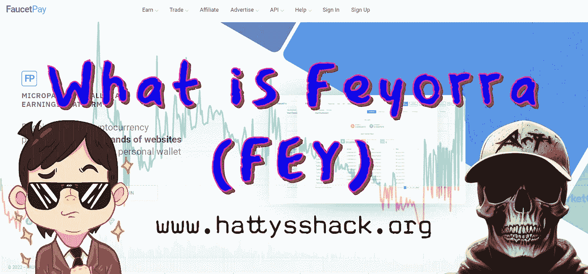

# 什么是费约拉费

> 原文：<https://medium.com/coinmonks/what-is-feyorra-fey-14e90a99a6d8?source=collection_archive---------11----------------------->

我认为 [FEY](https://coinmarketcap.com/currencies/feyorra/) 是一种特殊类型的加密，因为它来自于仅有的拥有自己的加密技术的加密盈利网站之一。[费约拉](https://coinmarketcap.com/currencies/feyorra/)在写这篇文章的时候价值**0.007247 美元**。我有一种感觉，随着时间的推移，越来越多的人想了解和赚取网上密码，那么这个网站将有一个稳定的倾向，在过去几年里，这意味着令牌的价格有机会随着时间的推移而增长。