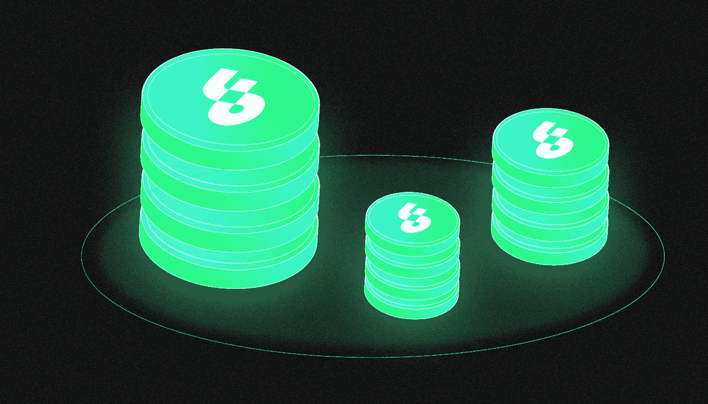

# 什么是流量？

> 原文：<https://medium.com/coinmonks/what-is-flow-6e7a483f9b42?source=collection_archive---------17----------------------->

***Flow 是一个区块链平台，专为 NFT 的发布和游戏应用的实现而设计。该项目允许您创建 dapps，数字收藏品和元诗句。它是如何工作的？有这么普遍吗？让我们一起来看看吧！***

流架构基于任务分离的原则，每个节点执行不同的功能。这一原理使得网络性能提高了一个数量级。编写智能合约时支持 Cadence 编程语言，这简化了不可互换令牌的发行(NFT)。

**Dapper Labs** ，第一款流行的区块链游戏 **CryptoKitties** 的创造者，创建了这个平台。流量区块链被用来建立一个生态系统，由主要的体育组织，如 NBA，UFC 和 NFL 支持。在 Flow 中发布的 NFT 被安装并整合到脸书和 Instagram 中。

# 谁在何时创造了心流？

区块链流是一个 **Dapper Labs** 项目，它因 **CryptoKitties** 区块链游戏而声名鹊起。

它的游戏性包括“教育”和以太坊网络上绑在不可替换的代币(NFT)上的角色之间的决斗。CryptoKitties 是第一款受欢迎的区块链游戏，导致以太坊严重超载，并在 **2017** 年底网络佣金全面上涨。

因此，Dapper Labs 决定构建他们自己的、更具可扩展性的区块链，为 NFT 的运营而“削尖”。主要流量网络于 **2020 年**上线。**迪特尔·雪莉**创立了这个项目，而**罗哈姆·加雷戈兹洛**担任首席执行官。

雪莉以 ERC-721 标准的创造者而闻名，加里戈兹洛之前领导了 Axiom Zen，这是加密项目的第一批风险基金之一。

**在****2020 年 9 月**，开发者因公开出售流量币获得 1950 万美元。Dapper Labs 于 2022 年 5 月向生态系统发展基金捐赠了 7 . 25 亿美元。Andreessen Horowitz、Coatue、Greenfield One、Liberty City Ventures 和其他公司都进行了投资。该基金在加密货币流中提供赠款和直接投资。该组织创建游戏和基础设施项目，同时还协助内容创作者。

# 流动解决了哪个问题？

许多项目在以太网上发布 NFT，但是在高峰负载期间交易成本可能超过几十美元。流量区块链解决了缩放和高费用问题，而不使用分片。

流区块链旨在与 NFT、游戏项目和其他应用程序结合使用。对于不熟悉区块链技术的用户来说，这是理想的选择，因为网络的地址很短，而且它的参与者不需要私钥。

该平台主要关注使用 NFT 的大型分散式应用程序的工作——主要是 GameFi 领域的项目。

Flow 有一种本地加密货币，在股票代码 FLOW 下交易，还有一个官方钱包用于存储它— [Dapper Wallet](https://meetdapper.com/) 。

Dapper Labs 在平台上实现了自己的项目，但是 Flow 协议对第三方程序员和公司开放。

# 流动的区块链

Flow 采用一种专门的架构，在提供高性能的同时避免网络碎片化(分片)。

节点具有不同的计算能力，这一点被其他区块链的开发者所忽略，导致资源使用不合理。为了优化它们，架构使用了任务分离的原则。区块链节点分为两个性能组，解决两类任务。“客观”任务需要高性能，而“主观”任务只需要少量的计算能力。

节点组负责各种功能。流使用四种类型的节点:

*   **收款节点**处理和“打包”交易。它们只向验证器传输散列，并向其他节点传输完整的信息。
*   **共识节点(验证器)**使用利害关系证明算法形成区块的初步版本，并通过投票解决主观问题。这种类型的节点专门处理事务哈希，不执行其他计算。
*   **执行节点**负责交易和智能合约的处理。他们在构造块的最终版本之前评估网络的状态。这些节点还使用单个解决方案执行目标计算。请求来自收集节点的数据来处理事务。
*   **验证节点**选择性验证交易。这类节点的工作允许您排除利益冲突。当共识节点检查它们已经形成的块时，冲突出现。该算法还排除不执行任何工作或使网络过载的验证节点。

Flow 还创建了块，块将任务分为四种类型。在某种程度上，每个节点类型都会涉及到。其他类型的节点执行计算和事务处理，而共识节点只检查新块并将它们添加到公共链中。在运算结果的计算过程中，共识节点形成以下块。

据[白皮书 Flow](https://arxiv.org/pdf/1909.05821.pdf) 的作者称，这种方法可以更有效地利用资源，并将区块链吞吐量提高了 50 多倍。

Flow 允许您启动智能合约。该环境允许您测试应用程序、保存日志和使用网络模拟器。该平台采用 Cadence 编程语言，简化了 NFT 的开发。

# 节点需求和加密货币流堆叠

因为流采用 PoS 算法，所以它的所有节点都必须向堆栈池贡献一定量的流才能发挥作用。最小数量由所选节点的类型决定:

*   执行力——125 万流量；
*   共识——50 万流量；
*   收藏— 25 万流量；
*   验证—13.5 万流量。

不同的节点性能导致了这样的要求。执行节点需要大量的计算能力，这需要大量的资金。正因为如此，最有生产力的节点最有利可图。分片和分布式信息存储是节点间功能分离的替代方案。据开发者称，该算法提供了可靠性和长期数据安全性。

# 流动表征组学

FLOW 是同名的区块链的本地加密货币。要支付佣金、执行智能合约和运行共识算法，需要硬币。流也用作已颁发令牌的安全令牌。

最初，流量加密货币通过在 CoinList 平台上于 **2020** 年底举行的[公开令牌销售](https://icodrops.com/flow/)在投资者中分发。Dapper Labs 总共售出了 1 亿个流量。另外 2500 万在**2020 年**10 月 6 日发放。变现的硬币被封锁了一年，这阻止了它们的自由销售。

Flow Foundation 是这种加密货币的最大持有者。有 2.5 亿流量可供项目长期发展使用。

您可以使用[流量区块链浏览器](https://flowscan.org/)跟踪网络上的交易。该资源提供分析信息，包括被阻止资产的数量、各种类型节点的数量以及锁定参数。还有关于奖项的最新信息。截至**9 月 22 日**的叠加收益率，根据投注奖励的数据，为年化 8.3%。

# 基于流量区块链的最大项目

Flow 是 NFT 领域最成功、最知名的网络之一。这是因为 Dapper Labs 参与了美国国家篮球协会(NBA)和终极格斗锦标赛(UFC) (UFC)等主要合作伙伴的项目。

该网络推出后，开发者创建了第一个 NFT 项目，包括与 NBA 合作创建的 NBA Top Shot 平台。它使您能够基于美国联盟中最大的篮球队以及它们之间发生的比赛来创建 NFT 收藏。 [NBA Top Shot](https://nbatopshot.com/) 代币的内容通常是一个球员的图像或者一场比赛的有趣视频片段。

An example of NFT content on the NBA Top Shot platform.Source: [NBA Top Shot](https://nbatopshot.com/listings/p2p/ddfe1fcb-c3f5-449f-b645-5fc4d308cc64+df1fac1c-f4f8-49b9-b548-dc1ced9a9032)

NBA Top Shot 成为了 Dapper Labs 的一个很好的广告，吸引了其他主要品牌对 Flow 区块链的关注。该平台长期以来一直是从 [Dapp 雷达](https://dappradar.com/rankings/category/collectibles)获取数字物品最受欢迎的产品。NBA Top Shot 的成功也让 Dapper Labs 在 2021 年**的春天举行了一轮重大投资。**

【2022 年 1 月，[UFC Strike NFT 平台](https://www.ufcstrike.com/)开始工作 Dapper Strike 和著名的综合格斗组织的官方项目，其中使用了许多 NBA 顶尖的投篮机械师。

同年**8 月**，[Dapper Labs 与美国国家橄榄球联盟(NFL)合作开发的 NFL 全天应用](https://www.nfl.com/news/nfl-nflpa-and-dapper-labs-launch-nfl-all-day-digital-video-highlight-nfl-platfor)在 Flow network 上线。到 9 月**底**平台[销量超过](https://beincrypto.com/nfl-all-day-monthly-sales-surpass-nba-top-shot-battle-flows-top-nft-collection/)NBA 状元指标。据 block browser 称，截至**2022 年 9 月 25 日**，已在 Flow network 中创建了超过 1500 万个账户，部署了超过 1700 个智能合约。生态系统[包括](https://www.flowverse.co/rankings)几十个活跃的 NFT 项目，并超过了不可替代的以太币交易数量。

# 流动生态系统管理系统及其发展

**2021 年**秋天，Flow [集成了](https://filecoin.io/blog/posts/filecoin-becomes-official-storage-collaborator-for-flow-blockchain/)Filecoin 区块链平台的分散式云文件存储解决方案。同时，德雷珀实验室与谷歌云达成了长期合作协议，这应该有利于流量的规模化。

Dapper Labs 的收购之一是初创公司 [Brud](https://www.dapperlabs.com/newsroom/dapper-labs-acquires-brud) ，其解决方案旨在为快速创建去中心化自治组织(DAO)的流生态系统添加工具。Flow 有这个方向的赏金计划。

不仅体育机构对 Flow 感兴趣:**2022 年夏天**，Meta 宣布即将把区块链整合到 Instagram 中。根据 Mark Zuckerberg 的说法，超过 100 个国家支持不可替换的令牌。Meta 后来为脸书增加了对 NFT 头像的原生流支持。

回到 **2020** ，Dapper Labs 宣布计划[将](https://cointelegraph.com/news/dapper-labs-welcomes-cryptokitties-onto-flow-blockchain) CryptoKitties 从以太坊转移到 Flow。这使您能够创建新的游戏功能，并在其他应用程序中使用令牌。然而，迁移的精确时间是未知的。

> 你有什么想法？如果你对流量话题有什么补充，请在下面留下你的评论！
> 
> 在[媒体](/@SunflowerCorpAdmin)或[推特](https://mobile.twitter.com/sunflower_corp)上关注[向日葵公司](https://sunflowercorp.com/)定期更新关于趋势加密新闻。

[*向日葵公司*](https://sunflowercorp.com/) *—专注于最佳交易体验和卓越技术的新型加密货币衍生交易所。*

我们提供杠杆高达 x100 的 BTC/USDT 永久期货，以及最具趋势性的工具。当您与我们交易时，您将获得一个可定制的交易终端、各种图表、技术分析工具、各种订单类型，以及“止损”和“止盈”订单选项。

> 交易新手？尝试[加密交易机器人](/coinmonks/crypto-trading-bot-c2ffce8acb2a)或[复制交易](/coinmonks/top-10-crypto-copy-trading-platforms-for-beginners-d0c37c7d698c)