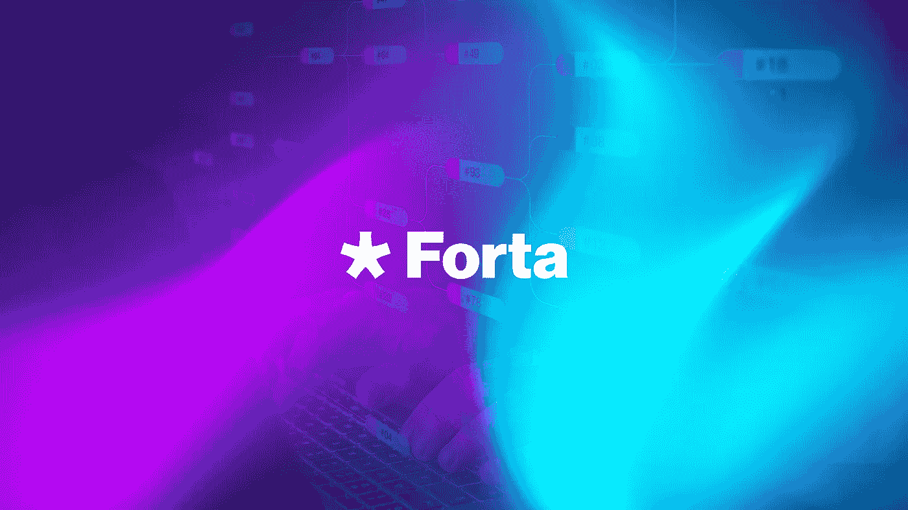

# 什么是福塔节点，如何利用它赚钱？

> 原文：<https://medium.com/coinmonks/what-is-forta-node-and-how-to-make-money-out-of-it-16a763dd4122?source=collection_archive---------11----------------------->

在网上投资加密货币本身也存在一定的安全风险。但现在有了分散的监控网络，就不再是这样了。

对于那些不知道的人来说， [Forta](https://forta.org/) 是一个去中心化的监控网络，致力于检测像 DeFi 这样的 Web 3.0 系统上的威胁和异常。该网络在独立节点操作员的帮助下实时检测异常，这些操作员扫描所有事务和逐块状态变化，以发现异常值和威胁。

这很重要，因为自从 Web 3.0 的大规模经济增长以来，安全需求已经变得绝对必要，仅在 2022 年第一季度，由于黑客攻击和利用，就损失了超过【2022 亿美元。虽然中央监控机构仍然不可行，但 Forta 的实时安全性可以提醒投资者和融资平台潜在的威胁，帮助您快速有效地做出反应。

# Forta 协议是如何工作的？

Forta 协议由称为验证器和代理的两个主要组件组成，可以在任何支持智能可靠性合同的区块链上运行，如以太坊、雪崩、多边形、BNB 链、Fantom、Arbitrum 和乐观。

验证器包含称为脚本的小程序，它与代理一起检查像 NFT 或交易的一小部分这样的事情。这些脚本可以部署在一个节点中，或者不同的节点可以使用不同的脚本和代理来验证 NFT 区块链、钱包等。

该协议本身被许多不同的区块链和应用程序使用，如 DYDX Exchange、Lido Finance、Poly Network、GMX(Arbitrum 上领先的 DEX)、Trader Joe(Avalanche 上领先的 DEX)以及许多其他每月都在使用 Forta 的应用程序。虽然许多人都在谈论它还没有多大用处，但很明显它在未来会有用处。

# 如何用 Forta 运行你的节点？

任何人都可以使用 Forta 协议运行自己的节点，您所需要的是最少 500 到最多 600 个 [Forta 令牌](https://docs.forta.network/en/latest/fort-token/)(从 2022 年 9 月 30 日开始，每个节点的令牌数量将最少为 2500 $FORT，最多为 3000 $FORT)。

在 Nodigy，我们为客户运行个人节点，每月服务器成本为 38 美元，外加 2%的奖励佣金。该成本分为每月需要支付的 28 美元服务器成本和 10 美元管理员和经理成本。每个节点的奖励大约是每月 172 美元。

每个令牌的价格是 0.17 美元(在撰写本文时)，这个价格很低，但预计将来会增长。价格便宜的原因是 Forta 令牌相对较新，目前只能在验证器节点中使用。但这种情况不会持续太久。从 2022 年 9 月 30 日起，运行一个节点的价格将呈指数级增长，预计最低可达 2 500 美元，最高可达 3 000 美元。

因此，如果你对这类项目感兴趣，并且是 Forta 令牌的坚定持有者，那么现在从这些项目中获利的最佳和唯一方式就是运行自己的节点。这是因为目前没有办法将这些令牌标记或委托给验证器。幸运的是，运行自己的节点相对简单，不需要成为管理员或拥有自己的服务器。

你所要做的就是联系我们并向我们下订单。我们将为您运行您的节点，让您更好地管理您的股份。

> 交易新手？试试[加密交易机器人](/coinmonks/crypto-trading-bot-c2ffce8acb2a)或者[复制交易](/coinmonks/top-10-crypto-copy-trading-platforms-for-beginners-d0c37c7d698c)