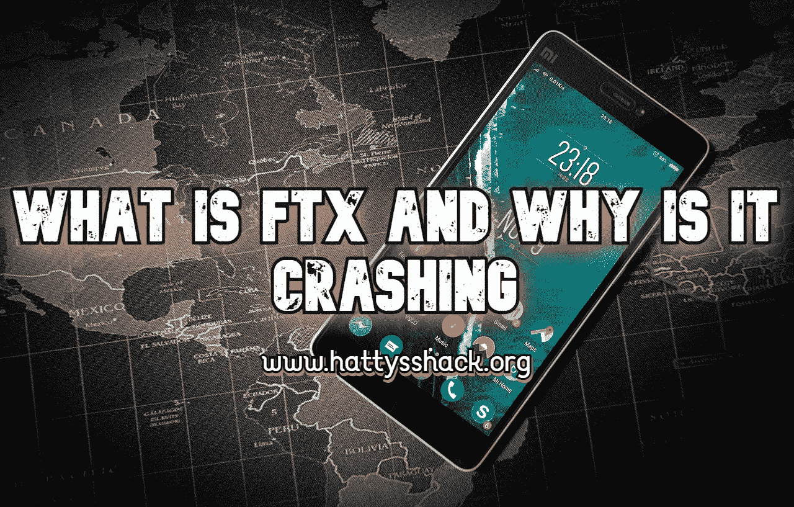
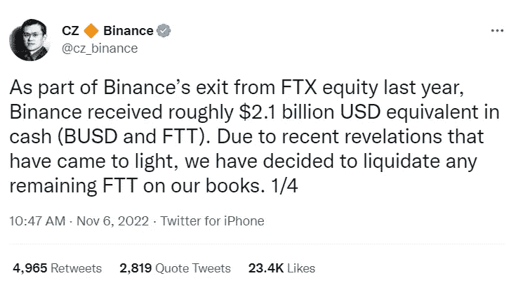

# 什么是 FTX，为什么它会崩溃

> 原文：<https://medium.com/coinmonks/what-is-ftx-and-why-is-it-crashing-a92b9ee9b97a?source=collection_archive---------17----------------------->

**什么是 FTX**

FTX 是一个中央加密货币交易所，它承诺提供便捷的加密交易和安全的交易。这个项目得到了汤姆·布拉迪和斯蒂芬·库里等知名人士的支持。

FTX 得到了全面提升。你可以在 YouTube、主流流媒体平台和互联网上看到广告。

FTX 承诺成为最安全的交易和投资你喜欢的加密项目的地方之一。当你在谷歌上搜索 FTX 是否安全时，出现的是这个。

**卓越的安全性**

**安全性对每个加密货币交易所都很重要，FTX 也是如此。美国显然对此很重视。它有一个定制的冷热钱包用于存储客户加密资金，所有热钱包资金的完全外部支持，以及与业界领先的托管机构的关系** — [来源](https://www.google.com/url?sa=t&rct=j&q=&esrc=s&source=web&cd=&cad=rja&uact=8&ved=2ahUKEwiFtNqznaT7AhW_kYkEHasZAY8QFnoECBIQAw&url=https%3A%2F%2Fwww.fool.com%2Fthe-ascent%2Fcryptocurrency%2Fftx-review%2F%23%3A~%3Atext%3Dprofit%2520limit%2520orders-%2CExcellent%2520security%2Crelationships%2520with%2520industry%2520leading%2520custodians.&usg=AOvVaw0k3jHtzM9LJsQxEI7_gWIR)

结果发现，FTX 并不安全，很多人因为信任这个平台而损失惨重。它被超过 100 万人使用。许多不太了解 Crypto 的人看到这个平台的广告，说它是安全的，并决定投资，因为他们认为这是一种安全合法的方式来进入 Crypto 的大门。他们错了。

交易所不安全。在你准备交易之前，把你的密码放在一个冰冷的钱包里。

**FTX 怎么了**

不到一年前，FTX 筹集了大量资金，估值达到 320 亿美元，就在上个月，FTX 也在谈论自己的收购计划。

**收购计划** **记录了所有成本、进度、技术、业务、管理和其他将管理收购计划的考虑因素，并从收购战略**中得出。— [来源](https://www.google.com/url?sa=t&rct=j&q=&esrc=s&source=web&cd=&cad=rja&uact=8&ved=2ahUKEwj_guKqmaT7AhVBj4kEHZXrA4EQFnoECA4QAw&url=https%3A%2F%2Fwww.dau.edu%2Faap%2Fpages%2FArticleContent.aspx%3Fitemid%3D18714%23%3A~%3Atext%3DAn%2520Acquisition%2520Plan%2520documents%2520all%2Cmilestones%2520in%2520the%2520acquisition%2520process.&usg=AOvVaw20SbjBdN7AF-aqBnsB2Iqf)

那么 FTX 发生了什么事？

Coindesk 一周前发布了一篇关于 FTX 及其姊妹公司 Alameda Research 的文章。显然，Alameda Research 资产负债表上的大部分资产是以 FTT 的形式存在的，这是 ftx 自己的加密和其他非流动性令牌。缺乏流动性的代币或资产意味着它不容易被买卖。这意味着阿拉米达研究公司的大部分资产并不像人们想象的那样稳定。

Coindesk 的文章让很多人开始质疑 ftx 的透明度和信任度。

这篇文章发表后，币安的首席执行官发布了一条推特，称他们正在清算剩余的 FTX 股份。

这引起了大规模恐慌，导致数量惊人的人开始撤回他们在 FTX 的投资。

本周二(2022 年 11 月 8 日), FTX 的客户开始难以从 FTX 提取资金。

**结论**

记得把你的密码放在一个冷钱包里，不要放在交易所里。当你准备出售时，把它们送到交易所去。把你的密码留在交易所会使你的密码处于危险之中。没有任何交换是安全的，这样的事情可能会发生。Crypto 仍然处于它的婴儿期，这些年将会有很多变化，所以确保你知道如何保持你的密码安全，远离危险。写下你的种子短语，放在安全的地方。永远不要把你的种子短语放在手机或电脑上。如果你用数字方式保存你的种子短语，那么我建议把它们保存在一个便携式硬盘上，放在一个只有你知道的安全的地方。

你可以按照下面文章中的说明制作自己的冷钱包。

[**把优盘变成安全的加密钱包**](https://read.cash/@HattyHats/turn-a-flash-drive-into-a-secure-crypto-wallet-6d967926)

查看我的网站，了解更多赚取、学习和投资 Crypto 的方法。

[哈蒂的小屋](https://www.hattysshack.org/)

[read.cash 上的原创文章](https://read.cash/@HattyHats/what-is-ftx-and-why-is-it-crashing-1c7d903f)

> 交易新手？尝试[加密交易机器人](/coinmonks/crypto-trading-bot-c2ffce8acb2a)或[复制交易](/coinmonks/top-10-crypto-copy-trading-platforms-for-beginners-d0c37c7d698c)