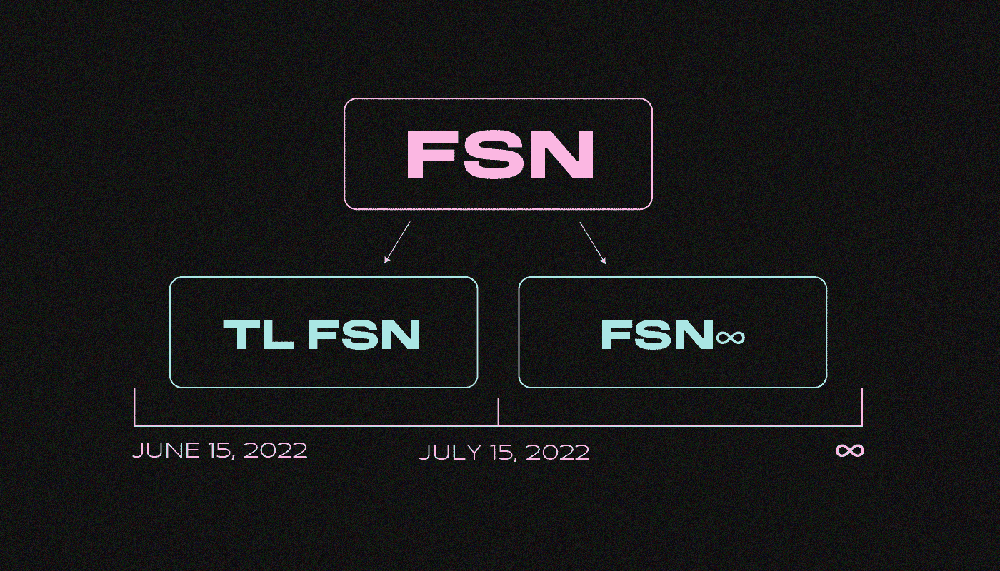
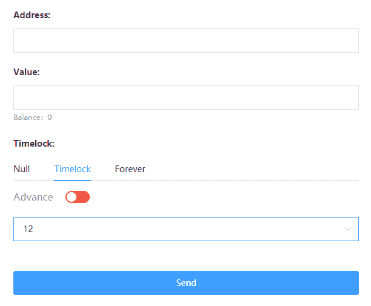

# 什么是融合？时间锁技术是如何工作的？

> 原文：<https://medium.com/coinmonks/what-is-fusion-how-does-time-lock-technology-work-3446644a7fef?source=collection_archive---------27----------------------->

****是一个区块链基于*******【TPoS】的一致协议。它是如何工作的？它的历史是怎样的？你想知道吗？我们开始吧！*****

****

**为了在 TPO 上堆叠，验证者购买 FSN 项目令牌的票。**

**融合网络随机选择门票。它们的主人有权签署下一个街区。验证者获得奖励——每块 2.5 FSN 和交易费。stakingrewards.com 的盈利能力可以通过 FSN 的赌注来计算。**

# **什么是 FSN？**

**[FSN](https://www.fusionite.info/fsn-1) 是融合原生令牌。需要支付交易费用，推出智能合约，购买跑马圈地票。**

**FSN 发行数量限定为**8192 万 FSN** 。融合赌注费用**每张票 5000 FSN** 。**

****什么是时间锁？****

**[时间锁](https://www.fusionite.info/time-slices-tl) (TL)是一种将 FSN 按时间-成本分成若干部分的技术:有限期(TL FSN)和无限期(FSN∞)。**

**用户在拆分令牌时指定 TL FSN 的生命周期。它对其他 Fusion 用户和网络智能合约可见。**

****

**TL FSN 将于 7 月 15 日被烧毁。之后，FSN 会变成 FSN**

**TL FSN 的市值比全 FSN 还少。它由令牌生命周期内的可用收益决定。**

**当 TL FSN 的存在结束时，代币会烧尽。相应的 FSN 被更改为 FSN。**

**时间锁可以比作有息贷款或出租财产。**

***例子:* 爱丽丝花 10 美元买了一本书。鲍勃借了一个月，付给爱丽丝 1 美元。爱丽丝仍然拥有这本书。同时，在鲍勃还书之前，爱丽丝不能阅读或转移这本书。**

**现在想象一下爱丽丝买下了 FSN。她将令牌分为存在期限为 30 天的 TL FSN 和 FSN∞，然后将 TL SN 出售给鲍勃。在鲍勃的 TL FSN 烧完之前，爱丽丝不能处理掉 FSN∞。**

# ****如何分割 FSN 代币？****

**要分割令牌，您需要从支持时间锁的钱包中发送交易。用户选择交易类型:**

*   ****空** —发送 send**
*   ****Timelock** —拆分 FSN，发送 TL FSN；**
*   ****永远** —分裂 FSN，送 FSN∞。**

****

**车主以月为单位设定 TL FSN 的使用寿命**

# ****时间锁的优点是什么？****

****

**时间锁允许你投资或委托代币没有风险。用户传输 TL FSN 一段时间，在此时间之后，令牌将会烧完。同时，FSN 将留在主人的钱包里。**

***示例:*
一位投资者将资金投入 TL FSN DeFi 项目，但黑客闯入智能合约并窃取了代币。投资者不会损失任何钱。当 TL FSN 被烧毁时，投资者将完全进入 FSN。**

**用户可以购买 5000 TL FSN 的临时堆叠票，并将代币发送到堆叠池。代币有效期到期后，TL FSN 将自动归还给所有者。**

***例:* 爱丽丝把一万个 FSN 分成两部分:寿命为 30 天的 TL FSN 和 FSN∞。鲍勃用 50 FSN 买了 10，000 土耳其里拉的 FSN，并把代币送到了 staking。在一个月内，鲍勃将获得 100 FSN，爱丽丝将获得 10，000 FSN。她将能够再次分割和出售代币。**

# ****frc 758 是什么？****

**[FRC758](https://www.fusionite.info/frc758-and-time-frames-tf) 是支持时间锁定技术的令牌标准。使用 FRC758，您可以将 BTC 和美元等资产令牌化，然后根据时间价值将它们分成几部分。**

**TL 令牌是具有有限生命周期的令牌化资产。**

# **如何使用 TL 令牌？**

**所有者可以将 FRC758 标准的令牌发送给另一个用户，或者在分散的交易所出售它们。**

*****其他使用 TL 令牌的方法:*****

*   ****加密货币贷款**。所有者可以在没有中介的情况下发行它们；**
*   ****流动性池**。投资者投资代币没有损失资产的风险；**
*   ****租房或 NFT** 。该令牌充当访问该属性的临时密钥。**

***示例:* 车主创建并出售了一个授权进入车辆的 TL 令牌。代币所有者可以选择驾驶汽车或将 TL 代币转让给另一个人。当令牌烧完时，车主重新获得对车辆的控制。**

# **你在哪里可以买到 FSN？**

**FSN 在 Huobi、AnySwap、MXC、Hotbit、OKex、Bittrex、Bibox、UpBit、Citex 和 COINBIG 上交易。**

**TL FSN 将在 Chainge Finance、AnySwap 和其他分散平台上交易。**

**Fusion 建议将 FSN 存储在带有时间锁支持的[whalet](https://whallet.net/#/)或 [My Fusion Wallet](https://www.myfusionwallet.com/) 中:**

*   ****将** FSN 分割成 TL FSN 和 FSN∞；**
*   ****结合**合适的 TL FSN 和 FSN∞进入 FSN；**
*   ****显示**钱包中 FSN、TL FSN 和 FSN 的余额。**

> **我们希望在下面的评论中听到您对融合和时间锁定技术的看法。如果你喜欢这篇文章，订阅我们的[媒体提要](https://medium.com/sunflowercorporation)以获得更多类似的内容。敬请期待！**

> **交易新手？尝试[加密交易机器人](/coinmonks/crypto-trading-bot-c2ffce8acb2a)或[复制交易](/coinmonks/top-10-crypto-copy-trading-platforms-for-beginners-d0c37c7d698c)**