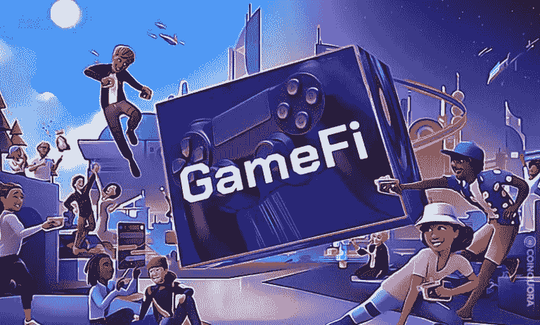
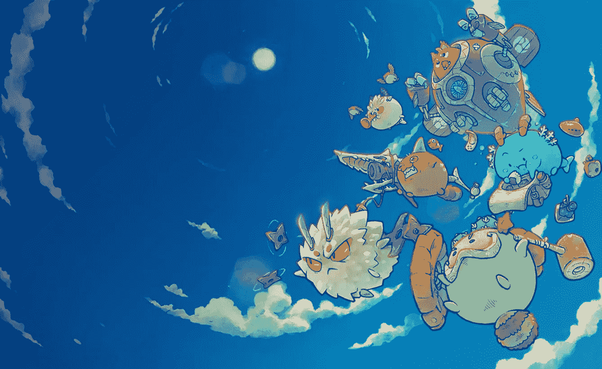

# 什么是 GameFi，如何从中获利？

> 原文：<https://medium.com/coinmonks/what-is-gamefi-and-how-can-i-earn-from-it-9b5c8dbdca76?source=collection_archive---------14----------------------->

想象一下，坐在屏幕前几个小时，敲击键盘只是为了赢得一场游戏，在游戏结束时，你赢得的硬币/金钱就在屏幕的顶部，注视着你。

它们被限制在游戏中，只能用于升级和购买游戏中的新物品——永远不能拿出来

如果你曾经希望你在玩游戏时赚的钱/奖励在现实世界中有实际价值，那么你的愿望就实现了。

是的，是的，它来自 Gamefi

# GameFi 是什么？

GameFi 是由两个词创造的——游戏和金融。它只是指一个让你在玩区块链游戏的同时赚取金钱或金融资产的系统

一般来说，任何能让你边玩边赚的游戏都会被贴上“边玩边赚”的标签。

这使得 GameFi 成为一种游戏赚钱的形式。

GameFi 和普通视频游戏(包括游戏赚钱游戏)的主要区别在于“区块链”

是的，区块链让一切变得不同。

传统的视频游戏都放在中央服务器上，这使得开发者可以完全掌控游戏中的一切。

换句话说，玩家对游戏中的资产没有实际的所有权，比如武器、服装(皮肤)、小玩意、土地和其他所有花了他们几天时间才获得的东西。

他们在游戏升级、角色设计、更新等决策上也没有发言权...开发者掌握着所有的权力来随心所欲地设计游戏。

现在，区块链所做的就是把所有的权力从开发者那里拿走，通过把游戏放在一个分散的平台上，让玩家可以使用

这意味着玩家可以完全拥有他们所有的游戏资产，用它们交换加密货币，如果他们愿意，还可以将加密货币转为法定货币——他们拥有所有的权利。

这也意味着玩家可以参与游戏的决策

多酷啊。

# GameFi 是如何工作的？

我们已经建立了 Gamefi 的背景，但这个游戏如何赚取系统甚至可能？

为了理解这一点，我们需要知道除了存储 GameFi 项目的区块链之外，GameFi 项目还可以处理两个主要的东西

1.NFTs
2。加密货币

在 GameFi 中，一些游戏资产是 NFT 的形式(或者可以转换成 NFT ),一些是代币。它们都可以在 NFT 市场和加密交易所轻松交易。

例如，如果我在玩 Axie Infinity 时达到 10 级，假设我获得了 10 个 SLP，我可以拿这 10 个 SLP 在加密交易所交易，换成另一种加密货币，这种货币很容易变成法定货币。

或者

我可以用那 10 个 SLP 在游戏中买一些武器，然后作为 NFT 拿到 NFT 市场去卖

这些 GameFi 项目中的大多数(如果不是全部的话)都有自己的本地货币(这是你通过玩游戏赚来的)、代币经济和市场

在 Axie Infinity 的情况下，原生货币是 SLP(顺滑爱情药剂)

与传统视频游戏类似，玩家通过在游戏中达到新的级别、完成任务、与其他玩家战斗以及其他游戏活动来获得游戏内奖励。

这些奖励(代币或其他游戏内资产)具有一定的价值

虽然有些是固定的，但其他的可能会上升或下降

例如，一些本地货币与另一种加密货币特定值挂钩

*1000 TLB = 1 索尔*

但资产和代币是不稳定的，它们会根据市场需求而上涨或下跌

一些 P2E 游戏是免费的，这意味着在你开始玩游戏赚钱之前，你不需要做任何投资或购买

而一些 GameFi 项目会要求你在成为游戏的一部分之前购买他们的 NFT 或 cryptoassests。

在这种情况下，**你应该谨慎行事，对游戏背后的创始人和团队进行尽职调查，然后评估这样的投资是否有利可图**

许多 GameFi 项目在游戏中加入了这个惊人的特性...你会喜欢的。

这是将游戏的 NFTs 借给其他不能购买的玩家的能力，以使他们能够玩游戏并获得奖励

这个系统被称为奖学金，而那些临时借用这些 NFT 来玩的人被称为学者

获得的奖励在 NFT 所有者和学者之间分配。

这给了这些游戏的 NFT 所有者一个获得被动收入的机会。

Axie Infinity 是采用这种系统的最大游戏之一

一些人聚集到一个团体(或道)来为那些可能无法购买游戏 NFT 开始游戏的玩家提供这些奖学金机会。这些机构被称为行会。

# 如何成为 GameFi 项目的一部分并开始盈利

有数以千计的 GameFi 项目有其独特的游戏和收入结构。

要进入 GameFi 的世界并开始赚钱，你需要对你关注的项目做一些研究，以确保你不会上当受骗或进入一个无利可图的结构(你投资的金额>你可能从游戏中获得的金额)

完成尽职调查后，您可以遵循以下步骤

## 1.打开加密钱包

加密钱包是你在区块链做的任何事情的重要组成部分，你有多种选择。

比较流行的有 Metamask，Trust wallet，【Crypto.com】T4，Defi Wallet…

然而，你应该注意到一些游戏对你应该使用哪种钱包有具体的规定。在下载任何人之前，一定要检查他们的网站。

您的加密钱包将用于存储您在游戏过程中获得的游戏资产(NFT)和代币。

## 2.将您的加密钱包与游戏连接

您需要将钱包连接到游戏，然后才能开始玩游戏。

要做到这一点，只需进入游戏网站，寻找一个写着“连接钱包”或类似内容的按钮。

这才是真正酷的地方。你不需要设置用户名或密码。

在它弹出你的钱包后，你将被要求签署一条信息，一旦完成，它将同步你的钱包的详细信息(如姓名)来打开你的游戏帐户

瞧啊。你被录取了。

我知道你可能想现在就开始玩

## 3.满足游戏的要求

每个游戏都有特定的要求，你必须满足这些要求才能开始。

它可以购买一个或多个游戏内的 NFT(角色)或本国货币。

无论是哪种情况，你都必须满足自己的要求，确保你评估了游戏的风险和盈利潜力

> 一个好的项目不会让你筋疲力尽地获得投资并开始赚钱
> 如果你想试水，你也可以选择我们之前提到的奖学金之一

# 最后一个音符

令人兴奋的 GameFi 并不全是糖。它也有它的风险，如果一个人不小心穿线的话，风险会相当严重

由于加密市场相当不稳定，代币和资产的价值受到巨大的增长和令人心碎的下降。

所以，在评估一个项目后，一定要确保做出最好的判断，并一如既往地投资你可能会失去的东西。

> 嘿，你要丢下我不管吗？别忘了关注更多有价值的文章

> 交易新手？试试[加密交易机器人](/coinmonks/crypto-trading-bot-c2ffce8acb2a)或者[复制交易](/coinmonks/top-10-crypto-copy-trading-platforms-for-beginners-d0c37c7d698c)