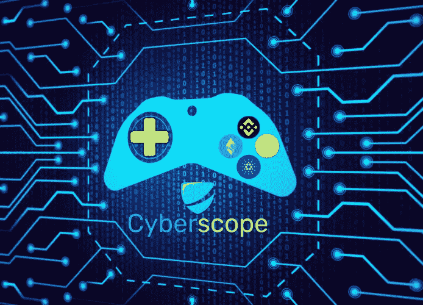
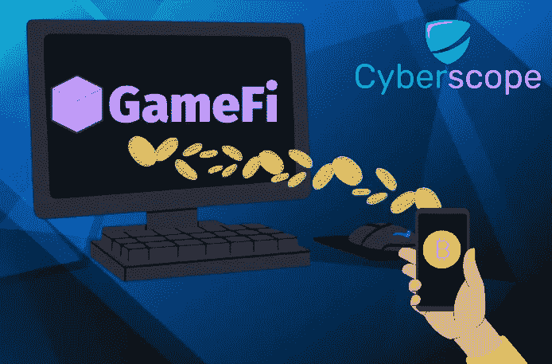
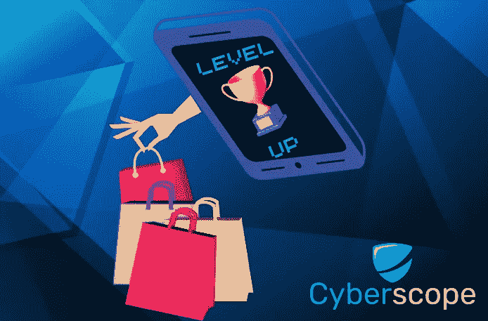

# GameFi 是什么，怎么能边玩边赚？

> 原文：<https://medium.com/coinmonks/what-is-gamefi-and-how-can-you-earn-while-playing-eaa4d0389ef2?source=collection_archive---------42----------------------->

# 介绍

在加密统治的最后几年里，GameFi 游戏设法爬上了顶级游戏流派的名单，将我们习惯的传统游戏抛在了身后。

新用户不断加入不断增加的 GameFi 游戏应用程序，寻求获得奖励甚至收入的机会。

这种新的游戏类型是如何工作的？Play2Earn 是什么意思，开始玩之前应该知道什么？在下面的指南中，你会找到你需要知道的一切。

# 什么是 GameFi，它是如何工作的？

GameFi-或通常被称为 **Play2Earn(P2E)** -是区块链游戏的一种类型，不断崛起，旨在建立一种新型的游戏体验。与传统游戏相比，GameFi 的优势在于通过游戏娱乐获得财务收益。

顾名思义，GameFi 游戏集“游戏”和“金融”于一身，玩家可以通过完成游戏中的任务获得加密奖励或 T2 NFT T3 奖励。然后，玩家可以在交易平台和 NFT 市场上交易他们的收入，从而获得经济利益。

GameFi 中的玩家可以根据游戏的设计以多种形式获得奖励。玩家会被召唤去成功完成任务，互相对战或者完成成就，总是符合每个游戏的内容。

收入可以是加密货币——通常是 GameFi 项目创造的代币——NFT 或游戏内资产，如化妆品、武器、技能点数等。在大多数情况下，这些资产是区块链上可用的 NFT，这给了玩家通过 NFT 市场直接交易的自由

GameFi logic 所基于的功能，有 ***玩 2 赚(P2E)、数字资产所有权*** *和* ***Defi 应用。***

# 玩 2 赚(P2E)

**游戏赚取模式(P2E)** 是 GameFi 项目的主要特色之一，它允许玩家通过利用游戏中的资产来赚取加密资产，如代币和 NFT。在传统游戏中，开发公司是游戏资产的合法所有者，与此形成对比的是，P2E 给予玩家完全的控制权，以及通过开发游戏赚钱的权利。

甚至付费游戏(P2P)也有区别——因为 P2E 游戏通常不需要投资就可以开始玩——其中一些游戏要求用户在加入游戏前购买加密资产或 NFT。在这种情况下，玩家必须评估风险，因为投资可能会超过他们从游戏中获得的最高回报

# 数字资产

如前所述，玩家可以拥有游戏中的数字资产，这将丰富他们的游戏体验。这些资产的类型可以是皮肤，武器，时间，技能点，虚拟土地财产和许多其他游戏组件

玩家可以通过金融交易将这些资产货币化，或者随着时间的推移利用这些资产获得被动收入。例如，玩家可以将游戏中的物品出租给其他玩家以换取金钱，或者对在他们拥有的土地上发生的访问收费。

# DeFi 应用程序

其他 GameFi 项目也提供密码持有者广为人知的功能，并帮助他们获得被动收入。像这样的功能，是打桩，采矿，流动性和产量农业。

基于每款游戏的机制，你越喜欢这些功能，游戏给你的奖励就越多。当你的游戏角色升级时，游戏可能会提高你的赌注 APY，或者通过锁定最低数量的令牌，给你更多的特权和访问独家内容的权限。

# 如何入门？

市场上有数以千计的区块链游戏。每一个都有不同的工作方式，所以要小心诈骗项目或虚假网站，它们可能会给你带来风险。一定要做好自己的研究，选择那些有知名加密公司的审计认证和 T2 KYC 认证的项目。理想情况下，您应该专门为此目的创建一个新的加密钱包，并且只使用您能够承受损失的资金。

如果你确信一个游戏是安全的，这里有一些开始的步骤。

1.  **创建加密钱包** 首先要做的是创建一个加密货币钱包。如上所述，专门为 GameFi 游戏创建一个会更好。请注意，每个游戏可能需要不同的区块链网络，所以一定要检查之前，你创建它。
2.  **将钱包连接到游戏**
    接下来，你要将钱包连接到游戏，才能开始玩游戏。在游戏的官网上，应该是一个选项，通过点击，可以连接你的钱包。请确保这是正确的游戏官方网站，而不是原始网站的假复制品。
3.  **查看玩的要求** 在你决定投资 GameFi 之前，一定要查看玩的要求是什么。通常情况下，游戏会要求你购买他们的加密令牌或他们的 NFT 来启动。花点时间做你自己的研究，估计多久能收回你的初始投资和利润

# 结论

GameFi 项目的数量在 2021 年和 2022 年已经超过了任何预测，预计在未来几年将继续增长，因为新的项目将继续在所有受欢迎的区块链部署，如 BNB 智能链、以太坊、Polygon、Harmony、Solana 等

随着游戏和金融收入的结合，难怪 GameFi 技术迅速吸引了游戏玩家和密码持有者。我们可以得出的唯一合乎逻辑的结论是，GameFi 游戏的数量和 GameFi 社区的成员将继续与加密市场并肩上升。

*…*

*原载于*[*www . cyber scope . io*](https://www.cyberscope.io/)

> 交易新手？尝试[加密交易机器人](/coinmonks/crypto-trading-bot-c2ffce8acb2a)或[复制交易](/coinmonks/top-10-crypto-copy-trading-platforms-for-beginners-d0c37c7d698c)