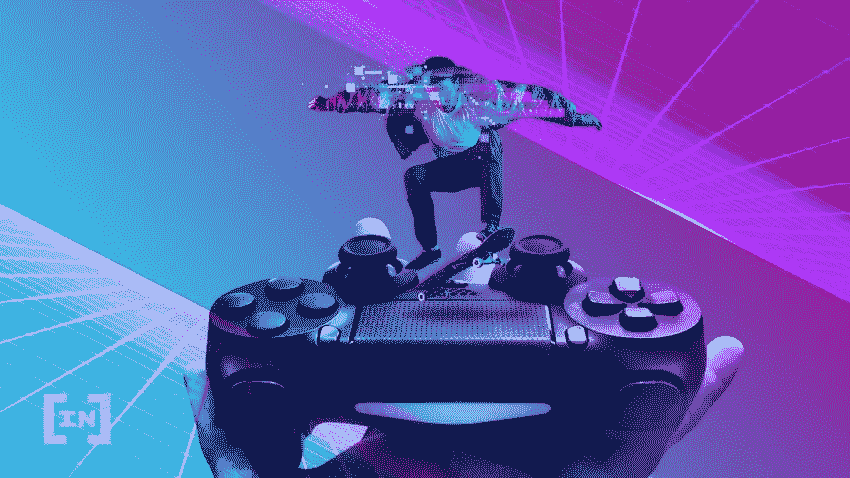

# GameFi 是什么？它是如何工作的？

> 原文：<https://medium.com/coinmonks/what-is-gamefi-how-does-it-work-329547c2411?source=collection_archive---------21----------------------->

“Gamefi”一词描述的是以区块链为基地的以金钱奖励玩家的“玩赚”游戏。通常情况下，完成任务，与其他玩家竞争，并通过各种游戏关卡，玩家将获得加密货币和 NFT 奖励。

自 Axie Infinity 出现以来，Gamefi 一直在迅速取代传统游戏领域。它通过给玩家娱乐和赚钱的机会来吸引玩家。

**什么是 Gamefi？**

“游戏”和“金融”这两个术语被组合成了“GameFi”它暗指区块链的“即玩即赚”游戏，这种游戏给玩家经济上的激励。GameFi 生态系统创造了一个虚拟游戏环境，它也利用了区块链技术和不可替代令牌(NFT)。

玩家通常通过完成任务、与其他玩家竞争以及通过各种游戏关卡来获得游戏中的好东西。为了在加密货币交易所和 NFT 市场进行交易，他们还可以将资产转移到游戏之外。

**GameFi 是如何工作的？**

在 GameFi 中，奖励可以根据游戏的不同而有不同的形式。它们可以是游戏中的资产，比如虚拟土地或虚拟角色，也可以被转换成 NFT，在 NFT 市场进行交易。游戏中的资产通常会给玩家带来一定的好处，比如获得更多奖励的能力。

根据游戏的不同，玩家可以通过完成任务、与其他玩家进行战斗或建造可以出售的建筑来获得奖励。通过下注或将其游戏内资产借给其他玩家，一些游戏可以允许用户在不主动参与游戏的情况下获得被动收入。让我们来看看 Gamefi 中的一些常见功能。

**先玩后赚模式(P2E)**

“玩到赚”(P2E)是一种突破性的游戏模式，是所有 Gamefi 冒险的核心。与经典视频游戏所使用的玩到玩的概念相比，这是相当不同的。逐场游戏要求玩家在开始前进行初始投资。例如，用户必须购买许可证或定期订阅才能玩像《使命召唤》这样的视频游戏。

**Defi 应用**

赌注、流动性开采和高产农业只是某些 GameFi 项目还提供的一些 Defi 产品和功能。玩家通常会拿游戏中的代币冒险来赢取奖励、获得优质产品或通过游戏的各个阶段。

加密货币中的分散式游戏也可以通过添加 Defi 方面来实现。社区可以参与各种 Gamefi 项目的决策过程，这与传统游戏工作室集中控制游戏更新形成对比。通过分散的独立组织，他们能够对下一次升级(Dao)提出建议并进行投票。

**数字资产所有权**

由于区块链技术使数字资产所有权成为可能，游戏玩家可以通过各种方式从他们的游戏资产中赚钱。一些流行的元宇宙游戏，如分散土地和沙盒，集中在土地所有权的概念。他们允许玩家将他们的虚拟土地货币化。在沙盒中，游戏玩家可以购买数字房地产，并开发它们来产生收入。

**视频游戏属于 GameFi 吗？**

普通视频游戏玩家可以赚取游戏中的货币并收集数字资产来提升他们的角色。然而，这些代币和物品不能在游戏之外交换。

区块链游戏中的游戏内货币和资产通常是加密货币和 NFT，但如果玩家愿意，他们仍然可以将游戏内货币和资产换成 NFT。玩家现在可以将他们的奖金转移到加密货币交易所或 NFTs 市场。然后，他们还可以将赢得的加密货币转换成法定货币。

**GameFi 的未来**

随着区块链技术的不断发展，Gamefi 的增长趋势预计将继续快速发展。拥有游戏内资产并从游戏中赚钱的能力使得 Gamefi 非常有吸引力，尤其是在发展中国家。

> 交易新手？尝试[加密交易机器人](/coinmonks/crypto-trading-bot-c2ffce8acb2a)或[复制交易](/coinmonks/top-10-crypto-copy-trading-platforms-for-beginners-d0c37c7d698c)