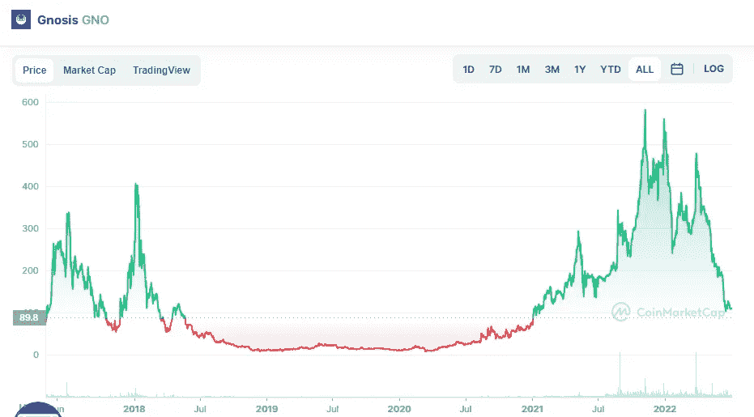

# 什么是灵知(GNO)。这是一笔划算的买卖吗？

> 原文：<https://medium.com/coinmonks/what-is-gnosis-gno-is-it-a-good-buy-1528741a3ef8?source=collection_archive---------41----------------------->

Source photo [Gnosis price today, GNO to USD live, marketcap and chart | CoinMarketCap](https://coinmarketcap.com/currencies/gnosis-gno/)

Gnosis (GNO)成立于区块链以太坊，是一个去中心化的开源市场，将在未来五年统治加密世界。作为以太坊风险制作工作室 ConsenSes 的一部分，加密货币是由马丁·科佩尔曼和斯蒂芬·乔治在 2015 年创造的。

该协议不是直接交易加密货币，而是允许用户根据加密货币进行交易