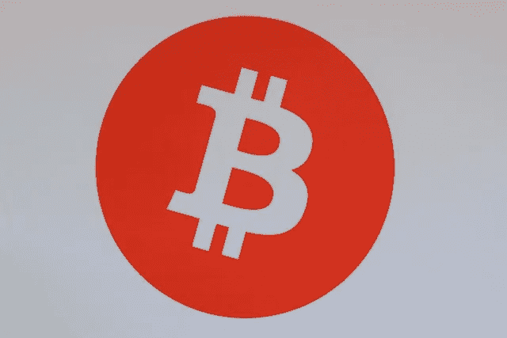
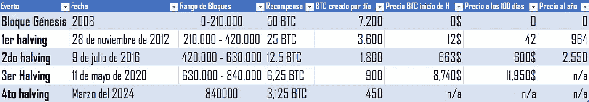

# 什么是 BTC 减半？

> 原文：<https://medium.com/coinmonks/what-is-halving-btc-e8a7fc6f6cfc?source=collection_archive---------42----------------------->

术语**【减半】**顾名思义就是减半，现在你减半的因素是什么。挖掘比特币的比率和奖励，这一事件大约每 4 年发生一次，用于监管比特币的生产，并尽可能保持低通胀率，使资产更有价值。

通过将矿工的奖励限制在一半，该事件在其解决方案的数学算法中产生了复杂性，并控制了创造新比特币的频率。

Picture by [Art Rachen](https://unsplash.com/@artrachen?utm_source=unsplash&utm_medium=referral&utm_content=creditCopyText) in [Unsplash](https://unsplash.com/es/s/fotos/btc-recompensa?utm_source=unsplash&utm_medium=referral&utm_content=creditCopyText)

## 什么是采矿？

挖掘是一个涉及网络验证者的过程，他们使用强大的计算机来解决复杂的数学问题，并反过来验证交易。在验证之后，交易作为新的块被添加到区块链。

## 什么是工作证明(PoW)？

用于保护网络和防止系统崩溃的机制称为工作证明。

## 工作证明(PoW)是如何工作的？

该协议的工作原理是从客户端请求一个作业，然后由网络进行验证。

这些操作随后由网络验证。一旦获得批准，客户端就可以使用网络资源。这是为了防止恶意客户端以不受控制的方式消耗所有资源。这种情况最终会拒绝向网络中的其他客户端提供服务。

## PoW 协议是如何工作的？

1.客户端或节点建立到网络的连接。此时，网络会分配给它一个计算量很大的任务。为了获得经济奖励，必须解决这个任务。

2.解谜开始了。这涉及到使用大量的计算能力来解决给定的谜题。这个过程叫做采矿。

3.一旦计算任务被解决，客户端就将其与网络共享以进行验证。至此，很快验证了任务符合要求。如果是，则提供对网络资源的访问。如果不符合，访问将被拒绝，提交的问题解决方案也将被拒绝。正是在这一点上，执行了双重支出保护检查。防止网络已经分配和验证的任务被多次提交的保护措施。

4.确认任务已经完成后，客户端访问网络资源。由于这一点，他从完成的计算工作中获得了利润。

picture by [micheile dot com](https://unsplash.com/@micheile?utm_source=unsplash&utm_medium=referral&utm_content=creditCopyText) in [Unsplash](https://unsplash.com/es/s/fotos/btc?utm_source=unsplash&utm_medium=referral&utm_content=creditCopyText)

区块链的数据块包含了该网络中发生的所有交易的记录。因此，随着网络上事务的增加，更多的块被添加到区块链。

矿工会获得新铸造的比特币作为他们验证交易的补偿，这告诉我们，他们总是在竞争问题的解决方案，计算资源越多，成为第一个验证者的机会就越大。

## BTC 故事减半。

虽然我们已经提到这种情况几乎每四年发生一次，但这并不完全正确，因为每次在网络中创建 210，000 个数据块时都会发生这种变化。

比特币算法中平分的总数将为 33，一旦达到这一点，每个区块的开采或补偿将等于 0，将产生的比特币金额为 21，000，000 BTC，此后，矿工的唯一奖励将是该区块中交易的佣金。

一开始，给网络增加新的街区的奖励是 50 BTC。

开采第一个区块的人是被称为中本聪的硬币的创造者，它在 2009 年 1 月 3 日被开采，直到那时。

2011 年后，人民币在市场上失去了价值，价格超过了 1 美元。

## 比特币 2012 年减半

第一次减半发生在 2012 年 11 月 28 日。起初，这对比特币价格没有明显影响。然而，在 2013 年初，最终价格超过了 1100 美元。终于，2015 年 10 月，9 个月，又开始长了。

矿工的报酬为 25 BTC。

## 比特币 2016 年减半

第二次减半发生在 2016 年 7 月 9 日。上升趋势很快持续，并成为指数增长。这一增长在 2017 年 12 月 17 日达到顶峰，价格达到历史最高，高达 19800 美元。在此之后，2018 年 12 月 17 日以 3276 美元的低价确立了漫长的下跌趋势。

12.5 BTC 的矿工赔偿。

## 比特币 2020 减半。

第三次减半，发生在 2020 年 5 月 11 日，与之前的比特币减半一样，没有引发立即涨价。但到 2021 年 4 月 14 日，BTC 再创新高，飙升至 64507 美元。

矿工赔偿到 6.25 BTC。

They represent important data of the event, amount of BTC created per day before each halving and the price at the beginning,100 days and per year.

尽管矿工的报酬每减半就下降一半，但它对那些实行这种做法的人仍然有吸引力，因为同样的削减在市场上运行通胀平衡，使硬币增值，这种价值仍然代表着有吸引力的利润和高于投资。

## BTC 减半的积极意义？

*   限制发布分散资产的频率。
*   降低资产的通货膨胀率。
*   保持长期价值。
*   通过增加网络中的安全层来增加算法的难度。
*   通过减少流通中的 BTC 数量，不断增长的需求推动资产价格上涨。
*   这一过程在某种程度上给投资者带来了安全感。

有许多因素可以用来比较迄今为止执行的每一次减半，但是，过一段时间后，BTC 的值往往会飙升。

特别是，该算法是一种为项目精心设计的数学结构，并且具有允许该资产稳定的经济基础。

picture de [愚木混株 cdd20](https://unsplash.com/@cdd20?utm_source=unsplash&utm_medium=referral&utm_content=creditCopyText) on [Unsplash](https://unsplash.com/es/s/fotos/btc-recompensa?utm_source=unsplash&utm_medium=referral&utm_content=creditCopyText)

[阿尔文·德·比特币 2024:buybitcoinworldwide.com](https://buybitcoinworldwide.com/es/bitcoin-clock/)

来源参考:[https://academy.bit2me.com/que-es-un-nodo/](https://academy.bit2me.com/que-es-un-nodo/)

> 交易新手？试试[密码交易机器人](/coinmonks/crypto-trading-bot-c2ffce8acb2a)或者[复制交易](/coinmonks/top-10-crypto-copy-trading-platforms-for-beginners-d0c37c7d698c)