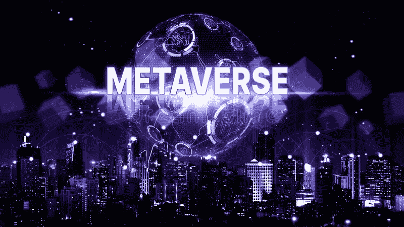

# 在这个西伯利亚的冬天，元宇宙发生了什么？

> 原文：<https://medium.com/coinmonks/what-is-happening-in-the-metaverse-during-this-siberian-winter-320412028809?source=collection_archive---------25----------------------->

dreamstime

[Virtua](https://virtua.com/) (一个多链元宇宙项目)提供了 Cardano、埃尔隆德、Polygon 和 Wax 在其生态系统中的实际用途。

联合创始人加里布里斯(BAFTA 提名的游戏行业老将)有超过 35 年的经验，建设一流的质量游戏。他已经安排与顶级 ips 合作，如教父，凯文·哈特，金刚(等)，以创造…