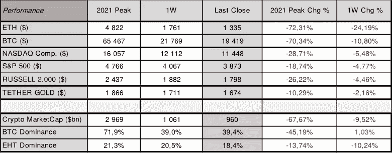
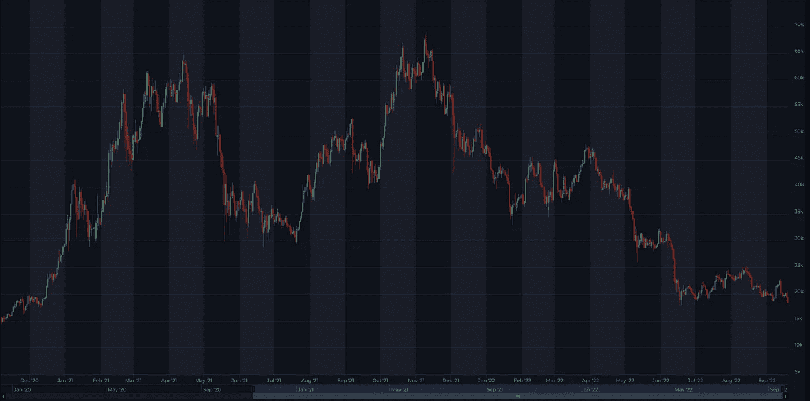
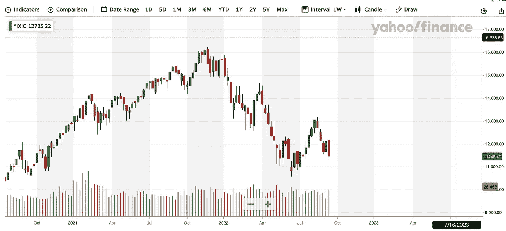
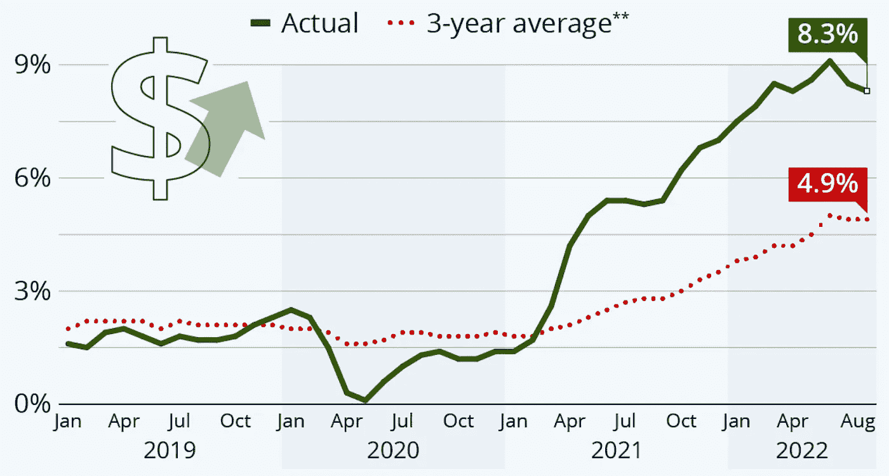
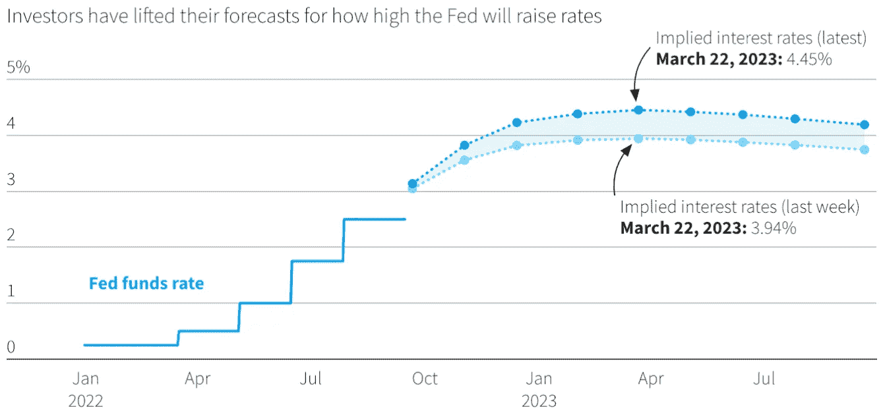

# 现在密码市场上发生了什么？

> 原文：<https://medium.com/coinmonks/what-is-happening-on-crypto-market-now-2e78e8a2e5d5?source=collection_archive---------23----------------------->

上周，加密和股票市场以下跌告终，为本周的美联储声明做准备。加密市场大幅下跌，与前一周相比，比特币下跌超过 10%，周日收于 19.419。ETH 经历了近 25%的最大跌幅。

合并已于 2022 年 9 月 15 日 08:42:42 GMT+2 在 Block #15.537.393 成功进行，标志着网络从工作验证(PoW)到利益验证(PoS)的全面过渡，与 PoW 共识机制相比，这将减少约 99.95%的能耗。然而，成功的升级并没有进一步推高乙醚的价格。相反，在合并活动中，价格保持平稳，本周收于 1.335。另一方面，股票下跌了约 5%，纳斯达克收于 11.448 点，S&P 收于 3.873 点。

**预计美联储本周将再次加息 0.75%。**美国劳工统计局(Bureau of Labor Statistics)上周二公布的消费者价格指数(CPI)8 月份增长 0.1%，收于 8.3%，低于 2022 年 7 月的 8.5%，但仍处于四十年来的高位。尽管汽油价格下跌，整体通胀率仍较上月上升 0.1%。

核心通胀率环比上升 0.6%，折合成年率增长 6.3%，高于前一时期的 5.9%。接受道琼斯调查的经济学家此前预计整体通胀率将下降 0.1%，核心通胀率将上升 0.3%。此外，路透社调查的经济学家预测，8 月份 CPI 环比下降 0.1%，导致 2022 年 8 月份 CPI 环比下降 8.1%，低于一个月前的 8.5%。

尽管汽油价格下跌，但核心通胀率的上升加剧了人们的猜测，即美联储将不得不在下次会议上进一步加息。据**路孚特称，新的预期将联邦基金利率指向 2022 年底前 3.80%至 4.20%的新目标区间，2023 年 3 月左右达到 3.94%-4.45%的峰值。**

# 比特币价格

来源:[altFINS.com](https://platform.altfins.com/screener)

# 纳斯达克

来源:[雅虎财经](https://finance.yahoo.com/)

# 美国消费物价指数

# 美国基金利率

来源:路孚特|路透社，2022 年 9 月 14 日

总体而言，与一个月前该指数为 29/100 相比，加密市场情绪(通过加密恐惧和贪婪指数衡量)继续保持在 **21/100，表明极度恐惧**。加密市场的总市值下降了近 10%，跌破 1 万亿美元大关。ETH 的主导地位从 20.5%略微下降到 18%，比特币略微上升到 39.4%。正如我们在上周的宏观分析中指出的，瑞士联邦理工学院的合并是一个典型的买入谣言卖出新闻的事件。该协议的技术升级已经反映在价格中。

**关注:**下一次货币政策会议定于 2022 年 9 月 20 日至 21 日举行，美联储和欧洲央行分别于 2022 年 10 月 27 日举行。下一次美国 2022 年 9 月 CPI 发布定于 2022 年 10 月 13 日。下一次美国 GDP 更新将于 2022 年 9 月 29 日发布，随后是 10 月 27 日。2022.

**记住，市场往往会比任何重大事件领先一步，所以不要错过新的机会，保持对市场发展的警惕。**在这一货币政策转变期间，保持投资的选择性非常重要，正如每次市场调整一样，准备好以低得多的估值进入市场。

知道何时进入市场——做好准备——在[altFINS.com](https://altfins.com/)获得更多见解、趋势和研究报告。

> 交易新手？尝试[加密交易机器人](/coinmonks/crypto-trading-bot-c2ffce8acb2a)或[复制交易](/coinmonks/top-10-crypto-copy-trading-platforms-for-beginners-d0c37c7d698c)