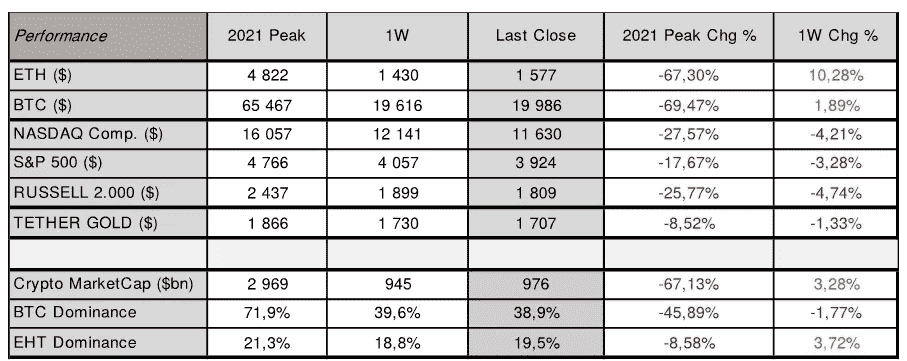
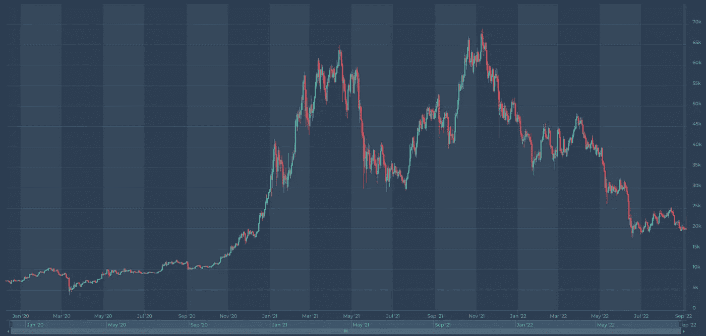
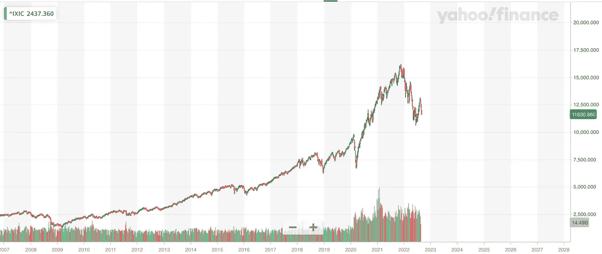
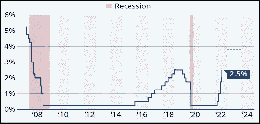

# 现在密码市场上发生了什么？

> 原文：<https://medium.com/coinmonks/what-is-happening-on-crypto-market-now-46f87c3ff898?source=collection_archive---------36----------------------->

更新日期:2022 年 9 月 5 日

股票经历了又一个痛苦的一周，纳斯达克和罗素指数与一周前相比下跌了近 5%。相反，加密市场出现分化，最终小幅走高，比特币较前一周上涨 1.9%，收盘略低于 20k 的心理水平。ETH 经历了超过 10%的最高涨幅，从最近的低点 1.430 收于 1.577。

这主要是由周五即将到来的合并和疲软的美国就业报告推动的。美国劳工部的数据显示，失业率上升，就业增长放缓，8 月份增加了 31.5 万个就业岗位，而 7 月份增加了 52.6 万个。报告发布后，股市随着加密市场的上涨而上涨，但在俄罗斯国有能源集团俄罗斯天然气工业股份公司(Gazprom)表示将无限期关闭北溪天然气管道(Nord Stream gas pipeline)后，股市随即下跌。欧盟领导人上周五就天然气价格上限达成一致，最终关闭了北溪天然气管道。这进一步挤压了欧洲的能源供应，意味着能源价格上涨。

美联储仍有望在 9 月加息，整体预期仍更接近 0.75%而非 0.50%。周五的就业报告发布后，预期略有降温，表明央行将在 2023 年 3 月前将主要利率从周四收盘时预测的 3.95%上调至 3.83%左右。我们预计他们将在 9 月份再次加息 0.75%。美国正处于技术性衰退，其最后一个季度 GDP 连续第二个季度收缩，下降了 0 . 9%。

本周，人们关注着欧洲央行，预计它将在本周加息至多 0.75%。它在 2022 年 7 月将利率从-0.50%上调至零。然而，如果欧洲央行决定提高 0.75%，这将是其历史上的第二次。他们第一次将利率提高这么多是在 1999 年，因为欧元启动后的技术调整。

随着能源危机席卷欧盟大陆，欧洲央行管理委员会成员呼吁采取行动，提前启动未来的加息路径，以防止通胀飙升成为上世纪 70 年代那种持续上涨的工资和价格螺旋。

# 比特币价格

来源:altFINS.com

# 纳斯达克

来源:[雅虎财经](https://finance.yahoo.com/)

# 美国消费物价指数

# 美国基金利率

来源:美联储系统理事会(美国)——*共有区域表示美国经济衰退。*

总体而言，加密市场情绪(通过加密恐惧和贪婪指数衡量)为 23/100，表明极度恐惧。密码市场的总市值大约低于 1 万亿美元。ETH 继续以 19.5%的份额跑赢比特币，而比特币则持续下跌。

**关注:2022 年 9 月 13 日** —美国 2022 年 8 月 CPI 指数。下一次货币政策会议定于 2022 年 9 月 8 日**欧洲央行**和 2022 年 9 月 20 日至 21 日**美联储**召开。预计两者将分别加息 0.75%和 0.50%。ETH 合并定于 2022 年 9 月**15 日。**

请记住，市场往往会比任何重大事件领先一步，因此不要错过新的机会，并保持对市场发展的警惕。在这一货币政策转变期间，保持投资的选择性将非常重要，正如每次市场调整一样，准备好以低得多的估值进入市场。

知道何时进入市场——做好准备——在[altFINS.com](https://altfins.com/)获得更多见解、趋势和研究报告。

[**altFINS**](https://altfins.com/) 是**一个领先的加密分析平台**，成千上万的交易者和投资者使用它来寻找有利可图的交易思路。

altFINS 项目是出于对缺乏高质量工具的失望而开始的，这些工具用于寻找交易想法、创建警报、执行交易策略以及监控交易所之间的投资组合表现。我们的团队决定填补这一空白。

我们正在构建一个全面而直观的平台，使用传统的技术分析和替代的链上数据以及跨交易所的交易执行来进行硬币筛选和分析。交易想法发现和交易执行的结合在加密交易领域是独一无二的。

你喜欢这篇文章吗？订阅 altFINS 时事通讯。

> 交易新手？试试[加密交易机器人](/coinmonks/crypto-trading-bot-c2ffce8acb2a)或者[复制交易](/coinmonks/top-10-crypto-copy-trading-platforms-for-beginners-d0c37c7d698c)