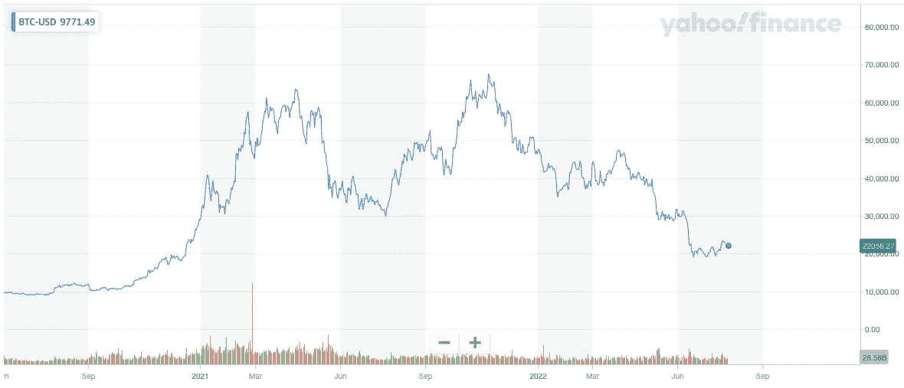
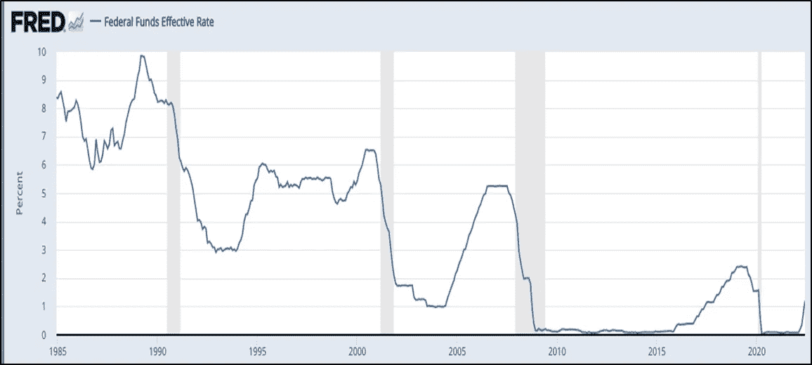
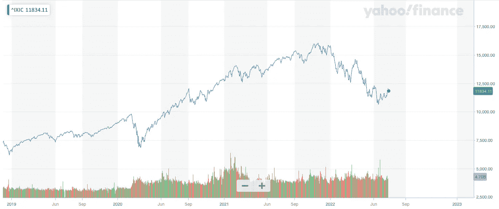
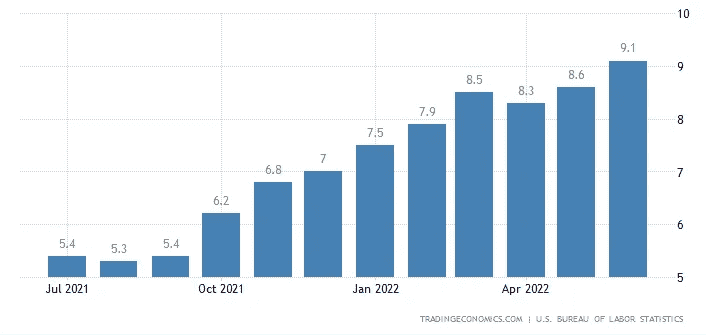

# 现在密码市场上发生了什么？

> 原文：<https://medium.com/coinmonks/what-is-happening-on-crypto-market-now-6403ad38304a?source=collection_archive---------51----------------------->

更新日期:2022 年 7 月 25 日

上周，加密和股票市场再次出现利好消息。与一周前相比，比特币进一步上涨了近 10%，周五收于 22.700 美元左右，而我们看到纳斯达克收于 11.834 美元，比前一周的收盘价上涨了 3%以上。我们看到以太坊上涨了近 25%,突破了 1.500 美元关口。这主要是由计划于 2022 年 9 月 19 日进行的 ETH 合并推动的。我们认为 ETH 合并也推动了整个加密领域的价格上涨。

尽管欧洲央行加息 50 个基点至 0%，但股市总体上又上涨了一周，这是 11 年来首次加息，预计将在 2022 年 9 月进一步加息 50 个基点。正如我们在上次报告中预测的那样，强劲的美国就业数据和飙升的汽油价格将美国 2022 年 6 月的通胀数据推高至 9.1%，比美联储 2.0%的目标利率高出 7.1%。

据彭博称，未来 12 个月经济衰退的可能性已经上升到 38%。6 月份，CPI 篮子中四分之三的商品和服务的年化增长率超过 4.0%。我们认为，美联储将在本周再次加息 75 个基点，到年底将利率上调至 3.5%左右，然后在 2023 年下半年开始降息。

本周加息 0.75%，将使基准利率达到 2.25%至 2.50%之间的区间。众所周知，加息会降低资产价格，提高借贷成本，进而冻结投资、招聘和支出，从而减缓经济增长，冷却通胀。这将对股票和密码市场产生负面影响。因此，我们认为最近的价格上涨可能是脆弱的，可能是对 2022 年 5 月以来大抛售的价格修正。从宏观基本面来看，我们对任何看涨趋势保持谨慎，因为持续的通胀斗争仍在继续。

## **比特币价格**

Source: [Yahoo Finance](https://finance.yahoo.com/)

美国 FUD 利率

Source: Board of Governors of the Federal Reserve System (US) — *shared areas indicate U.S. recessions.*

纳斯达克

Source: [Yahoo Finance](https://finance.yahoo.com/)

美国消费物价指数

总体而言，加密市场情绪(以加密恐惧和贪婪指数衡量)达到 30/100，这仍然是恐惧，但没有 2022 年 5 月那么严重。过去一周，加密市场的总市值攀升了 10%以上，达到 1 万亿美元以上，以太坊的表现优于比特币以及其主导指标攀升 8%至 18.4%的股票。

**接下来要关注:**本周 2022 年 7 月 26 日至 27 日，美联储就美国货币政策进展再次召开会议。下一次货币政策会议定于 2022 年 9 月 8 日(欧洲央行)和 2022 年 9 月 20 日至 21 日(美联储)召开。

请记住，市场往往会比任何重大事件领先一步，因此不要错过新的机会，并保持对市场发展的警惕。在这一货币政策转变期间，保持投资的选择性将非常重要，正如每次市场调整一样，准备好以低得多的估值进入市场。

知道何时进入市场——做好准备——在[altFINS.com](https://altfins.com/)获得更多见解、趋势和研究报告。

[**altFINS**](https://altfins.com/) 是**一个领先的密码分析平台**被成千上万的交易者和投资者用来寻找有利可图的交易思路。

altFINS 项目是出于对缺乏高质量工具的失望而开始的，这些工具用于寻找交易想法、创建警报、执行交易策略以及监控交易所之间的投资组合表现。我们的团队决定填补这一空白。

我们正在构建一个全面而直观的平台，使用传统的技术分析和替代的链上数据以及跨交易所的交易执行来进行硬币筛选和分析。交易想法发现和交易执行的结合在加密交易领域是独一无二的。

> 交易新手？尝试[加密交易机器人](/coinmonks/crypto-trading-bot-c2ffce8acb2a)或[复制交易](/coinmonks/top-10-crypto-copy-trading-platforms-for-beginners-d0c37c7d698c)