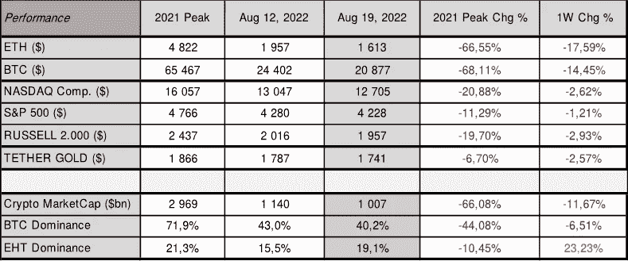
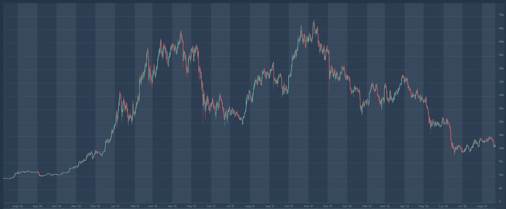
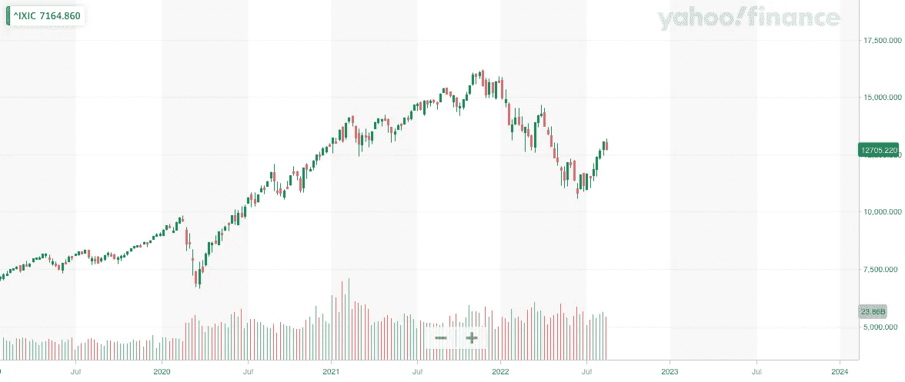
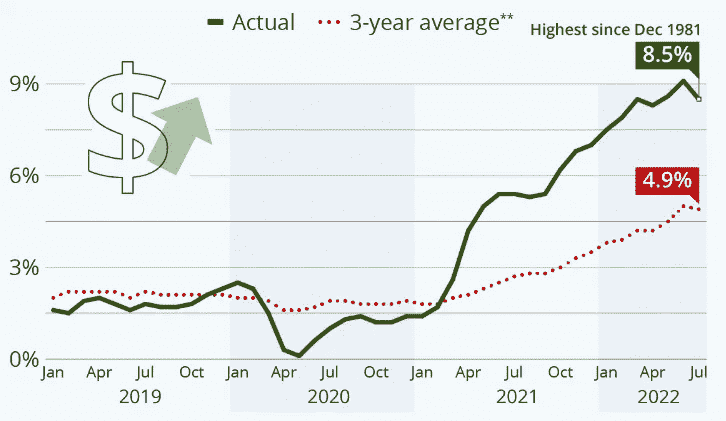
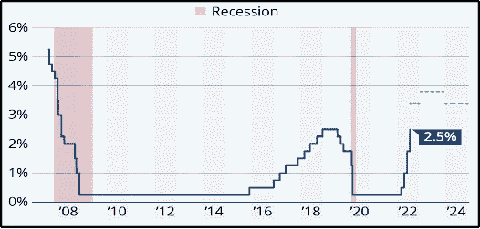

# 现在密码市场上发生了什么？

> 原文：<https://medium.com/coinmonks/what-is-happening-on-crypto-market-now-6a2c1002b3c8?source=collection_archive---------35----------------------->

更新日期:2022 年 8 月 22 日

Crypto and equities 抹去了部分夏季收益。比特币本周收盘下跌近 15%，周五收于 20.877 左右，纳斯达克收于 12.705，较前一周收盘下跌逾 2%。

ETH 也下跌超过 17%，收于 1.613 点。抛售压力来自于 2022 年 8 月 18 日公布的美联储纪要，该纪要表明，美联储将在美国经济增长之前优先考虑抗击通胀，时间比一些投资者希望的要长。

这意味着，即使美国经济陷入更深的衰退，更高的利率也将持续更长时间，这对更乐观的加密和股票投资者都是一个打击。

美联储在 2022 年 7 月的最后一次货币政策会议上加息 75 个基点，至 2.5%。我们预计他们将在 9 月份再次加息，目标是到年底达到 3.5%至 3.75%，然后在 2023 年下半年开始降息。美国已经陷入衰退，其最后一个季度 GDP 连续第二个季度收缩，下降了 0 . 9%。

Source: [altFINS.com](https://platform.altfins.com)

2022 年 7 月美国 CPI 降至 8.5%，低于上月的 9.1%，因汽油价格下跌导致通胀压力缓解。然而，较低的读数不太可能说服美联储放弃收紧货币政策。

另一方面，2022 年 7 月，英国的通胀率超过 10%，是 40 多年来的最高水平，也是 G7 国家中最高的。花旗预计，2023 年 1 月，英国通胀率将攀升至 18.6%，为近半个世纪以来的最高水平。类似地，德国央行警告称，由于通胀率预计将超过 10%，这是 70 年来的最高水平，并将一直保持到 2023 年，因此利率需要继续上调。

# 比特币价格

来源:altFINS.com

# 纳斯达克

来源:[雅虎财经](https://finance.yahoo.com/)

# 美国消费物价指数

# 美国基金利率

来源:美联储系统理事会(美国)——*共有区域表示美国经济衰退。*

总体而言，加密市场情绪(通过加密恐惧和贪婪指数衡量)仍在 29/100，表明恐惧继续占上风。密码市场的总市值约为 1 万亿美元，比一周前下降了 10%以上。ETH 以 19%的份额继续跑赢大盘，而比特币则持续下跌。

**接下来要关注:**2022 年 9 月 13 日，我们将公布 2022 年 8 月的美国 CPI 指数。欧洲央行下一次货币政策会议定于 2022 年 9 月 8 日，美联储定于 2022 年 9 月 20 日至 21 日。预计两者都将进一步加息。ETH 合并定于 2022 年 9 月 19 日。

请记住，市场往往会比任何重大事件领先一步，因此不要错过新的机会，并保持对市场发展的警惕。在这一货币政策转变期间，保持投资的选择性非常重要，正如每次市场调整一样，准备好以低得多的估值进入市场。

知道何时进入市场——做好准备——在 altFINS.com 的[获得更多见解、趋势和研究报告。](https://altfins.com/)

[**altFINS**](https://altfins.com/) 是**一个领先的加密分析平台**，成千上万的交易者和投资者使用它来寻找有利可图的交易思路。

altFINS 项目是出于对缺乏高质量工具的失望而开始的，这些工具用于寻找交易想法、创建警报、执行交易策略以及监控交易所之间的投资组合表现。我们的团队决定填补这一空白。

我们正在构建一个全面而直观的平台，使用传统的技术分析和替代的链上数据以及跨交易所的交易执行来进行硬币筛选和分析。交易想法发现和交易执行的结合在加密交易领域是独一无二的。

> 交易新手？尝试[加密交易机器人](/coinmonks/crypto-trading-bot-c2ffce8acb2a)或[复制交易](/coinmonks/top-10-crypto-copy-trading-platforms-for-beginners-d0c37c7d698c)