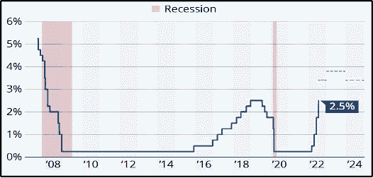

# 现在密码市场上发生了什么？

> 原文：<https://medium.com/coinmonks/what-is-happening-on-crypto-market-now-767b8ea7abba?source=collection_archive---------41----------------------->

加密和股票市场本周收盘上涨，纳斯达克和罗素指数上涨超过 4%，收复了前一周的失地。加密市场表现优于股票，比特币较前一周上涨近 9%，周日收于 22.769。

ETH 再次经历了超过 11%的最高涨幅，收于 1.761。ETH 继续得到**的支持，即将于本周 13 日****—2022 年 9 月 15 日****发生的合并。**

**预计美联储将在 9 月晚些时候加息，总体预期仍更接近 0.75%而非 0.50%。我们预计他们将提高 0.75%。美国正处于技术性衰退，其最后一个季度 GDP 连续第二个季度收缩，下降了 0 . 9%。**

****

**Source: altFINS**

**本周，所有人都在关注美国 CPI 和 ETH 的合并。由于美国 8 月份汽油价格连续第二个月低于预期，预计 CPI 将保持小幅下降。路透社调查的经济学家预测，8 月份 CPI 环比下降 0.1%，导致 2022 年 8 月份 CPI 环比下降 8.1%，低于上月的 8.5%。**

**较低的通胀对股票和加密等风险资产来说是好消息，但美联储不太可能在 9 月晚些时候实施另一次大幅加息，因为通胀率仍远高于其目标，服务价格增长仍然强劲。**

****比特币价格****

****

**Source: altFINS**

****纳斯达克****

****

**Source: [Yahoo Finance](https://finance.yahoo.com/)**

****美国消费者物价指数****

****

****美国基金利率****

****

**Source: Board of Governors of the Federal Reserve System (US) — *shared areas indicate U.S. recessions.***

**总体而言，加密市场情绪(通过加密恐惧和贪婪指数衡量)为 25/100，表明极度恐惧。密码市场的总市值大约超过 1 万亿美元。ETH 继续跑赢比特币，再次跨越 20%的市场份额。**

**尽管 ETH 在上周表现良好，但投资者仍应对即将到来的合并事件保持谨慎，因为第二大加密货币已经远远超过比特币，自 2022 年 6 月以来上涨了 90%以上。这可能表明合并已经被价格消化，因此，价格的任何反弹都可能是短暂的。**

****关注:**2022 年 9 月 13 日——美国将公布 2022 年 8 月的月度 CPI 数据。下一次货币政策会议定于 2022 年 9 月 20 日至 21 日举行，美联储和欧洲央行分别于 2022 年 10 月 27 日举行。ETH 合并定于 2022 年 9 月 13 日。**

****在我们的博客上阅读完整报告:******或在研究中心:**[**【https://altfins.com/research】**](https://altfins.com/research)****

> ****交易新手？尝试[加密交易机器人](/coinmonks/crypto-trading-bot-c2ffce8acb2a)或[复制交易](/coinmonks/top-10-crypto-copy-trading-platforms-for-beginners-d0c37c7d698c)****