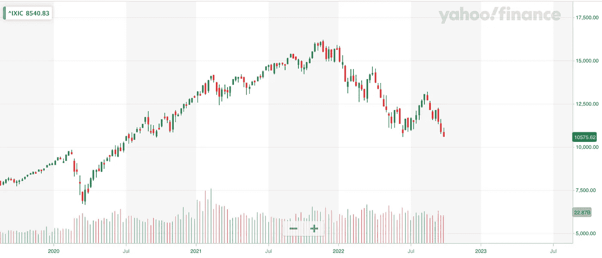
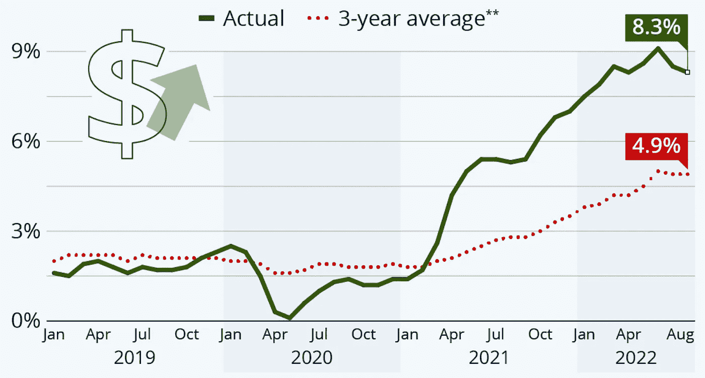

# 现在密码市场上发生了什么？

> 原文：<https://medium.com/coinmonks/what-is-happening-on-crypto-market-now-9c78aea6a120?source=collection_archive---------46----------------------->

更新日期:2022 年 10 月 3 日

对于加密和股票来说，这是喜忧参半的一周。比特币本周收盘上涨近 2%，周日收于 19.044。ETH 本周收盘微跌约 1.4%。美国股市下跌幅度在 1%至 3%之间，纳斯达克收于 10.575，标准普尔上周五收于 3.584。由于 2022 年 9 月 21 日(周三)举行的上一次美联储货币会议的结果，这两个市场的表现仍然不佳。此外，上周五，随着能源价格继续飙升，欧洲通胀率达到创纪录的 10%。俄罗斯对欧洲天然气供应的挤压导致能源价格飙升，并迫使欧盟各国政府进行干预，花费数十亿欧元保护消费者和企业免受影响。火热的通胀数据再次表明，欧洲央行将在 10 月晚些时候的下一次货币会议上加息。

留欧，英国经历了动荡的一周。英国新政府上任仅几周就宣布减税。结果，英镑跌至历史最低点，抵押贷款交易被从市场上撤出，因为英国政府债券遭到大量抛售，其收益率触及历史新高，并导致英格兰银行开始实施临时购买计划以平抑波动。英国政府刚刚清楚地表明，各国央行提高利率、减少对债券市场支持的道路，可能会变得比最初想象的复杂得多。

**上个月，美联储将利率提高了 0.75%，并宣布进一步收紧政策。**因此，联邦基金利率的目标区间目前为 3.00-3.25%。美联储董事会成员对目标区间中点的预测中值是，2022 年底为 4.4%，2023 年底为 4.6%。**9 月份通胀数据将于 2022 年 10 月 13 日公布** — **美联储对克里夫兰通胀的临近预测预测，CPI 将从一个月前的 8.3%降至 8.20%** ，核心 CPI 将进一步上升至 6.64%。然而，美国 CPI 的这些趋势的强度仍有待观察。

# 比特币价格

来源:[altFINS.com](https://platform.altfins.com/screener)

# 纳斯达克

来源:[雅虎财经](https://finance.yahoo.com/)

# 美国消费物价指数

# 美国基金利率

来源:路孚特|路透社，2022 年 9 月 14 日

总体而言，与一周前指数为 21/100 相比，加密市场情绪(通过加密恐惧和贪婪指数衡量)略微上升至 **24/100，仍表明极度恐惧**。然而，加密市场的总市值上升了 1%以上，仍低于 1 万亿美元的心理关口。与前一周相比，ETH 和 BTC 的优势度均下降了 1%。

**看点:**欧洲央行下一次货币政策会议:2022 年 10 月 27 日；美联储:2022 年 11 月 01 日–02 日；下一次美国 2022 年 9 月 CPI 发布定于 2022 年 10 月 13 日。下一次美国 GDP 更新将于 10 月 27 日发布。2022.

> 交易新手？试试[密码交易机器人](/coinmonks/crypto-trading-bot-c2ffce8acb2a)或者[复制交易](/coinmonks/top-10-crypto-copy-trading-platforms-for-beginners-d0c37c7d698c)