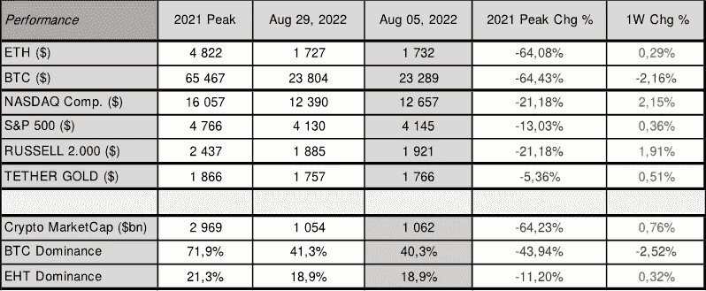
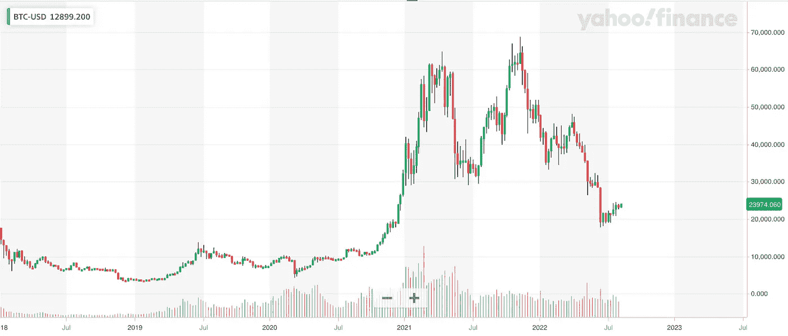
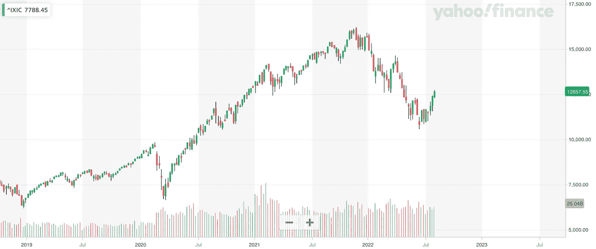
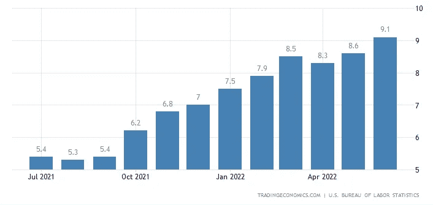
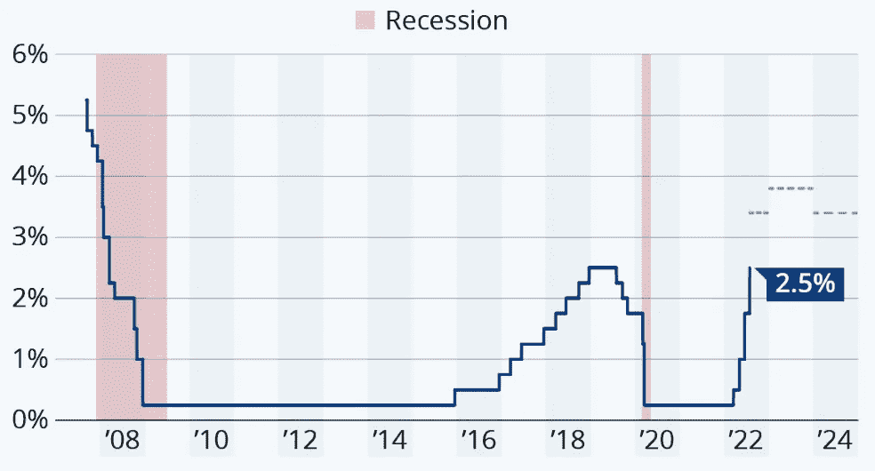

# 现在密码市场上发生了什么？

> 原文：<https://medium.com/coinmonks/what-is-happening-on-crypto-market-now-ac0df25b83ba?source=collection_archive---------53----------------------->

更新日期:2022 年 8 月 8 日

Crypto 和 equities 报告称，上周的表现喜忧参半，出现了一点脱钩。总体而言，我们看到了稳定的估值，没有任何重大变动。

比特币本周收盘微跌逾 2%，周五收于 23.289 左右，纳斯达克收于 12.657，较前一周收盘涨幅逾 2%。ETH 保持乐观情绪，再次推动了即将于 2022 年 9 月中旬进行的合并。

正如预期的那样，美联储在上次货币政策会议上将利率提高了 75 个基点，至 2.5%。我们预计他们将在 9 月份继续上调基金利率，目标是到年底达到 3.5%至 3.75%，然后在 2023 年下半年开始降息。

美国现在正式陷入衰退，2022 年 28 日公布的最新 GDP 数据连续第二个季度收缩，下降了 0.90%。更高的利率应该通过降低资产价格和提高借贷成本来减缓经济和冷却通货膨胀，导致支出减少，并使经济陷入衰退——所以看起来美联储的行动除了冷却通货膨胀之外还在发挥作用。

美国就业数据再次表明，劳动力市场依然坚如磐石。2022 年 7 月，非农就业岗位增加了 528，000 个，为 2 月份以来的最大增幅，使就业水平超过了疫情之前的水平。因此，我们可能会在 7 月份的读数中看到接近 10%的通胀率。

届时，美联储将更加有信心在 9 月份进一步加息，因为强劲的就业与美国陷入衰退相矛盾。必须指出的是:然而，最近的就业增长主要是由休闲和酒店业带动的，其中大多数是在餐馆和酒吧。金融、制造、住房、零售和技术部门等利率敏感型企业正在裁员，上周申请失业救济人数高于预期。

这可能表明，美国就业将从 2022 年 9 月开始出现调整，届时季节性工人将离开，更高的利率开始产生影响。

# 比特币价格

来源:[雅虎财经](https://finance.yahoo.com/)

纳斯达克

来源:[雅虎财经](https://finance.yahoo.com/)

# 美国消费物价指数

# 美国基金利率

来源:美联储系统理事会(美国)——*共有区域表示美国经济衰退。*

总体而言，加密市场情绪(通过加密恐惧和贪婪指数衡量)达到 30/100，表明恐惧继续占上风。加密市场总市值略高于 1 万亿美元，与前一周相比没有太大变化。我们还看到 ETH 继续表现出色，凭借其 19%的份额，它每天都在获得更高的主导地位，而比特币却在失去。

**接下来要关注:**本周，也就是 2022 年 8 月 10 日星期三，我们将公布 2022 年 7 月的美国 CPI 指数。下一次货币政策会议定于 2022 年 9 月 8 日(欧洲央行)和 2022 年 9 月 20 日至 21 日(美联储)召开。预计两者都将进一步加息。

**记住，市场往往会比任何重大事件领先一步，所以不要错过新的机会，保持对市场发展的警惕。**在这一货币政策转变期间，保持投资的选择性非常重要，正如每次市场调整一样，做好以低得多的估值进入市场的准备。

知道何时进入市场——做好准备——在 altFINS.com[获得更多见解、趋势和研究报告。](https://altfins.com/)

[**altFINS**](https://altfins.com/) 是**一个领先的加密分析平台**，被成千上万的交易者和投资者用来寻找有利可图的交易思路。

项目 [altFINS](https://altfins.com/) 开始于缺乏高质量的工具来寻找交易想法、创建警报、执行交易策略和监控交易所之间的投资组合表现的沮丧。我们的团队决定填补这一空白。

我们正在构建一个全面而直观的平台，使用传统的技术分析和替代的链上数据以及跨交易所的交易执行来进行硬币筛选和分析。交易想法发现和交易执行的结合在加密交易领域是独一无二的。

> 加入 Coinmonks [电报频道](https://t.me/coincodecap)和 [Youtube 频道](https://www.youtube.com/c/coinmonks/videos)了解加密交易和投资

# 另外，阅读

*   [加拿大最佳加密交易机器人](https://coincodecap.com/5-best-crypto-trading-bots-in-canada) | [库币评论](https://coincodecap.com/kucoin-review)
*   [用于 Huobi 的加密交易信号](https://coincodecap.com/huobi-crypto-trading-signals) | [HitBTC 审查](/coinmonks/hitbtc-review-c5143c5d53c2)
*   [TraderWagon 回顾](https://coincodecap.com/traderwagon-review) | [北海巨妖 vs 双子座 vs BitYard](https://coincodecap.com/kraken-vs-gemini-vs-bityard)
*   [如何在 FTX 交易所交易期货](https://coincodecap.com/ftx-futures-trading)
*   [OKEx vs KuCoin](https://coincodecap.com/okex-kucoin) | [摄氏替代度](https://coincodecap.com/celsius-alternatives) | [如何购买 VeChain](https://coincodecap.com/buy-vechain)