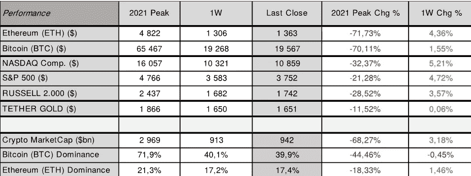
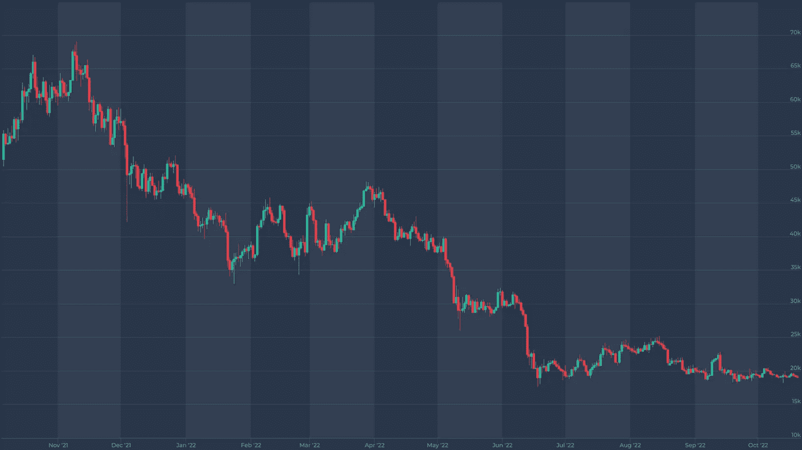
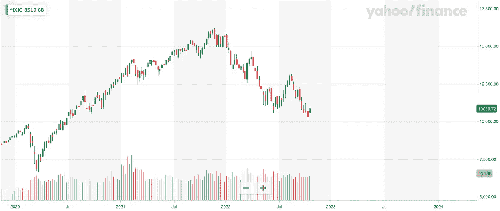
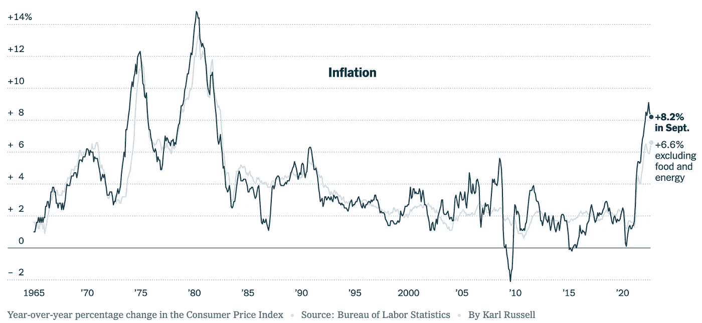
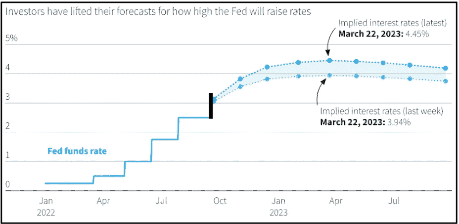

# 市场上发生了什么？

> 原文：<https://medium.com/coinmonks/what-is-happening-on-market-702e61932045?source=collection_archive---------34----------------------->

与上周相比，数字资产和美国股票都有所上涨。纳斯达克周五收盘上涨至 10.859 点( **5.21%** ，标准普尔收于 3.752 点( **4.72%** )。比特币( [**BTC**](https://altfins.com/crypto-screener) )本周收盘上涨 **1.5%** ，周日收于 19.567，而以太坊( [**ETH**](https://altfins.com/crypto-screener) )几乎跃升 **4.5%** 至 1.363。

本周初，市场再次创下新低，因为投资者预计美联储明年将加息至 5%，这表明与几周前相比，美联储将采取更强有力的紧缩措施来应对高通胀。预期上升是因为 2022 年 9 月美国 CPI 高于预期，显示月度价格压力惊人加速，特别是在广泛的日常用品和服务领域。然而，两个市场都抹去了大部分损失，价格回撤回升，本周收高。

自 2020 年以来，比特币和以太坊的价格波动性首次低于纳斯达克和标准普尔 500 指数。这一新趋势表明，加密货币市场对动荡的宏观经济事件的反应不如 2022 年早些时候，尽管股票市场仍然非常敏感。

最新的美国消费者物价指数和弹性的美国劳动力市场表明，11 月初将再次加息 0.75%，2022 年 12 月将再次加息 0.75%，预计 2023 年 2 月将再次加息 0.50%。

为了减缓上涨，美联储需要看到通货膨胀已经开始。每月都有所缓解，但事实并非如此。在加拿大和英国上周报告 2022 年 9 月 CPI 涨幅超过预期后，利率预期上调至 5%。目前，联邦基金利率目标区间为 3.00-3.25%，美联储董事会成员对目标区间中点的最后一个中值预测仍为 2022 年底的 4.4%和 2023 年底的 4.6%。**经过小幅修正后，我们预计美国 CPI 将在 2022 年 10 月略有降温，并稳定在 8.14%，核心 CPI 略低于 6.58%，而 2022 年 9 月分别为 8.20%和 6.64%。**

# 比特币价格

来源:[altFINS.com](https://platform.altfins.com/screener)

# 纳斯达克

来源:[雅虎财经](https://finance.yahoo.com/)

# 美国消费物价指数

# 美国基金利率

来源:路孚特|路透社，2022 年 9 月 14 日

与一周前相比，秘密市场情绪(通过秘密恐惧和贪婪指数衡量)保持在 **22/100，**表示**极度恐惧**。加密市场的总市值回升了超过 **3%** ，略低于**1 万亿美元大关**。以太坊( [**ETH**](https://altfins.com/crypto-screener) )优势度上升至 17.4%，收盘较前一周上涨近 1.50%。而比特币( [**BTC**](https://altfins.com/crypto-screener) )的统治地位相对保持不变，在 40.0%左右。

**看点:**欧洲央行下一次货币政策会议:2022 年 10 月 27 日；美联储:2022 年 11 月 01 日–02 日；下一次美国 2022 年 10 月 CPI 发布定于 2022 年 11 月 10 日。下一次美国 GDP 更新将于 10 月 27 日发布。2022.

请记住，市场往往会比任何重大事件领先一步，因此不要错过新的机会，并保持对市场发展的警惕。在这一货币政策转变期间，保持投资的选择性将非常重要，正如每次市场调整一样，准备好以低得多的估值进入市场。

知道何时进入市场——做好准备——在[altFINS.com](https://altfins.com/)获得更多见解、趋势和研究报告。

[**altFINS**](https://altfins.com/) 是**一个领先的加密分析平台**，成千上万的交易者和投资者使用它来寻找有利可图的交易思路。

altFINS 项目是出于对缺乏高质量工具的失望而开始的，这些工具用于寻找交易想法、创建警报、执行交易策略以及监控交易所之间的投资组合表现。我们的团队决定填补这一空白。

我们正在构建一个全面而直观的平台，使用传统的技术分析和替代的链上数据以及跨交易所的交易执行来进行硬币筛选和分析。交易想法发现和交易执行的结合在加密交易领域是独一无二的。

> 交易新手？尝试[加密交易机器人](/coinmonks/crypto-trading-bot-c2ffce8acb2a)或[复制交易](/coinmonks/top-10-crypto-copy-trading-platforms-for-beginners-d0c37c7d698c)