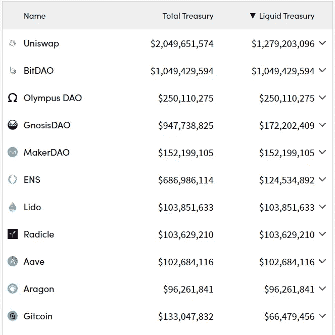
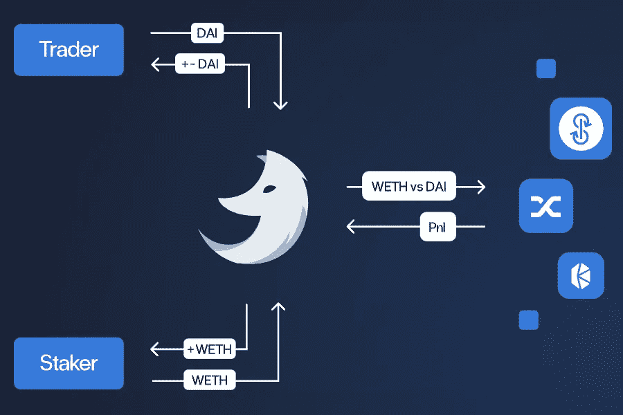

# 什么是 Ithil，你为什么要关心？

> 原文：<https://medium.com/coinmonks/what-is-ithil-protocol-and-why-should-you-care-e50c4919ff34?source=collection_archive---------4----------------------->

“ [DeFi 正在死去](https://twitter.com/search?q=defi%20is%20dying&src=typed_query)”——每一个对加密有影响的人都变成了末日预言家最喜欢的*短语*。

但这是真的吗？嗯，不会比上一轮牛市中一个比特币的价格达到 10 万美元更好了。

然而，我们不得不承认，DeFi 存在一些非常现实的问题。在[我们之前的文章](https://ithil-protocol.medium.com/introducing-ithil-protocol-the-defi-wizard-6e7fa2e2f836)中，我们讨论了空间中的一些常见问题、障碍和挫折。我们还调侃了我们的解决方案: [**Ithil，Web3Wizard**](https://ithil.fi) **。**

今天，我们在高层次上探索 Ithil 的基本原理。让我们开始吧。

# 什么是 Ithil，Web3 向导？

Ithil 是第一个**金融原始协议**，允许你**接触到 Web3** 中的任何新趋势，无论是元宇宙、NFTs 还是 DeFi。

我们施展魔法，通过**简化的用户界面向**选定的** **策略**提供**增强曝光**。**

让我们打开这份使命宣言。

# **(1)增强曝光**

Ithil 的核心特征之一是**提供抵押不足的杠杆和贷款。这有效地允许用户增加他们对我们精心策划的投资策略的曝光率，并放大他们的回报。**

我们认为资本效率是任何健康金融生态系统的关键。没有投入使用的资本是正在缓慢(或迅速，在当前的通胀水平下)萎缩的资本。

现在，[考虑一下道美国国债](https://openorgs.info/)中的流动资金数量，其中大部分目前没有任何回报。

(DeFi) DAO treasuries hold billions of dollars worth of undeployed capital

这还不包括加密巨鲸、做市商、对冲基金甚至越来越关注 DeFi 的 TradFi 参与者持有的所有未部署资本。

同时，许多当前和未来的 DeFi 用户可用的资金有限。对于零售部门来说尤其如此，因此他们经常面临天然气成本超过投资回报的局面。

我们设想通过我们内部的低抵押贷款技术将这两个群体结合在一起。

**它是这样工作的:** 流动性提供者(LP)通过 Ithil 协议使他们的令牌可用于部署，并在同一个令牌中赚取费用。用户可以在任何列入白名单的令牌中发布保证金，并获得对其首选策略的欠抵押杠杆的访问权。

然后，该协议执行选定的投资策略，并在用户决定套现或被清算时支付 LPs。这样，资金永远不会离开协议，直到贷款完全偿还，从而消除了超额抵押的需要。

强大的清算机器人**保护有限合伙人和用户免受动荡的市场环境**的影响，确保有限合伙人永远不会失去他们的任何存款，并且用户不会因为短暂的资金而被可怕地清算。

# (2)策划策略

虽然存在许多不同的方案和策略，但是很难找到可靠的、可持续的产量。

我们已经看到，在最近的牛市中，叉、产量农场和“实验性”协议大量涌现，经常提供巨额 apy 以吸引资本。然而，其中的大部分最终给除了一小部分用户之外的所有用户造成了巨大的损失。

此外，DeFi 生态系统正越来越多地扩展到越来越多的替代层(L1、L2)。其中一些层是梦幻般的(新)DeFi 项目的所在地(例如 [Dopex](https://www.dopex.io/) on [Arbitrum](https://portal.arbitrum.one/) )，但由于相对默默无闻，这些项目中的许多并没有达到更广泛的受众。

这同样适用于追求构建长期高质量产品的项目，而不是制造营销炒作(通常通过可疑的影响者)和抬高象征性价格或为极度通胀的回报曲线创造退出流动性。

What could possibly go wrong?

简单的人类贪婪的一个不幸后果是，注意力不成比例地集中到了被夸大的狗屁硬币上。然而，作为一个聪明的投资者，你更喜欢创造价值并提供合理、可持续收益模型的项目。这些通常更难找到。

对于一般的市场参与者来说，以上都是一个问题。大多数 DeFi 使用者通常不愿意或不能投入大量时间进行研究和尽职调查。然而，这是发现适合你的时间偏好和风险偏好的合理策略的唯一途径。

Ithil 的解决方案很简单:我们的道的战略家做繁重的工作，并提供具有可信赖的 DeFi 产品的策划战略。

用户可以从风险、回报和时间跨度各不相同的 smrgás board 审查策略中进行选择。由于有限合伙人提供的资本，用户可以提高杠杆来增加他们的回报。以下是我能提供的一套 DeFi 策略:

# (3)简化的用户界面

目前，想要构建(并定期管理)多样化投资组合的 DeFi 用户必须跨越多个区块链和/或层与不同的协议进行交互。这是一项繁重的工作，由于不同的用户界面和陡峭的学习曲线，可能会令人生畏。

虽然像 zapper.fi 或 T2 debank 这样的工具可以帮助维护你的投资组合，但它们对于主动管理来说用处不大。

这就是我们想用 Ithil 做出改变的地方。我们的目标是让 DeFi 变得可访问，不仅是现在的用户，还有未来的用户。为此，我们创建了一个统一的、易于使用的界面，我们将通过迭代过程不断改进它。

这个 UI 也是一个从高级策略中抽象出复杂性的工具。即使是最复杂的飞轮策略也可以通过简单的点击来选择和执行，而所有的艰苦工作都在(漂亮的)引擎罩下进行。

最终，我们将通过一个界面为用户提供高质量的策略，这个界面很有吸引力，使用起来很直观。

你觉得你可以在生活中使用一些魔法吗？好消息:我们的公共测试网将在未来几周内部署。

请务必关注以获取所有最新信息，或者在 Twitter 或 Discord 上与我们联系。此处的所有链接:

## 【https://linktr.ee/ithil_protocol】>>><<<