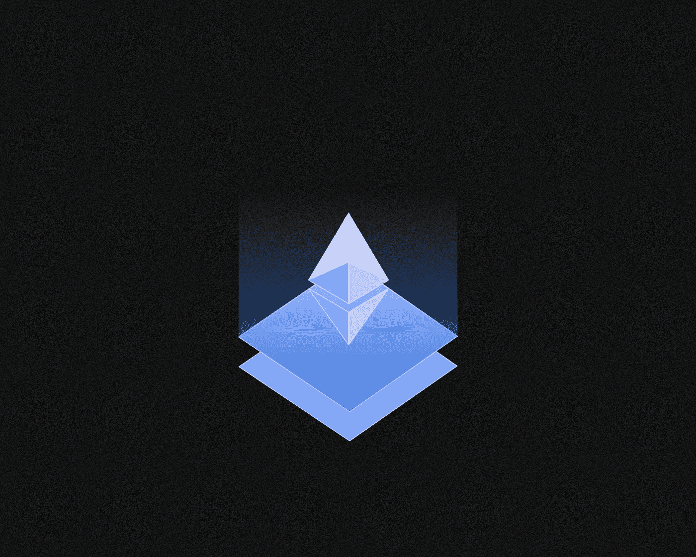
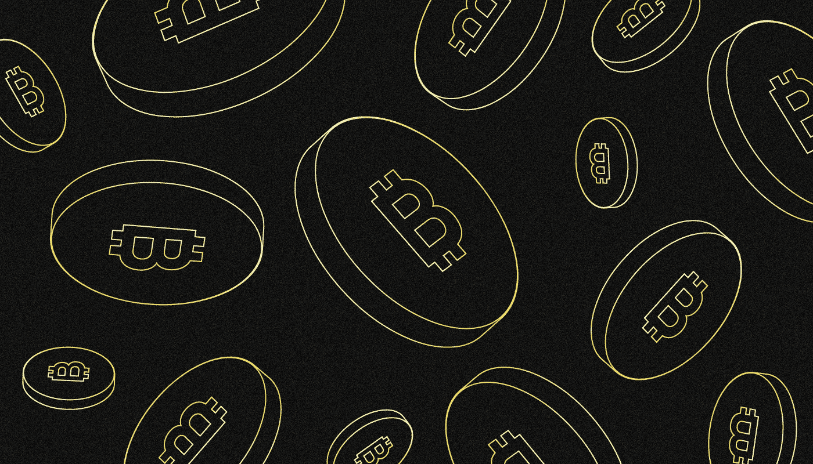
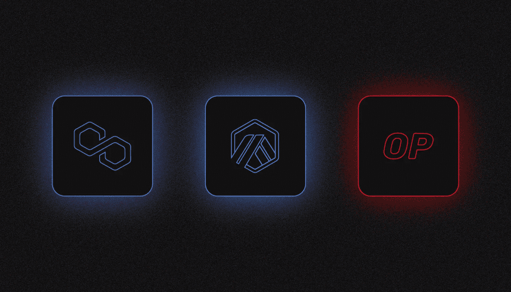
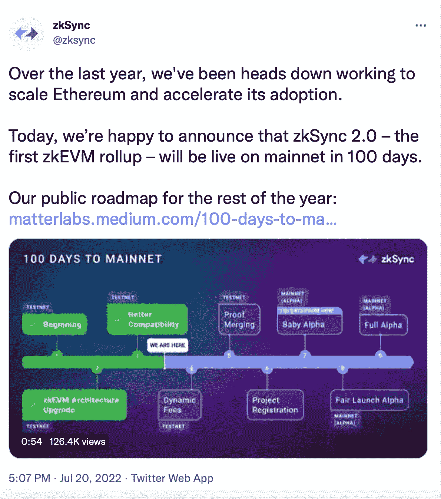

# 区块链的第二层是什么？

> 原文：<https://medium.com/coinmonks/what-is-layer-2-in-blockchain-540f3944629f?source=collection_archive---------18----------------------->

***第 2 层是运行在主区块链(第 1 层)之上的协议，旨在提高其可扩展性。它是如何工作的，我们为什么需要它？让我们一起来看看吧！***

L2 解决方案用于低带宽的流行区块链平台，如以太坊和比特币。

第 2 层与主网络深度集成，支持兼容的智能合约和加密资产。

在以太坊的情况下，将需要跨链桥来在主网络和第二层之间传输加密货币。

# **我们为什么需要第二层？**

区块链的“可扩展性三元悖论”是一个问题，它使得很难同时创建一个快速、分散和安全的网络。因此，开发人员经常需要从三个组件中选择和优化不超过两个组件。

早期的区块链架构，主要是比特币和以太坊，并不是为大量交易和用户设计的，所以它们的带宽有限。例如，比特币每秒交易 5-7 次，而以太坊每秒交易约 15 次。

可伸缩性可以通过改变区块链协议的代码和利用诸如分片之类的功能来提高。但是，这需要很长时间，可能需要几年。此外，因为这样的增强改变了架构的基础，项目团体并不总是同意执行它们。

L2 解决方案允许至少部分解决低带宽和高传输费用的问题，而不影响主区块链码。它们的主要优点是能够在使用“第二层”的同时在“第一层”的地址之间转移资产，第二层可以是单独的链外协议或单独的区块链。

# 有哪些针对比特币的 L2 解决方案？

闪电网络是第一个加密货币(LN)的主要 L2 项目。它基于一个使用智能契约和所谓的状态通道的协议。闪电网于 **2015** 上线，此后一直积极发展。**截至 2022 年 5 月底**，LN 渠道总容量达到**3900 BTC**。

LN 的首要功能是允许比特币持有者进行直接交易，而不必向其注册表写入信息。要做到这一点，你必须创建一个特殊的渠道，一个单一的链上交易，并存入比特币。

激活后，支付通道使您能够以更高的速度和更低的费用在链外或主网络外进行转账。与链上交易不同，闪电网络渠道交易只对其用户可见。主区块链只记录交易的初始和最终状态。

这种方法大大降低了主比特币网络的负载:闪电网络每秒可以处理数千次操作，同时保持高水平的系统安全性。

# **闪电网的支付渠道是靠什么来保障的？**

该渠道由其参与者和他们的共同智能合同来验证。在完成链外交换之后，最终状态被记录在主网络的新块中。智能合约保护国家渠道内的交易，也充当参与者关系中的“法官”。

一些通道使用计时器来自动更新或阻止事务的链上状态。截止日期过后，系统将启动最终事务，更新主区块链，并根据最后验证的事务关闭状态通道。任何解锁状态通道的新尝试都会生成新的加密并重新启动计时器。

# **以太坊有哪些 L2 解决方案？**

尽管速度很慢，以太坊是分散化应用中使用最多的区块链平台。它是分散融资(DeFi)和不可替代代币(NFT)领域许多热门项目的焦点。因此，以太坊的可伸缩性问题尤为突出

几个主要的 L2 解决方案正在同时开发中:

*   [多边形](/sunflowercorporation/what-is-polygon-matic-916f4fa2afee)(MATIC)；
*   仲裁机构；
*   乐观

汇总是他们工作中使用的主要技术，有两种类型:

*   **乐观向上。**借助该解决方案，交易在 L2 网络中进行，然后以大的组组合成一个紧凑的块，由主以太坊网络中的验证器包含。Arbitrum 和乐观都使用乐观汇总。
*   **ZK 卷装**。二级网络中的交易也是组合成数据包发送到以太坊网络，但要借助专门的验证器进行确认，这是操作有效性的密码学证明。多边形是使用 ZK 卷实现的。该平台的主要联合创始人 Vitalik Buterin 相信这种缩放技术。

无论 L2 的解决方案是什么，以太坊作为“第一层”负责验证事务和生成块，以及记录最终状态的注册表和共识机制。因此，项目不需要建立自己的基础设施。

还有额外的第 2 层项目。例如，Matter Labs 在 2022 年 7 月**宣布发布 sync 2.0。**

Source: [Twitter](https://twitter.com/zksync/status/1549757888641437696?ref_src=twsrc%5Etfw%7Ctwcamp%5Etweetembed%7Ctwterm%5E1549757888641437696%7Ctwgr%5Eb33ffa5c6910722cb9f15eb37405fc062b5893a4%7Ctwcon%5Es1_&ref_url=https%3A%2F%2Fforklog.com%2Fnews%2Frazrabotchiki-zksync-anonsirovali-zapusk-resheniya-v-osnovnoj-seti-ethereum)

一个月后，它自己用开罗语编写的协议启动了 StarkWare 项目。

# **如何将资产从 L1 网络转移到 L2？**

为了将加密货币从一级区块链转移到 L2 网络，必须使用跨链桥。

要使用它们，你需要一个基于浏览器的 Web3 钱包，如 Meta Mask 或 WalletConnect。首先，将所需的网络(例如，乐观)添加到钱包设置中。

项目有自己的[官桥](https://app.optimism.io/bridge)。在 bridge 网站上，选择您要转移的资产，指定金额，确认交易，然后收到相同的令牌，但已经是 L2 网络。[多边形](https://wallet.polygon.technology/login?next=%2Fbridge%2F)和[仲裁处](https://bridge.arbitrum.io/)也有各自的桥梁。

L2 网络的加密货币几乎可以不受限制地作为“原始”货币使用，例如，在分散式交易所或在 DeFi 协议中用于转账或交易。大多数大型应用程序支持二级解决方案资产。在 Uniswap 中，这种方法被称为“多链”。

L2 网络的加密货币几乎可以不受限制地作为“原始”货币使用，例如，在分散式交易所或在 DeFi 协议中用于转账或交易。大多数大型应用程序支持二级解决方案资产。在 [Uniswap](/sunflowercorporation/what-is-uniswap-2ab17b51b63b) 中，这种方法被[称为](https://uniswap.org/blog/multichain-uniswap)“多链”。

# **侧链属于 L2 解决方案吗？**

侧链，如在 Cosmos 或 Polkadot 中发现的那些，不是二级解决方案。前者使用自己的安全系统，而后者在这方面依赖“母”区块链。

> 如果你对 VeChain 主题有任何补充，欢迎评论！
> 在跟踪更新方面，订阅我们的 [Medium Feed。](/@SunflowerCorpAdmin)
> 
> 您也可以在我们的平台[向日葵公司](https://sunflowercorp.com)上尝试使用加密货币。
> 敬请期待！

> 交易新手？试试[加密交易机器人](/coinmonks/crypto-trading-bot-c2ffce8acb2a)或者[复制交易](/coinmonks/top-10-crypto-copy-trading-platforms-for-beginners-d0c37c7d698c)