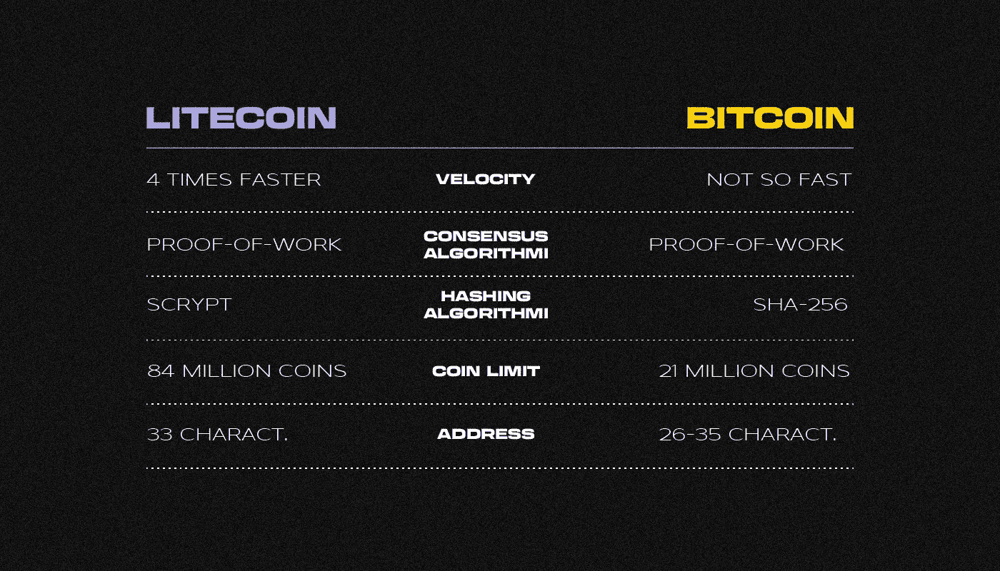

# 什么是莱特币？

> 原文：<https://medium.com/coinmonks/what-is-litecoin-7e3de00c5228?source=collection_archive---------70----------------------->

***莱特币(Litecoin)是建立在比特币源代码上的全球去中心化 p2p 支付网络，采用同名货币(Litecoin，ticker LTC)。如果我们有比特币，为什么还需要它？让我们来了解一下！***

它于 2011 年 10 月在**由作者和开发者**查理·李**推出，他们希望通过采用不同的挖掘算法和缩短交易确认时间来改进第一种加密货币的系统。MIT/X11 在自由许可下发布了**“数字银”**项目的代码，这意味着它可以以修改后的形式进行修改、复制和分发。**

李最近在一次采访中表示，他开始开采莱特币**只是为了好玩** **，并没有期望它会成功**。他认为它比比特币稍不安全和分散，但由于较低的费用、高网速和带宽，它很有吸引力。Lee 认为，比特币作为价值储存手段将变得更加流行，而莱特币将用于小额支付。

# **莱特币和比特币有什么不同？**

**litetcoin** 本质上是**比特币**的一个分叉。其网络的轻便性使得交易确认的速度比比特币区块链(T23)快 4 倍(T21)。两个系统都使用工作证明(PoW，Proof-of-Work)共识算法，但**比特币**使用 SHA-256 哈希算法，而**莱特币**使用 Scrypt，这需要更多的 RAM，但更容易设置。

**比特币**的币限为**2100 万币**，而**莱特币**的币限为**8400 万币**。每个**比特币地址**有**26–35 个字符，**以数字 1 或 3 开头，而**莱特币** **地址**由 **33 个字符**组成，使用 SHA-256 哈希法形成，以字母 L 或数字 3 开头(SegWit 启用后)。

# **如何购买莱特币？**

莱特币可以在加密货币交易所购买，手动或从交易所(不太安全)购买，或使用信用卡直接从 Litecoin.com 购买。

# **开采莱特币有多难？**

Litecoin 网络每 2016 个区块(每 4 天一次)自动调整一个参数，该参数反映了寻找新区块所需的计算量，即挖掘硬币的复杂性。尽管采矿能力发生变化，但这需要将创建新区块所需的时间保持在 2.5 分钟左右。

# **如何开采莱特币？**

在中国矿业巨头**比特大陆**于 **2014** 推出基于 Scrypt 算法的 **ASIC 矿机**之前， **litecoin** 可以使用中央处理器(CPU)和图形处理器(GPU)(GPU)进行开采。可以使用项目的官方钱包或使用 Scrypt 算法的特殊软件来挖掘 LTC。

鉴于这种情况下计算任务的复杂性将高于比特币采矿，并且矿工的报酬金额最近有所减少，如果没有专门的采矿农场，现在极难从开采莱特币中赚钱。

> 在跟踪更新方面，订阅我们的[媒体提要。](https://medium.com/sunflowercorporation)敬请期待！
> 您也可以在我们的平台[向日葵公司](https://sunflowercorp.com)尝试使用加密货币。

# **什么是莱特币减半？**

**2019 年 8 月初，**莱特币网络的第二次减半发生在 **1680000** 区块，将网络开采区块的矿工报酬金额从 25 LTC 降至 12.5 LTC。正如查理·李解释的那样，它应该会阻止 LTC 价格进一步下跌。

下一次类似的薪酬削减定于 2023 年 8 月在**进行。**

# **谁在开发莱特币网？**

最初，**查理·李**做了所有与莱特币网络开发相关的工作。他曾在谷歌工作，自 2013 年以来，他同时在美国加密货币交易所比特币基地工作，直到 2017 年夏天**才全身心地投入到这个项目中。**

同年，他在新加坡创立了 **Litecoin Foundation** 并成为常务董事，与他一起的还有开发者兼加密投资人**王新喜**，英国开发者**富兰克林理查兹**，以及项目经理 **Zing Yang** 。Litecoin 基金会为 Litecoin 核心开发团队提供资金支持，该团队由 Litecoin 项目开发人员和几名组织专业人员组成。

【2017 年 12 月，**查理·李**将其拥有的莱特币全部出售给莱特币基金会，解释说他想降低自己对社区、市场和加密资产价格的影响。

# **为什么莱特币网络需要一个 SegWit fork？**

通过从事务中删除签名数据，**隔离见证(" SegWit")** 技术允许您增加块大小限制。SegWit softfork 是为了增加比特币网络吞吐量而创建的。虽然 Litecoin 在 2017 年 4 月**日**并未要求这样的解决方案，但该更新是其网络上第一个被激活的。

因此，网络的块大小增加了一倍，一些专家认为这一更新有助于莱特币更好地适应比特币，并为引入闪电网络技术做好了准备，该技术允许用户发送硬币而无需支付佣金。正如查理·李后来所说，他的项目帮助比特币测试了 SegWit。

> 交易新手？尝试[加密交易机器人](/coinmonks/crypto-trading-bot-c2ffce8acb2a)或[复制交易](/coinmonks/top-10-crypto-copy-trading-platforms-for-beginners-d0c37c7d698c)