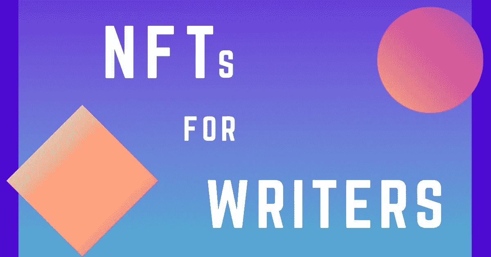

# 什么是文学 NFT？作为一名作家，你能从中受益吗？

> 原文：<https://medium.com/coinmonks/what-is-literary-nft-and-how-can-you-benefit-as-a-writer-d9dd7fd158f1?source=collection_archive---------42----------------------->

不可替代的代币已经成为许多行业的重要游戏规则改变者。虽然它彻底改变了艺术行业，但房地产、供应链和摄影等其他行业也开始意识到它的用处。随着这种意识的全面增长，其他部门正在寻找如何利用这种强大而新生的创新来取得切实的成果。

《文学 NFT》是我们最近看到的非功能性翻译的最新改编作品之一。它是以书面形式采用非功能性测试。实质上，文学 NFT 包括使用非功能性翻译来改进传统的写作、图书出版和图书发行过程。

现在，让我们深入这个主题。

# 什么是文学 NFT？

如前所述，文学 NFT 通常在写作过程中采用不可替代的标记。这并不是说 NFT 是用来写书的，而是说 NFT 是用来管理整个写作价值链的，从一本书被写出来到它到达最终消费者手中。

在传统图书出版行业中，整个价值链从拥有剧本和想法的作者到图书编辑——出版商根据他们的风格和读者群做出调整，直到图书出版和图书发行。

有时，整个过程通常由出版商出资，他们进行初始投资，希望在销售横财到来时获得回报。尽管这对新兴作家来说是一个很好的选择，但这种做法导致了强大出版社的出现，这些出版社有时会通过将他们的想法叠加到作家身上来扼杀创造力。更不用说，出版商和分销商通常最终都拿走了大部分销售收入，留给作家的只有微薄的收入和零花钱。

# 文学 NFT 的好处

显而易见，出版社和经销商网络已经成为每一个新兴的甚至是成熟的作者都必须与之抗衡的庞然大物。在这方面，文学 NFT 创造了一种方式，让作家绕过系统，直接创建一个通向消费者的网络。

以下是文学非功能性翻译的一些好处:

# 不再有中间人

作为一名作家，你不再需要担心喜欢强加他们的系统的出版商和经销商网络。你现在可以绕过这个过程，通过以 NFTs 的形式出售你的作品，直接与你的观众网络建立联系。

此外，您不再需要担心经常出现的创作压力和限制，因为您必须通过使作品符合出版商的创作风格来编辑作品。

在创作方向方面，你也可以自由选择以 NFT 的身份出售你的作品的方式。它可以是图像、视频或音频文件的形式。您也可以决定将 NFT 作为通往

# 利润和特许权使用费

这通常是出版商的领域，如果有的话，转售和版税对大多数作家来说是小本经营。有了 NFT，所有的版税直接汇入作家的金库。

通过 NFTs 发行作品，作者有机会从首次销售中获得全部利润，同时在二次销售中获得一定的佣金。这直接增加了利润空间，因为没有中间商分享收入，整个价值链本身也被缩短了。

# 社区联系

随着中间人的消失，作家能够与他们的粉丝群建立直接联系。有了 NFT 和 web3 的额外好处，作家可以将他们的 NFTs 作为进入他们社区的门户，在那里他们可以寻求吸引他们的目标受众，并与他们建立长期的牢固联系。

然后可以引入许多增值功能，比如对即将推出的作品的独家访问，或者通过提案提供投入和贡献的能力。这也需要社区有能力决定一个即将到来的作品的封面应该是什么样子，甚至直接塑造他们想要的角色属性。

所有这些形式的参与最终形成了一个强大的作家社区纽带，这有助于创建一个充满活力的在线基础，致力于作家的作品，而作家反过来会感谢他们的承诺。

# 警告

尽管文学 NFT 的概念很有前途，但重要的是要声明，它仍然是一个尚未被许多人接受的新生概念。值得一提的是，部署 NFTs 可能对已经在这个领域成名的作者有好处，而新兴作者仍然有责任证明他们的技术。

# 结果

文学非功能性翻译的概念才刚刚出现，在这个领域还有更多有待发现。正如其他部门正在寻找创新的方法来部署非功能性测试，NFT 部署在出版物将在未来几年进一步完善。然而，文学界的 NFT 已经给那些多年来一直生活在发行商网络的阴影下、任由传统出版社摆布的作家和作者们带来了希望。

> 交易新手？试试[密码交易机器人](/coinmonks/crypto-trading-bot-c2ffce8acb2a)或者[复制交易](/coinmonks/top-10-crypto-copy-trading-platforms-for-beginners-d0c37c7d698c)