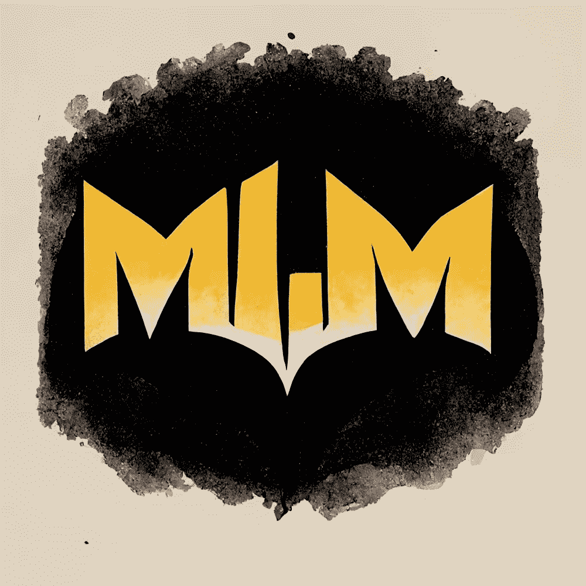
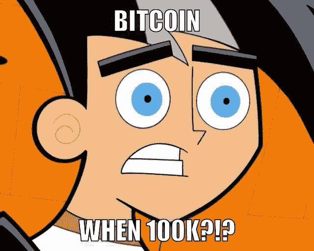

# 什么是营销&为什么每个人都应该是营销人员🗣

> 原文：<https://medium.com/coinmonks/what-is-marketing-why-everyone-should-be-a-marketer-6173b8dffd61?source=collection_archive---------18----------------------->

直接取自韦氏词典在线词典的营销定义如下:

> “营销的定义:
> 
> 在市场上销售或购买的行为或过程。
> 
> **b:** 推销、销售和分销产品或服务的过程或技术。
> 
> **2:** 将商品从生产者手中转移到消费者手中所涉及的功能的集合。"

> 简单来说，这意味着什么？营销是产品或服务的一切。颜色、徽标、行话/词汇、形状、“氛围”、团队、产品/服务本身…

作为营销人员，我们的工作通常是帮助公司销售产品或服务，有许多方法可以实现这一点，这取决于产品或服务、KPI(关键绩效指标)和公司的使命。

每个公司的营销剧本都不一样，差异很大，但一个公司进行良好营销的基本经验是找到你的目标受众，把所有时间花在他们发展朋友/社区的地方，并解决我们社区的问题。
_ _ _ _ _ _ _ _ _ _ _ _ _ _ _ _ _ _ _ _ _ _ _ _ _ _ _ _ _ _ _ _ _ _ _ _ _ _ _ _ _ _ _

假设我们是一家专注于能量治疗、水晶和自然疗法的另类健康公司。无论你有什么样的公司，把它降低到你的理想客户……你希望他们购买你的产品/服务……并迎合这些人。

对于我们的砖和砂浆 alt。健康公司，让我们把它命名为 Orionlion，我们希望对我们的产品和服务感兴趣的人是任何寻求自然治愈自己的人。相对而言，这些人可能更喜欢有机食品，可能练习瑜伽，喜欢旅游，有同情心，可能有剩余收入。

有了对潜在客户的所有了解，我们现在可以开始围绕这一点开发我们的品牌。

我们的产品和服务应该有一个稍微高一点的价位，我们的“氛围”应该是和平、健康和充满活力的，我们的颜色应该是浅色/柔和和充满活力的，我们的员工应该是健康、善良和乐于助人的。我们应该利用社交媒体，参加“有机”博览会、农贸市场，并进行现场演示。

Orionlion 的一个好的营销目标应该是“至少向我们社区的每个人问好一次”。很简单，成为社区周围的友好面孔。消息会传开的。

始终如一，跳出框框思考，努力工作，销售高价值的产品/服务，为人友善。

_________________________________________

在另一个例子中，假设我们是一个名为“哈利·水獭”的 NFT 项目，这是一个基于哈利·波特的亲民党迷因项目。

我们需要一个艺术家，一个聪明的合同/技术人员，以及一个能接触到尽可能多的 NFT 人和哈利波特爱好者的方法。

我们希望艺术是小的，可爱的，有趣的，从惠普谁变成水獭字符…我们也希望艺术是随机生成的，所以我们需要艺术家有知识创造分层艺术和如何通过代码生成艺术(也许技术人员也可以帮助)。

大多数 NFT 项目往往会有好的结果，最大限度地利用营销。据说 NFT 的项目几乎都是关于良好的营销。

大多数 NFT 项目预计在 idea 之后的 3-6 个月内启动。然而这并不是必须的。我们可以花一年或更长的时间简单地发展一个社区和观众，让我们的盛大发布。

这意味着你需要建立一个专门的社区，而社区=沟通+时间…所以你越是坚持不懈地与你的社区交流，建立他们的信任，建立友谊，以及你的社区聚在一起解决共同问题或一起享受时间的“仪式”，对于一个好的启动是至关重要的。

由于 NFT 基本上都是数字化的，我们所有的营销也应该是数字化的。如果你有一个 IRL NFT 项目，你也可以拓展业务，做 IRL 营销，但现在我们将坚持数字营销。

这意味着我们应该专注于 1-2 个社交媒体平台，并在那里真正树立我们的支柱。也许我们选择不和谐和抖音，辅以 YouTube 和 IG…

我们可以制作关于所有哈利波特电影的评论和评论的短视频，编辑/剪辑它们，放入 TikToks，IG reels 和 YT shorts，并通过反向链接将潜在客户转发到我们的 Discord 和其他社交网站。

当今最好、最便宜、最简单的营销形式是内容。你发布的内容越多，价值越高，你的项目就会吸引越多的目光。

在发布前的最后一周和发布后的一周大肆宣传，然后在发布后执行你的计划。请参阅我关于启动 NFT 项目的其他文章，了解更详细的启动信息…

> [https://medium . com/coin monks/NFT-launch-everything-you-need-to-know-for-a-successful-drop-d766a 7373594](/coinmonks/nft-launch-everything-you-need-to-know-for-a-successful-drop-d766a7373594)

_________________________________________

## 为什么每个人都应该成为营销人员

如果你是世界上最好的工程师，但却不知道如何推销自己或自己的工作，你要么雇别人来做，要么冒着永远不被注意的风险…

如果你知道市场营销的基本知识，你就可以宣传你自己和你的工作，有可能为你赢得客户，为你自己创造更富裕的生活。

如果你从底层开始，白手起家，没有钱雇佣营销专家/团队，你需要能够以某种方式向你的目标受众分享你的产品/服务，你对营销了解得越多，第一次开始就越容易。

在过去十年或更长时间里，制作内容一直是自举商人利用营销的最佳方式，但当然，如今竞争非常激烈……这意味着你应该在内容中提供最大价值，并在创作内容时跳出框框思考。超越自我。

也许你甚至没有自己的产品/服务，也没有专注于企业营销…营销可以在许多其他方面发挥作用，比如获得一份你想要的工作，降低你想要的房子/汽车的价格，找到投资者，找到合适的配偶…

营销不仅仅是商品和服务…它是心理上的…作为营销人员，我们的目标是简单明了地得到我们想要的东西。无论是在生活中，工作中，还是其他任何事情上…

随着你成为一名营销人员，你会了解营销策略的潜在原因，并能理解为什么人们会说他们选择使用的词语，为什么汽车销售人员在外表上倾向于欺骗，以及为什么有些人似乎只是得到他们生活中想要的一切…

_ _ _ _ _ _ _ _ _ _ _ _ _ _ _ _ _ _ _ _ _ _ _ _ _ _ _ _ _ _
_ _ _ _ _ _ _ _ _ _ _ _ _ _ _ _ _ _ _ _ _ _ _ _ _ _ _ _ _ _ _

**时刻小心！！！⚠️**

*这一点我怎么强调都不为过！保持高度警惕，留意你点击的每一个链接、你做的每一笔交易和你接触的每一个人，因为这个领域骗子很多，即使是最好看的项目也会被撤下。*

*点击所有链接之前，仔细检查，确保它们是你要找的官方链接。此外，在给自己或他人发送任何有价值的东西之前，要再三检查所有的钱包地址。*

关注我的新营销代理公司**多层次营销**，获取更多未来几年的营销技巧/建议！

> [*推特*](https://www.twitter.com/metadadsxyz)[*不和*](https://discord.gg/mchzhDCwhF)[*YouTube*](https://www.youtube.com/channel/UC7pbtSBs9nRJHK6coMhCR8g)[*抖音*](https://www.tiktok.com/@thedudescrypto)[*insta gram*](https://www.instagram.com/metadadsxyz)[*Spotify 播客*](https://open.spotify.com/episode/5U8vXE9HDAsGbSbebw9p62?si=2rZIigw-Tw2pCxjxmkbYzQ)
> 
> 请发送 Polygon Matic 到这个 Eth 地址或 Eth Tokens 来支持我和我的家庭🙏🏼
> ***0xb 53 b 3978333 e 11 c 382 ab 619 f 02 f 469 A8 c 70750 af***

_________________________________________________________________

感谢阅读:]

# 干杯，
泰，又名“纨绔子弟”

**其他一些我的博文:**
[web 3 的 5 个败笔](/coinmonks/5-downfalls-of-web3-cd5dc8ade4fd)
[5 + 5 不欢而散的战术](/coinmonks/5-tips-for-a-better-discord-nft-crypto-edition-ff9b039d0359)
[Crypto 101:初学者指南](/coinmonks/crypto-101-a-beginners-guide-345d440bd163)
[NFT 5 大最佳实践(营销&社区成长)](/coinmonks/top-5-nft-best-practices-marketing-and-community-growth-7025e26eb50c)
[Web3 基础知识](/coinmonks/web3-basics-252121357f33)

> 交易新手？尝试[加密交易机器人](/coinmonks/crypto-trading-bot-c2ffce8acb2a)或[复制交易](/coinmonks/top-10-crypto-copy-trading-platforms-for-beginners-d0c37c7d698c)